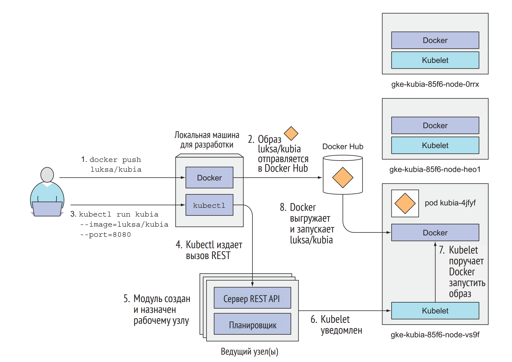

# Kubernetes

## Настройка работы

Самый простой и быстрый путь к полностью функционирующему кластеру Kubernetes – использовать инструмент Minikube.

__Minikube__ – это инструмент, который настраивает одноузловой кластер. Такой кластер отлично подходит как для
тестирования системы Kubernetes, так и для разработки приложений локально.

1. Установить Hypervisor (VirtualBox, Hyper-V)
2. Установить kubectl. Скачать бинарный файл и прописать путь к нему в переменную PATH.
3. Установить minikube из установочного файла.
4. Запустить локальный кластер minikuba

`minikube start --vm-driver=virtualbox --no-vtx-check --memory 24000 --cpus=6`

После того, как команда `minikube start` отработала успешно, будет примерно такой результат:
```java
Starting local Kubernetes cluster...
Starting VM...
SSH-ing files into VM...
...
Kubectl is now configured to use the cluster
```
После выполнь команду для проверки состояния кластера:

`minikube status`

Если кластер запущен, то в выводе команды `minikube status` должно быть что-то вроде этого:
```
host: Running
kubelet: Running
apiserver: Running
kubeconfig: Configured
```
Теперь, когда Minikube работает с выбранным вами гипервизором, можно продолжить использовать Minikube или остановить кластер. 
Чтобы остановить кластер, нужно выполнить команду `minikube stop`.

Для удаления и очистки minikube нужно выполнить команду `minikube delete`.

`minikube ip` - получение ip миникуба, который нужно прописать в файле hosts - C:\Windows\System32\drivers\etc.

## Создание псевдонима
Чтобы вместо ввода в командной строке `kubectl` использовать сокращенный псевдоним, нужно в файл `~/.bashrc` или 
эквивалентный ему файл нужно добавить строку `alias k=kubectl`

## Работа с кластером
Ниже показана диаграмма кластера Kubernetes со всеми связанными компонентами.


+ `kubectl get pods` - вывод списка модулей (нод)

Схема запуска и развертывания



### Доступ к панели управления
- minikube 

`minikube dashboard` - команда для автоматического открытия в браузере панели управления кластером

- Google Kubernetes Engine

`kubectl cluster-info | grep dashboard` - узнать URL-адрес панели управления

```
kubernetes-dashboard is running at https://104.155.108.191/api/v1/proxy/
➥ namespaces/kube-system/services/kubernetes-dashboard
```

Если открыть этот URL-адрес в браузере, то вам будет предложено ввести имя и пароль пользователя. Найти имя и пароль 
пользователя можно выполнив следующую команду:  
`$ gcloud container clusters describe kubia | grep -E "(username|password):`
```
password: 32nENgreEJ632A12
username: admin
```

## Get-команды с основном выводом

```yaml
kubectl get services -n <name-namespace>      #Вывести все сервисы в пространстве имён
kubectl get pods --all-namespaces             #Вывести все поды во всех пространств имён
kubectl get pods -o wide                      #Вывести все поды в текущем пространстве имён с подробностями
kubectl get deployment my-dep                 #Вывести определённое развёртывание
kubectl get pods                              #Вывести все поды в пространстве имён
kubectl get pod my-pod -o yaml                #Получить информацию по поду в формате YAML
kubectl get namespace                         #Вывести все пространста имен
```

## Посмотреть дополнительные сведения команды с многословным выводом

```yaml
kubectl get nodes                             #вывод списка узлов кластера
kubectl describe nodes my-node                #вывод характеристик указанного пода
kubectl describe pods my-pod                  #вывод характеристик указанного узла
```

## Работа с узлами и кластером
```yaml
kubectl cluster-info                          #Показать адреса главного узла и сервисов
```
```yaml
kubectl apply <name-manifest.yaml> -n <name-namespace>        #применяет манифест к кластеру, управляет созданием объектов 
                                                              #в кластере с помощью манифестов yaml в указанном пространстве имен
```
```yaml
kubectl port-forward <pod-name> <local-port>:<pod-port>       #пробросить порты пода
```