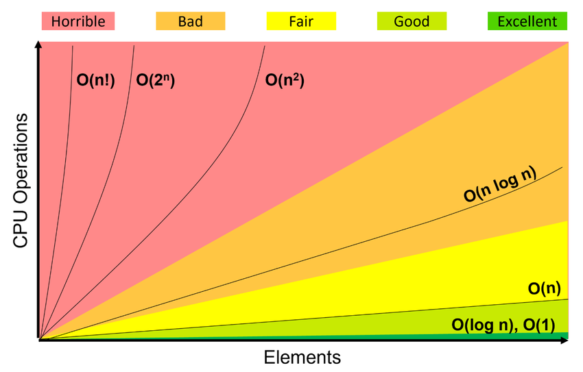

#### [Оглавление](../README.md)

# Алгоритмы
+ [Что такое Big O? Как происходит оценка асимптотической сложности алгоритмов?](#что-такое-big-o-как-происходит-оценка-асимптотической-сложности-алгоритмов)
+ [Что такое рекурсия? Сравните преимущества и недостатки итеративных и рекурсивных алгоритмов (с примерами)](#что-такое-рекурсия-сравните-преимущества-и-недостатки-итеративных-и-рекурсивных-алгоритмов--с-примерами-)
+ [Что такое жадные алгоритмы? Приведите пример](#что-такое-жадные-алгоритмы-приведите-пример)
+ [Расскажите про пузырьковую сортировку](#расскажите-про-пузырьковую-сортировку)
+ [Расскажите про быструю сортировку](#расскажите-про-быструю-сортировку)
+ [Расскажите про сортировку слиянием](#расскажите-про-сортировку-слиянием)
+ [Расскажите про бинарное дерево](#расскажите-про-бинарное-дерево)
+ [Расскажите про красно-черное дерево](#расскажите-про-красно-черное-дерево)
+ [Расскажите про линейный и бинарный поиск](#расскажите-про-линейный-и-бинарный-поиск)
+ [Расскажите про очередь и стек](#расскажите-про-очередь-и-стек)
+ [Сложность операции с коллекциями](#сложность-операций-с-коллекциями)

___________________________________________________________________________________________________________________________________________________________________________________________________________________________________________
<span style="display: inline-block; float: right">[содержание](#алгоритмы)</span>

## Что такое Big O? Как происходит оценка асимптотической сложности алгоритмов? 

__Big O __(O большое / символ Ландау) – математическое обозначение порядка функции для сравнения асимптотического поведения функций.

__Асимптотика__ – характер изменения функции при стремлении ее аргумента к определенной точке.

Любой алгоритм состоит из неделимых операций процессора (шагов), поэтому вместо секунд нужно измерять время в операциях процессора.

__DTIME__ – количество шагов (операций процессора), необходимых, чтобы алгоритм завершился.

Временная сложность обычно оценивается путем подсчета числа элементарных операций, осуществляемых алгоритмом. 
Время исполнения одной такой операции при этом берется константой, то есть асимптотически оценивается как O(1).

Сложность алгоритма состоит из двух факторов: временная сложность и сложность по памяти. __Временная сложность__ – функция, 
представляющая зависимость количество операций процессора, необходимых, чтобы алгоритм завершился, от размера входных данных. 
Все неделимые операции языка (операции сравнения, арифметические, логические, инициализации и возврата) считаются 
выполняемыми за 1 операцию процессора, эта погрешность считается приемлемой. При росте N, слагаемые с меньшей скоростью роста
все меньше влияют на значение функции. Поэтому вне зависимости от констант при слагаемых слагаемое с большей скорость роста 
определяет значение функции. Данное слагаемое называют порядком функции.

__Пример__: Т(N) = 5 * N^2 + 999 * N... Где (5 * N^2) и (9999 * N) являются слагаемыми функции. Константы (5 и 999) не 
указываются в рамках нотации Big O, так как не показывают абсолютную сложность алгоритма, поскольку могут изменяться в 
зависимости от машины, поэтому сложность равна О(N^2).



В порядке возрастания сложности:
1. O(1) – константная, чтение по индексу из массива.
2. O(log(n)) – логарифмическая, бинарный поиск в отсортированном массиве
3. O(√n) – сублинейная.
4. O(n) – линейная, перебор массива в цикле, два цикла подряд, линейный поиск
   наименьшего или наибольшего элемента в неотсортированном массиве.
5. O(n*log(n)) – квазилинейная, сортировка слиянием, сортировка кучей.
6. O(n^2) – полиномиальная (квадратичная), вложенный цикл, перебор двумерного массива,
   сортировка пузырьком, сортировка вставками.
7. O(2^n) – экспоненциальная, алгоритмы разложения на множители целых чисел.
8. O(n!) - факториальная, решение задачи коммивояжёра полным перебором

Алгоритм считается приемлемым, если сложность не превышает O(n*log(n)), иначе говнокод.

n – количество операций.
___________________________________________________________________________________________________________________________________________________________________________________________________________________________________________
<span style="display: inline-block; float: right">[содержание](#алгоритмы)</span>

## Что такое рекурсия? Сравните преимущества и недостатки итеративных и рекурсивных алгоритмов (с примерами)

__Рекурсия__ – способ отображения какого-либо процесса внутри самого этого процесса, то есть ситуация, когда процесс является 
частью самого себя.

Рекурсия состоит из базового случая и шага рекурсии. Базовый случай представляет собой самую простую задачу, которая 
решается за одну итерацию, например, if(n == 0) return 1.

В базовом случае обязательно присутствует условие выхода из рекурсии.

Смысл рекурсии в движении от исходной задачи к базовому случаю, пошагово уменьшая размер исходной задачи на каждом шаге рекурсии.

После того как будет найден базовый случай, срабатывает условие выхода из рекурсии, и стек рекурсивных вызовов 
разворачивается в обратном порядке, пересчитывая результат исходной задачи, который основан на результате, найденном в 
базовом случае.

Так работает рекурсивное вычисление факториала:
```
int factorial(int n) {
    if(n == 0) return 1; // базовый случай с условием выхода
    else return n * factorial(n - 1); // шаг рекурсии (рекурсивный вызов)
}
```
Или так:
```
return (n==0) ? 1 : n * factorial(n-1);
```

Рекурсия имеет линейную сложность O(n).

Циклы дают лучшую производительность, чем рекурсивные вызовы, поскольку вызовы методов потребляют больше ресурсов, 
чем исполнение обычных операторов. Циклы гарантируют отсутствие переполнения стека, т. к. не требуется выделения
дополнительной памяти.

В случае рекурсии стек вызовов разрастается и его необходимо просматривать для получения конечного ответа.
При использовании головной рекурсии необходимо принимать во внимание размер стека Если уровней вложненности много или 
изменятся, то предпочтительна рекурсия. Если их несколько, то лучше цикл.
___________________________________________________________________________________________________________________________________________________________________________________________________________________________________________
<span style="display: inline-block; float: right">[содержание](#алгоритмы)</span>

## Что такое жадные алгоритмы? Приведите пример

Жадные алгоритмы являются одной из трех техник создания алгоритмов, вместе с принципом «Разделяй и властвуй» и динамическим 
программированием.

__Жадный алгоритм__ – это алгоритм, который на каждом шагу совершает локально оптимальные решения, т. е. максимально 
возможное из допустимых, не учитывая предыдущие или следующие шаги. Последовательность этих локально оптимальных решений 
приводит (не всегда) к глобально оптимальному решению.

Т. е. задача разбивается на подзадачи, в каждой подзадаче делается оптимальное решение, и в итоге вся задача решается 
оптимально. При этом важно является ли каждое локальное решение безопасным шагом. Безопасный шаг – это шаг, приводящий к 
оптимальному решению.

К примеру, алгоритм Дейкстры нахождения кратчайшего пути в графе жадный, потому что на каждом шагу ищем вершину с 
наименьшим весом, в которой еще не бывали, после чего обновляем значения других вершин. При этом можно доказать, 
что кратчайшие пути, найденные в вершинах, являются оптимальными.

Пример: наименьшая яма с кладом.
___________________________________________________________________________________________________________________________________________________________________________________________________________________________________________
<span style="display: inline-block; float: right">[содержание](#алгоритмы)</span>

## Расскажите про пузырьковую сортировку

Будем идти по массиву слева направо. Если текущий элемент больше следующего, меняем их местами. Делаем так, пока массив 
не будет отсортирован. 

Aсимптотика в худшем и среднем случае – O(n^2), в лучшем случае – O(n) – массив уже отсортирован.
___________________________________________________________________________________________________________________________________________________________________________________________________________________________________________
<span style="display: inline-block; float: right">[содержание](#алгоритмы)</span>

## Расскажите про быструю сортировку

Выберем некоторый опорный элемент. После этого перекинем все элементы, меньшие его, налево, а большие – направо. Для этого 
используются дополнительные переменные – значения слева и справа, которые сравниваются с опорным элементом. Рекурсивно
вызовемся от каждой из частей, где будет выбран новый опорный элемент. В итоге получим отсортированный массив, так как 
каждый элемент меньше опорного стоял раньше каждого большего опорного.

Асимптотика: O(n*log(n)) в среднем и лучшем случае. Наихудшая оценка O(n^2) достигается при неудачном выборе опорного элемента.
___________________________________________________________________________________________________________________________________________________________________________________________________________________________________________
<span style="display: inline-block; float: right">[содержание](#алгоритмы)</span>

## Расскажите про сортировку слиянием

Основана на парадигме «разделяй и властвуй». Будем делись массив пополам, пока не получим множество массивов из одного 
элемента. После чего выполним процедуру слияния: поддерживаем два указателя, один на текущий элемент первой части, второй – на текущий
элемент второй части. Из этих двух элементов выбираем минимальный, вставляем в ответ и сдвигаем указатель, 
соответствующий минимуму. Так сделаем слияния массивов из первого элемента в массивы по 2 элемента, затем из двух в 4 и т. д.

Слияние работает за O(n), уровней всего log(n), поэтому асимптотика O(n*log(n)).
___________________________________________________________________________________________________________________________________________________________________________________________________________________________________________
<span style="display: inline-block; float: right">[содержание](#алгоритмы)</span>

## Расскажите про бинарное дерево

__Бинарное дерево__ – иерархическая структура данных, в которой каждый узел может иметь двух потомков. Как правило, 
первый называется родительским узлом, а наследники называются левым и правым нодами/узлами. Каждый узел в дереве задает поддерево,
корнем которого он является. 

Оба поддерева – левое и правое – тоже являются бинарными деревьями. Ноды, которые не имеют потомков, называются листьями дерева. 
У всех узлов левого поддерева произвольного узла X значения ключей данных меньше, нежели значение ключа данных самого узла X. 
У всех узлов правого поддерева произвольного узла X значения ключей данных больше либо равны, нежели значение ключа данных 
самого узла X.

Этим достигается упорядоченная структура данных, то есть всегда отсортированная.

Поиск в лучшем случае – O(log(n)), худшем – O(n) при вырождении в связанный список.
___________________________________________________________________________________________________________________________________________________________________________________________________________________________________________
<span style="display: inline-block; float: right">[содержание](#алгоритмы)</span>

## Расскажите про красно-черное дерево

Усовершенствованная версия бинарного дерева. Каждый узел в красно-черном дереве
имеет дополнительное поле цвет. Красно-черное дерево отвечает следующим требованиям:
+ узел либо красный, либо черный;
+ корень черный;
+ все листья черные и не хранят данных;
+ оба потомка каждого красного узла черные;
+ любой простой путь от узла-предка до листового узла-потомка содержит одинаковое число черных узлов; если не одинаковое, 
то происходит переворот.

При добавлении постоянно увеличивающихся/уменьшающихся чисел в бинарное дерево оно вырождается в связанный список и теряет 
свои преимущества. Тогда как красно-черное дерево может потребовать до двух поворотов для поддержки сбалансированности, чтобы
избежать вырождения.

При операциях удаления в бинарном дереве для удаляемого узла надо найти замену.

Красно-черное дерево сделает то же самое, но потребует до трех поворотов для поддержки сбалансированности. В этом и состоит преимущество.

Сложность поиска, вставки и удаления – O(log(n)).
___________________________________________________________________________________________________________________________________________________________________________________________________________________________________________
<span style="display: inline-block; float: right">[содержание](#алгоритмы)</span>

## Расскажите про линейный и бинарный поиск

__Линейный поиск__ – сложность O(n), так как все элементы проверяются по очереди.

__Бинарный поиск__ – O(log(n)). Массив должен быть отсортирован. Происходит поиск индекса

в массиве, содержащего искомое значение.
1. Берем значение из середины массива и сравниваем с искомым. Индекс середины считается по формуле mid = (high + low) / 2.
   + __low__ – индекс начала левого подмассива;
   + __high__ – индекс конца правого подмассива.
2. Если значение в середине больше искомого, то рассматриваем левый подмассив и high =
   middle - 1
3. Если меньше, то правый и low = middle + 1.
4. Повторяем, пока mid не становится равен искомому элементу или подмассив не станет пустым.

```java
public static int binarySearch(int[] a, int key) {
   int low = 0;
   int high = a.length - 1;
   
   while (low <= high) {
       int mid = (low + high)/2;
       if (key > a[mid]) {
           low = mid + 1;
       } else if (key < a[mid]) {
           high = mid - 1;
       } else return mid;
   }
   return -1;
}
```
___________________________________________________________________________________________________________________________________________________________________________________________________________________________________________
<span style="display: inline-block; float: right">[содержание](#алгоритмы)</span>

## Расскажите про очередь и стек

__Stack__ – это область хранения данных, находящееся в общей оперативной памяти (RAM).

Всякий раз, когда вызывается метод, в памяти стека создается новый блок-фрейм, который содержит локальные переменные 
метода и ссылки на другие объекты в методе. Как только метод заканчивает работу, блок перестает использоваться, тем 
самым предоставляя доступ для следующего метода. Размер стековой памяти намного меньше объема памяти в куче.
   
Стек в Java работает по схеме LIFO.
   
__Queue__ – это очередь, которая обычно (но необязательно) строится по принципу FIFO (First-In-First-Out), поэтому 
извлечение элемента осуществляется с начала очереди, вставка элемента – в конец очереди. Хотя этот принцип нарушает, к 
примеру, PriorityQueue, использующая «natural ordering» или переданный Comparator при вставке нового элемента.

__Deque (Double Ended Queue)__ расширяет Queue. Согласно документации это линейная коллекция, поддерживающая 
вставку/извлечение элементов с обоих концов. Помимо этого реализации интерфейса Deque могут строится по принципу FIFO, 
либо LIFO.

Реализации и Deque, и Queue обычно не переопределяют методы equals() и hashCode(), вместо этого используются 
унаследованные методы класса Object, основанные на сравнении ссылок.
___________________________________________________________________________________________________________________________________________________________________________________________________________________________________________
<span style="display: inline-block; float: right">[содержание](#алгоритмы)</span>

## Сложность операций с коллекциями


