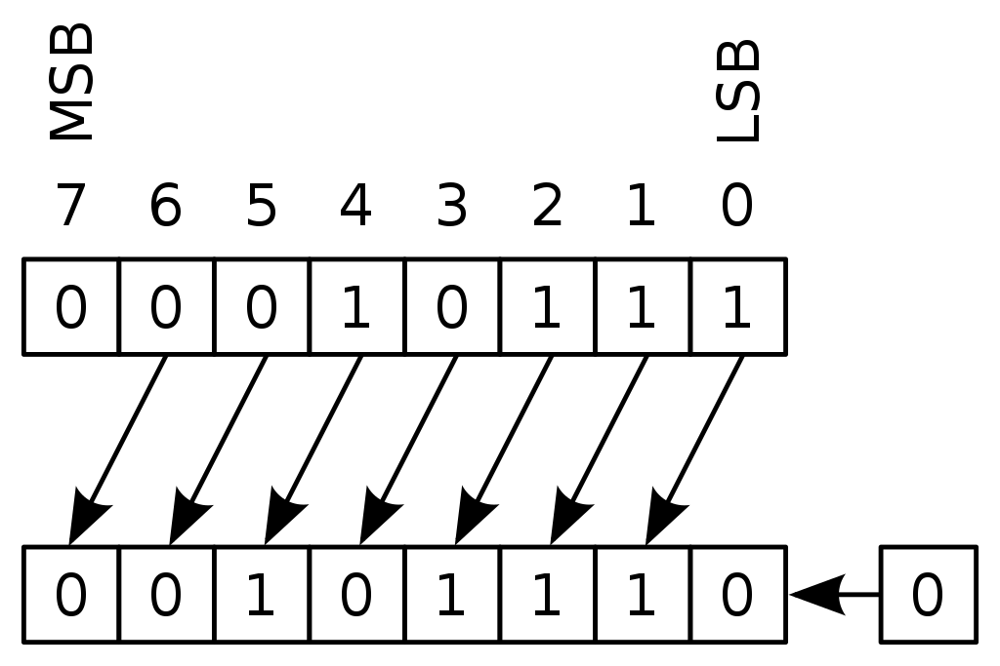
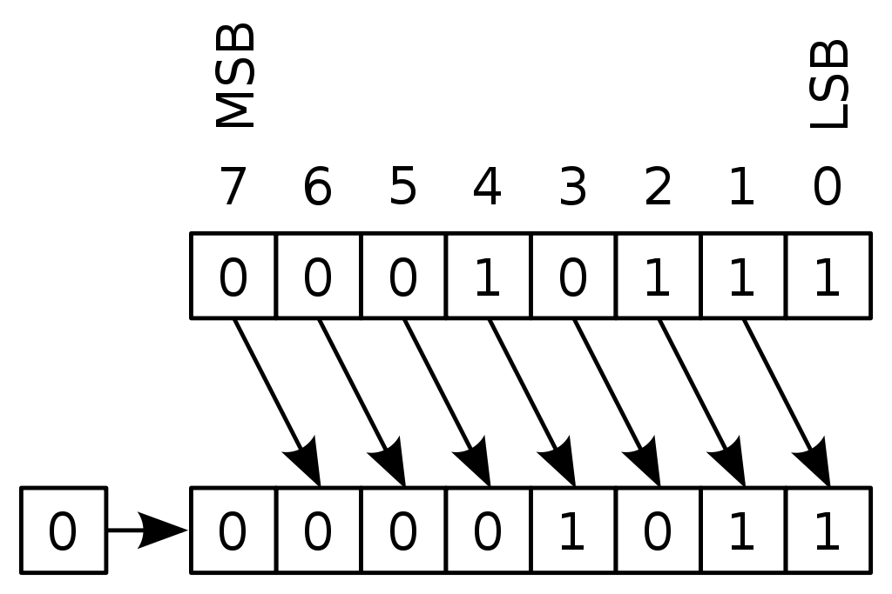
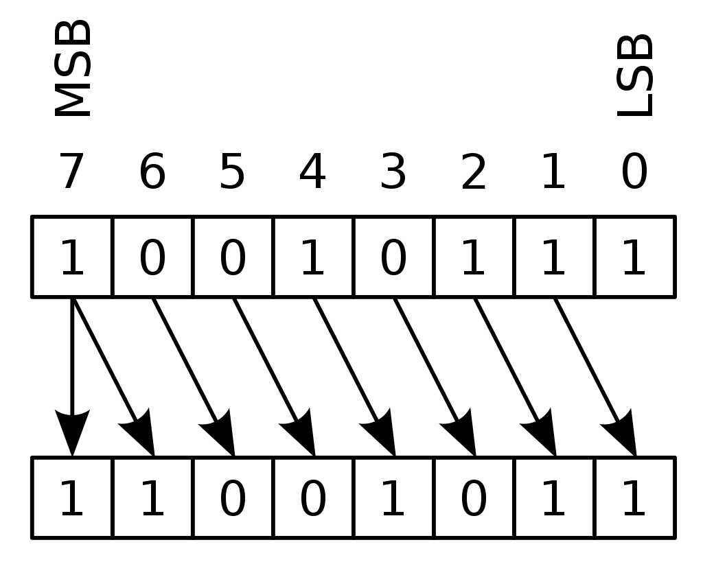
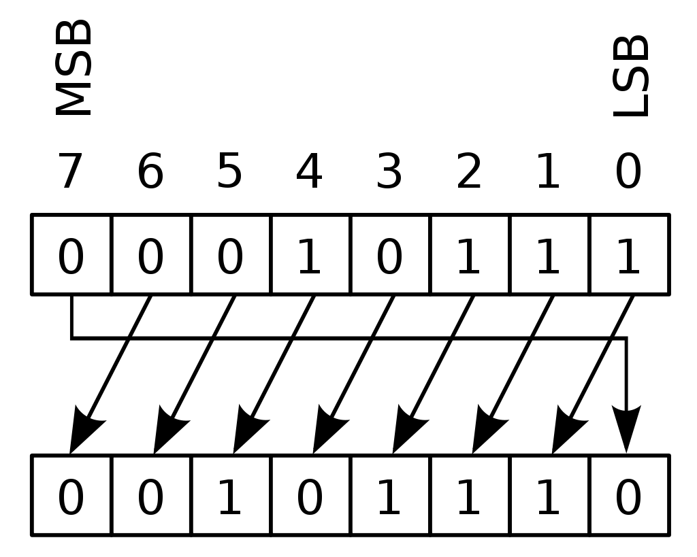
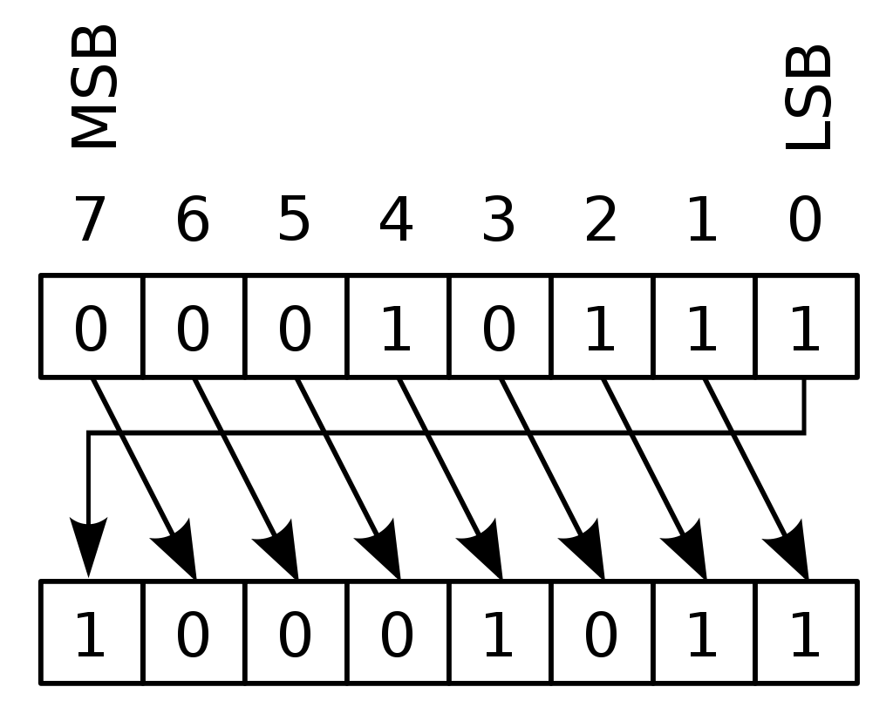
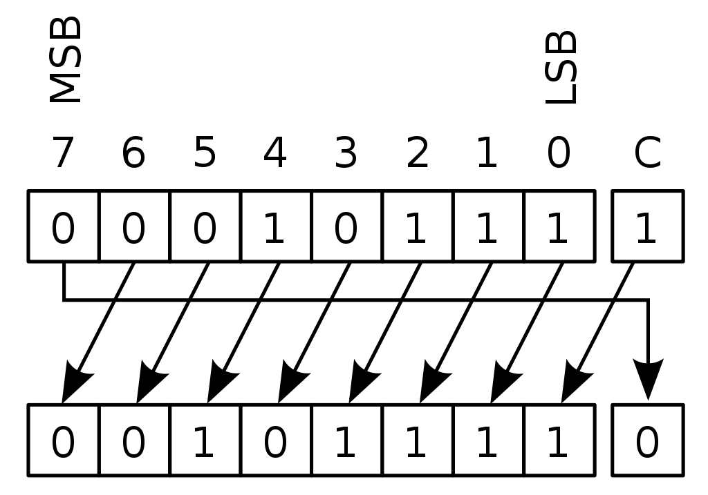
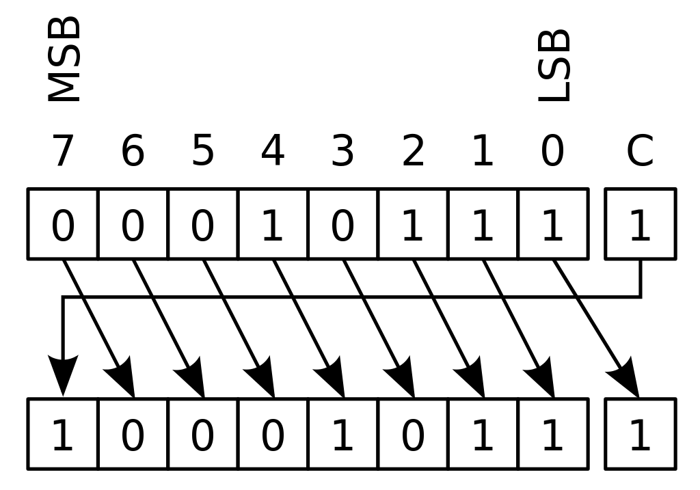

#### [Оглавление](../README.md)

# Java Core
+ [Модификаторы доступа](#модификаторы-доступа)
+ [Heap и Stack память в Java и разница между ними](#heap-и-Stack-память-в-Java-и-разница-между-ними)
+ [Верно ли утверждение, что примитивные типы данных всегда хранятся в стеке, а экземпляры ссылочных типов данных – в куче?](#верно-ли-утверждение-что-примитивные-типы-данных-всегда-хранятся-в-стеке-а-экземпляры-ссылочных-типов-данных--в-куче)
+ [Ключевые слова](#ключевые-слова)
+ [Оператор assert](#оператор-assert)
+ [Логические операторы](#логические-операторы)
+ [Тернарный условный оператор](#Тернарный-условный-оператор)
+ [Побитовые операции](#побитовые-операции)
+ [Что такое литералы?](#Что-такое-литералы)
+ [Примитивные типы данных в Java](#примитивные-типы-данных)
+ [Сколько памяти занимает boolean?](#Сколько-памяти-занимает-boolean)
+ [Классы-обертки](#Классы-обертки)
+ [Какими значениями инициализируются переменные по умолчанию?](#какими-значениями-инициализируются-переменные-по-умолчанию)
+ [Автоупаковка и автораспаковка](#автоупаковка-и-автораспаковка)
+ [Каким образом передаются переменные в методы, по значению или по ссылке?](#каким-образом-передаются-переменные-в-методы-по-значению-или-по-ссылке)

Object
+ [Что такое класс `Object`? Какие в нем есть методы?](#что-такое-класс-object--какие-в-нем-есть-методы)
+ [Зачем нужен `equals()`. Чем он отличается от операции `==`?](#зачем-нужен-equals--чем-он-отличается-от-операции--)
+ [Какая связь между `hashCode()` и `equals()`?](#какая-связь-между-hashcode-и-equals-)
+ [Если `equals()` переопределен, есть ли какие-либо другие методы, которые следует переопределить?](#если-equals-переопределен-есть-ли-какие-либо-другие-методы-которые-следует-переопределить)
+ [Каким образом реализованы методы `hashCode()` и `equals()` в классе `Object`?](#каким-образом-реализованы-методы-hashcode-и-equals-в-классе-object-)
+ [Правила переопределения метода `Object.equals()`.](#правила-переопределения-метода-objectequals-)
+ [Для чего нужен метод `hashCode()`?](#для-чего-нужен-метод-hashcode-)
+ [Что будет, если переопределить `equals()` не переопределяя `hashCode()`? Какие могут возникнуть проблемы?](#что-будет-если-переопределить-equals-не-переопределяя-hashcode--какие-могут-возникнуть-проблемы)
+ [Какой контракт между hashCode() и equals()?](#какой-контракт-между-hashcode---и-equals---)
+ [Каковы правила переопределения метода `Object.hashCode()`?](#каковы-правила-переопределения-метода-objecthashcode-)
+ [Есть ли какие-либо рекомендации о том, какие поля следует использовать при подсчете `hashCode()`?](#есть-ли-какие-либо-рекомендации-о-том-какие-поля-следует-использовать-при-подсчете-hashcode-)
+ [Могут ли у разных объектов быть одинаковые `hashCode()`?](#могут-ли-у-разных-объектов-быть-одинаковые-hashcode-)
+ [Если вы хотите переопределить `equals()`, какие условия должны выполняться?](#если-вы-хотите-переопределить-equals--какие-условия-должны-выполняться)
+ [Какими свойствами обладает порождаемое `equals()` отношение эквивалентности?](#какими-свойствами-обладает-порождаемое-equals-отношение-эквивалентности)
+ [Если у класса `Point{int x, y;}` реализовать метод `equals(Object that) {(return this.x == that.x && this.y == that.y)}`, но сделать хэш код в виде `int hashCode() {return x;}`, то будут ли корректно такие точки помещаться и извлекаться из `HashSet`?](#если-у-класса-pointint-x-y-реализовать-метод-equalsobject-that-return-thisx--thatx--thisy--thaty--но-сделать-хэш-код-в-виде-int-hashcode-return-x--то-будут-ли-корректно-такие-точки-помещаться-и-извлекаться-из-hashset-)
+ [Могут ли у разных объектов `(ref0 != ref1)` быть `ref0.equals(ref1) == true`?](#могут-ли-у-разных-объектов-ref0--ref1-быть-ref0equalsref1--true-)
+ [Могут ли у разных ссылок на один объект `(ref0 == ref1)` быть `ref0.equals(ref1) == false`?](#могут-ли-у-разных-ссылок-на-один-объект-ref0--ref1-быть-ref0equalsref1--false-)
+ [Можно ли так реализовать метод `equals(Object that) {return this.hashCode() == that.hashCode()}`?](#можно-ли-так-реализовать-метод-equalsobject-that-return-thishashcode--thathashcode-)
+ [В `equals()` требуется проверять, что аргумент `equals(Object that)` такого же типа что и сам объект. В чем разница между `this.getClass() == that.getClass()` и `that instanceof MyClass`?](#в-equals-требуется-проверять-что-аргумент-equalsobject-that-такого-же-типа-что-и-сам-объект-в-чем-разница-между-thisgetclass--thatgetclass-и-that-instanceof-myclass-)
+ [Можно ли реализовать метод `equals()` класса `MyClass` вот так: `class MyClass {public boolean equals(MyClass that) {return this == that;}}`?](#можно-ли-реализовать-метод-equals-класса-myclass-вот-так--class-myclass-public-boolean-equalsmyclass-that-return-this--that-)
+ [Есть класс `Point{int x, y;}`. Почему хэш код в виде `31 * x + y` предпочтительнее чем `x + y`?](#есть-класс-pointint-x-y--почему-хэш-код-в-виде-31--x--y-предпочтительнее-чем-x--y-)
+ [Расскажите про клонирование объектов.](#расскажите-про-клонирование-объектов)
+ [В чем отличие между _поверхностным_ и _глубоким_ клонированием?](#в-чем-отличие-между-поверхностным-и-глубоким-клонированием)
+ [Какой способ клонирования предпочтительней?](#какой-способ-клонирования-предпочтительней)
+ [Почему метод `clone()` объявлен в классе `Object`, а не в интерфейсе `Cloneable`?](#почему-метод-clone-объявлен-в-классе-object--а-не-в-интерфейсе-cloneable-)
+ [Почему нельзя реализовать `hashcode()`, который будет гарантированно уникальным для каждого объекта?](#почему-нельзя-реализовать-hashcode--который-будет-гарантированно-уникальным-для-каждого-объекта)
+ [Чем `a.getClass().equals(A.class)` отличается от `a instanceOf A.class`?](#чем-agetclassequalsaclass-отличается-от-a-instanceof-aclass-)
+ [instanceof](#instanceof)

String
+ [Что такое char?](#что-такое-char)
+ [Какие есть особенности класса `String`?](#какие-есть-особенности-класса-string-)
+ [Что такое «пул строк»?](#Что-такое-пул-строк)
+ [Почему не рекомендуется изменять строки в цикле? Что рекомендуется использовать?](#почему-не-рекомендуется-изменять-строки-в-цикле-что-рекомендуется-использовать)
+ [Почему `char[]` предпочтительнее `String` для хранения пароля?](#почему-char-предпочтительнее-string-для-хранения-пароля)
+ [Почему `String` неизменяемый и финализированный класс?](#почему-string-неизменяемый-и-финализированный-класс)
+ [Почему строка является популярным ключом в `HashMap` в Java?](#почему-строка-является-популярным-ключом-в-hashmap-в-java)
+ [Что делает метод `intern()` в классе `String`?.](#что-делает-метод-intern-в-классе-string-)
+ [Можно ли использовать строки в конструкции `switch`?](#можно-ли-использовать-строки-в-конструкции-switch-)
+ [Какая основная разница между `String`, `StringBuffer`, `StringBuilder`?](#какая-основная-разница-между-string--stringbuffer--stringbuilder-)
+ [Что такое `StringJoiner`?](#что-такое-stringjoiner-)

Массивы
+ [Существуют ли в Java многомерные массивы?](#существуют-ли-в-Java-многомерные-массивы)
+ [Если передать массив и изменить его в методе, то будет ли изменяться текущий массив?](#eсли-передать-массив-и-изменить-его-в-методе-то-будет-ли-изменяться-текущий-массив)

Enum
+ [Что такое перечисления (enum)?](#что-такое-перечисления--enum--)
+ [Особенности Enum-классов](#Особенности-Enum-классов)

Main
+ [Сигнатура метода](#сигнатура-метода)
+ [Что вы знаете о функции `main()`?](#что-вы-знаете-о-функции-main-)

Пулы
+ [Пул int-ов](#пул-int-ов)
+ [Можно ли измениить размер пула int?](#можно-ли-измениить-размер-пула-int)
+ [Какие еще есть пулы примитивов?](#какие-еще-есть-пулы-примитивов)
+ [Что такое «пул строк»?](#что-такое-пул-строк)

Классы
+ [Какие типы классов бывают в Java?](#какие-типы-классов-бывают-в-java)
+ [Расскажите про вложенные классы. В каких случаях они применяются?](#расскажите-про-вложенные-классы-в-каких-случаях-они-применяются)
+ [Что такое «статический класс»?](#что-такое-статический-класс-)
+ [Какие существуют особенности использования вложенных классов: статических и внутренних? В чем заключается разница между ними?](#какие-существуют-особенности-использования-вложенных-классов--статических-и-внутренних-в-чем-заключается-разница-между-ними)
+ [Что такое «локальный класс»? Каковы его особенности?](#что-такое-локальный-класс--каковы-его-особенности)
+ [Что такое «анонимные классы»? Где они применяются?](#что-такое-анонимные-классы--где-они-применяются)
+ [Каким образом из вложенного класса получить доступ к полю внешнего классa?](#каким-образом-из-вложенного-класса-получить-доступ-к-полю-внешнего-класса)
+ [Ромбовидное наследование](#ромбовидное-наследование)
+ [Как проблема ромбовидного наследования решена в java?](#как-проблема-ромбовидного-наследования-решена-в-java)
+ [Дайте определение понятию «конструктор»](#дайте-определение-понятию-конструктор)
+ [Что такое конструктор по умолчанию?](#что-такое-конструктор-по-умолчанию)
+ [Могут ли быть приватные конструкторы? Для чего они нужны?](#могут-ли-быть-приватные-конструкторы-для-чего-они-нужны)
+ [Где и как вы можете использовать приватный конструктор?](#где-и-как-вы-можете-использовать-приватный-конструктор)
+ [Расскажите про классы-загрузчики и про динамическую загрузку классов](#расскажите-про-классы-загрузчики-и-про-динамическую-загрузку-классов)
+ [Чем отличаются конструкторы по умолчанию, конструктор копирования и конструктор с параметрами?](#чем-отличаются-конструктор-по-умолчанию-конструктор-копирования-и-конструктор-с-параметрами)
+ [Может ли объект получить доступ к члену класса объявленному как private? Если да, то каким образом?](#может-ли-объект-получить-доступ-к-члену-класса-объявленному-как-private-если-да-то-каким-образом)
+ [Что такое _Reflection_?](#что-такое-reflection-)

+ [Какие есть модификаторы доступа?](#какие-есть-модификаторы-доступа)
+ [Что означает модификатор static?](#что-означает-модификатор-static)
+ [К каким конструкциям Java применим модификатор `static`?](#к-каким-конструкциям-java-применим-модификатор-static-)
+ [В чем разница между членом экземпляра класса и статическим членом класса?](#в-чем-разница-между-членом-экземпляра-класса-и-статическим-членом-класса)
+ [Может ли статический метод быть переопределен или перегружен?](#может-ли-статический-метод-быть-переопределён-или-перегружен)
+ [Могут ли нестатические методы перегрузить статические?](#могут-ли-нестатические-методы-перегрузить-статические)
+ [Как получить доступ к переопределенным методам родительского класса?](#как-получить-доступ-к-переопределенным-методам-родительского-класса)
+ [Можно ли сузить уровень доступа/тип возвращаемого значения при переопределении метода?](#можно-ли-сузить-уровень-доступатип-возвращаемого-значения-при-переопределении-метода)
+ [Что можно изменить в сигнатуре метода при переопределении? Можно ли менять модификаторы (throws и т. п.)?](#что-можно-изменить-в-сигнатуре-метода-при-переопределении-можно-ли-менять-модификаторы--throws-и-т-п--)
+ [Могут ли классы быть статическими?](#могут-ли-классы-быть-статическими)
+ [Что означает модификатор `final?` К чему он может быть применим?](#что-означает-модификатор-final-К-чему-он-может-быть-применим)
+ [Где и для чего используется модификатор `abstract`?](#где-и-для-чего-используется-модификатор-abstract-)
+ [Что такое абстрактные классы? Чем они отличаются от обычных?](#что-такое-абстрактные-классы-Чем-они-отличаются-от-обычных)
+ [Можно ли объявить метод абстрактным и статическим одновременно?](#можно-ли-объявить-метод-абстрактным-и-статическим-одновременно)
+ [Может ли быть абстрактный класс без абстрактных методов?](#может-ли-быть-абстрактный-класс-без-абстрактных-методов)
+ [Могут ли быть конструкторы у абстрактных классов? Для чего они нужны?](#могут-ли-быть-конструкторы-у-абстрактных-классов-Для-чего-они-нужны)
+ [Дайте определение понятию _«интерфейс»_. Какие модификаторы по умолчанию имеют поля и методы интерфейсов?](#дайте-определение-понятию-интерфейс--какие-модификаторы-по-умолчанию-имеют-поля-и-методы-интерфейсов)
+ [Чем абстрактный класс отличается от интерфейса? В каких случаях следует использовать абстрактный класс, а в каких интерфейс?](#чем-абстрактный-класс-отличается-от-интерфейса-В-каких-случаях-следует-использовать-абстрактный-класс-а-в-каких-интерфейс)
+ [Что имеет более высокий уровень абстракции – класс, абстрактный класс или интерфейс?](#что-имеет-более-высокий-уровень-абстракции---класс--абстрактный-класс-или-интерфейс-)
+ [Может ли один интерфейс наследоваться от другого? От двух других?](#может-ли-один-интерфейс-наследоваться-от-другого-от-двух-других)
+ [Чем интерфейсы отличаются от абстрактных классов? В каких случаях следует использовать абстрактный класс, а в каких интерфейс?](#чем-интерфейсы-отличаются-от-абстрактных-классов-В-каких-случаях-следует-использовать-абстрактный-класс-а-в-каких-интерфейс)
+ [Что такое дефолтные методы интерфейсов? Для чего они нужны?](#что-такое-дефолтные-методы-интерфейсов-для-чего-они-нужны)
+ [Почему в некоторых интерфейсах вообще не определяют методов?](#почему-в-некоторых-интерфейсах-вообще-не-определяют-методов)
+ [Почему нельзя объявить метод интерфейса с модификатором `final`?](#почему-нельзя-объявить-метод-интерфейса-с-модификатором-final-)
+ [Что такое `default` методы интерфейса?](#что-такое-default-методы-интерфейса)
+ [Как вызывать `default` метод интерфейса в реализующем этот интерфейс классе?](#как-вызывать-default-метод-интерфейса-в-реализующем-этот-интерфейс-классе)
+ [Что такое `static` метод интерфейса?](#что-такое-static-метод-интерфейса)
+ [Как вызывать `static` метод интерфейса?](#как-вызывать-static-метод-интерфейса)
+ [Как решается проблема ромбовидного наследования при наследовании интерфейсов при наличии default-методов?](#как-решается-проблема-ромбовидного-наследования-при-наследовании-интерфейсов-при-наличии-default-методов)
+ [Каков порядок вызова конструкторов и блоков инициализации с учётом иерархии классов?](#каков-порядок-вызова-конструкторов-и-блоков-инициализации-с-учётом-иерархии-классов)
+ [Зачем нужны и какие бывают блоки инициализации?](#Зачем-нужны-и-какие-бывают-блоки-инициализации)
+ [Для чего в Java используются статические блоки инициализации?](#Для-чего-в-java-используются-статические-блоки-инициализации)
+ [Где разрешена инициализация статических/нестатических полей](#где-разрешена-инициализация-статическихнестатических-полей)
+ [Что произойдёт, если в блоке инициализации возникнет исключительная ситуация?](#что-произойдёт-если-в-блоке-инициализации-возникнет-исключительная-ситуация)
+ [Какое исключение выбрасывается при возникновении ошибки в блоке инициализации класса?](#какое-исключение-выбрасывается-при-возникновении-ошибки-в-блоке-инициализации-класса)
+ [Приведение типов. Понижение и повышение типа](#приведение-типов-понижение-и-повышение-типа)
+ [Явное и неявное приведение типов. В каких случаях в java нужно использовать явное приведение?](#явное-и-неявное-приведение-типов-в-каких-случаях-в-java-нужно-использовать-явное-приведение)

+ [ClassCastException и когда оно может быть выброшено](#classCastException-и-когда-оно-может-быть-выброшено)
+ [Чем отличаются `final`, `finally` и `finalize()`?](#чем-отличаются-final--finally-и-finalize-)

_______________________________________________________________________________________________________________________
<span style="display: inline-block; float: right">[содержание](#java-core)</span>

## Модификаторы доступа

__private__ (приватный): члены класса доступны только внутри класса. Для обозначения используется служебное слово
`private`.

__default__, package-private, package level (доступ на уровне пакета): видимость класса/членов класса только внутри
пакета. Является модификатором доступа по умолчанию - специальное обозначение не требуется.

__protected__ (защищённый): члены класса доступны внутри пакета и в наследниках. Для обозначения используется служебное
слово `protected`.

__public__ (публичный): класс/члены класса доступны всем. Для обозначения используется служебное слово `public`.

Последовательность модификаторов по возрастанию уровня закрытости: public, protected, default, private.

Во время наследования возможно изменения модификаторов доступа в сторону большей видимости (для поддержания соответствия
_принципу подстановки Барбары Лисков_).
_______________________________________________________________________________________________________________________
<span style="display: inline-block; float: right">[содержание](#java-core)</span>

## Heap и Stack память в Java и разница между ними

__Heap (куча)__ используется Java Runtime для выделения памяти под объекты и классы. Создание нового объекта также
происходит в куче. Она же является областью работы сборщика мусора. Любой объект, созданный в куче, имеет глобальный
доступ и на него могут ссылаться из любой части приложения.

__Stack (стек)__ – это область хранения данных также находится в общей оперативной памяти (RAM). Всякий раз, когда
вызывается метод, в памяти стека создается новый блок, который содержит примитивы и ссылки на другие объекты в методе.
Как только метод заканчивает работу, блок перестает использоваться, тем самым предоставляя доступ для следующего метода.
Размер стековой памяти намного меньше объема памяти в куче. Стек в Java работает по схеме LIFO
(последний-зашел-первый-вышел).

___Различия между Heap и Stack памятью:___
+ куча используется всеми частями приложения, в то время как стек используется только одним потоком исполнения программы;
+ всякий раз, когда создается объект, он всегда хранится в куче, а в памяти стека содержится лишь ссылка на него,
  память стека содержит только локальные переменные примитивных типов и ссылки на объекты в куче;
+ объекты в куче доступны из любой точки программы, в то время как стековая память не может быть доступна для других
  потоков;
+ стековая память существует лишь какое-то время работы программы, а память в куче живет с самого начала до конца работы
  программы;
+ если память стека полностью занята, то Java Runtime бросает исключение java.lang.StackOverflowError, если заполнена
  память кучи, то бросается исключение java.lang.OutOfMemoryError: Java Heap Space;
+ размер памяти стека намного меньше памяти в куче;
+ из-за простоты распределения памяти стековая память работает намного быстрее кучи.

Для определения начального и максимального размера памяти в куче используются опции JVM -Xms и -Xmx. Для стека
определить размер памяти можно с помощью опции -Xss.
___

## Верно ли утверждение, что примитивные типы данных всегда хранятся в стеке, а экземпляры ссылочных типов данных – в куче?

Не совсем. Примитивное поле экземпляра класса хранится не в стеке, а в куче. Любой объект (все, что явно или неявно
создается при помощи оператора new) хранится в куче.
___

## Ключевые слова

__Ключевые слова__ - предопределенные идентификаторы, зарезервированные в Java. Их нельзя использовать как
идентификаторы. True, false, и null - это не ключевые слова, но они являются зарезервированными словами, так что их тоже
нельзя использовать как имена в программах.

abstract, assert, break, case, catch, class, const*, continue, default, do, else, enum, extends, final,
finally, for, goto*, if, implements, import, instanceof, interface, native, new, package, return, static,
strictfp, super, switch, synchronized, this, throw, throws, transient, try, void, volatile, while.
* – зарезервированное слово, не используется.
___

## Оператор assert

__Assert (утверждение)__ – это специальная конструкция, позволяющая проверять предположения о значениях произвольных
данных в произвольном месте программы.

Утверждение может автоматически сигнализировать об обнаружении некорректных данных, что обычно приводит к аварийному
завершению программы с указанием места обнаружения некорректных данных.

Утверждения существенно упрощают локализацию ошибок в коде. Даже проверка результатов выполнения очевидного кода может
оказаться полезной при последующем рефакторинге, после которого код может стать не настолько очевидным и в него может
закрасться ошибка.

Обычно утверждения оставляют включенными во время разработки и тестирования программ, но отключают в релиз-версиях
программ.

Т. к. утверждения могут быть удалены на этапе компиляции либо во время исполнения программы, они не должны менять
поведение программы. Если в результате удаления утверждения поведение программы может измениться, то это явный признак
неправильного использования assert. Таким образом, внутри assert нельзя вызывать методы, изменяющие состояние программы,
либо внешнего окружения программы.

В Java проверка утверждений реализована с помощью оператора assert, который имеет
форму:

`assert [Выражение типа boolean];` или `assert [Выражение типа boolean] : [Выражение любого типа, кроме void];`

Во время выполнения программы в том случае, если проверка утверждений включена, вычисляется значение булевского
выражения, и если его результат false, то генерируется исключение java.lang.AssertionError. В случае использования
второй формы оператора assert выражение после двоеточия задает детальное сообщение о произошедшей ошибке (вычисленное
выражение будет преобразовано в строку и передано конструктору AssertionError).
___

## Логические операторы

+ `&`: Логическое _AND_ (И);
+ `&&`: Сокращённое _AND_;
+ `|`: Логическое _OR_ (ИЛИ);
+ `||`: Сокращённое _OR_;
+ `^`: Логическое _XOR_ (исключающее _OR_ (ИЛИ));
+ `!`: Логическое унарное _NOT_ (НЕ);
+ `&=`: _AND_ с присваиванием;
+ `|=`: _OR_ с присваиванием;
+ `^=`: _XOR_ с присваиванием;
+ `==`: Равно;
+ `!=`: Не равно;
+ `?:`: Тернарный (троичный) условный оператор.
___

## Тернарный условный оператор

__Тернарный условный оператор__ - оператор, которым можно заменить некоторые конструкции операторов if-then-else.

Выражение записывается в следующей форме:

условие ? выражение1 : выражение2

Если условие выполняется, то вычисляется выражение1 и его результат становится результатом выполнения всего оператора.
Если же условие равно false, то вычисляется выражение2 и его значение становится результатом работы оператора. Оба
операнда выражение1 и выражение2 должны возвращать значение одинакового (или совместимого) типа.
_______________________________________________________________________________________________________________________
<span style="display: inline-block; float: right">[содержание](#java-core)</span>

## Побитовые операции

```text
~: Побитовый унарный оператор NOT;
&: Побитовый AND;
&=: Побитовый AND с присваиванием;
|: Побитовый OR;
|=: Побитовый OR с присваиванием;
^: Побитовый исключающее XOR;
^=: Побитовый исключающее XOR с присваиванием;
>>: Сдвиг вправо (деление на 2 в степени сдвига) - логический (беззнаковый) сдвиг;
>>=: Сдвиг вправо с присваиванием;
>>>: Сдвиг вправо без учета знака - логический (беззнаковый) сдвиг;
>>>=: Сдвиг вправо без учета знака с присваиванием;
<<: Сдвиг влево (умножение на 2 в степени сдвига);
<<=: Сдвиг влево с присваиванием.
```
  
+ __AND ( & )__

| a   | b   | a AND b |
|-----|-----|---------|
| 0   | 0   | 0       |
| 0   | 1   | 0       |
| 1   | 0   | 0       |
| 1   | 1   | 1       |
            
+ __OR ( | )__  

| a   | b   | a OR b |
|-----|-----|--------|
| 0   | 0   | 0      |
| 0   | 1   | 1      |
| 1   | 0   | 1      |
| 1   | 1   | 1      |

+ __XOR ( ^ )__

| a   | b   | a XOR b |
|-----|-----|---------|
| 0   | 0   | 0       |
| 0   | 1   | 1       |
| 1   | 0   | 1       |
| 1   | 1   | 0       |

Двоичная система счисления

    0000 0000 - 0
    0000 0001 - 1
    0000 0010 - 2
    0000 0011 - 3
    0000 0100 - 4
    0000 0101 - 5
    0000 0110 - 6
    0000 0111 - 7
    0000 1000 - 8
    0000 1001 - 9
    0000 1010 - 10
    0000 1011 - 11
    0000 1100 - 12
    0000 1101 - 13
    0000 1110 - 14
    0000 1111 - 15
    0001 0000 - 16
    0001 0001 - 17
    0001 0010 - 18
    0001 0011 - 19
    0001 0100 - 20
    0001 0101 - 21
    0001 0110 - 22
    0001 0111 - 23
    0001 1000 - 24
    0001 1001 - 25
    0001 1010 - 26
    0001 1011 - 27
    0001 1100 - 28 
    0001 1101 - 29
    0001 1110 - 30
    0001 1111 - 31


| 1024 | 512 | 256 | 128 | 64  | 32  | 16  | 8   | 4   | 2   | 1   |
|------|-----|-----|-----|-----|-----|-----|-----|-----|-----|-----|
| 1    | 1   | 1   | 1   | 1   | 1   | 1   | 1   | 1   | 1   | 1   | 

```1_1111_1111 (2) = 511 (10)```

__Битовый сдвиг__ — изменение позиций бит в машинном слове.

+ __Логический (беззнаковый) сдвиг__

Логический сдвиг влево



Логический сдвиг вправо



Сдвиг, при котором уходящий бит исчезает, не влияя на оставшиеся биты, а на месте появившегося бита записывается бит 0.

Пример работы операции сдвига:

    Пусть у нас есть число 10101010 (в двоичной системе).
    Если сделать сдвиг влево на 1 бит, то получим число 01010100.
    Если сделать сдвиг исходного числа вправо на 1 бит, то получим число 01010101.

В большинстве процессоров уходящий бит сохраняется во флаге переноса. Эта функция широко используется при работе с 
многобайтовыми числами.

+ __Арифметический (знаковый) сдвиг__

Арифметический сдвиг влево


Арифметический сдвиг вправо



При этом сдвиге слово рассматривается не просто как группа битов, а как целое число в дополнительном коде. При сдвиге 
влево ведёт себя как логический сдвиг, при сдвиге вправо уходящий бит исчезает, не влияя на оставшиеся биты, а на месте 
появившегося бита устанавливается бит, соответствующий знаку.
Пример №1

Пример работы операции сдвига 8 битного числа в прямом коде:

    Пусть у нас есть 8 битное число: 00000010b = 2. (записанное в двоичной системе, в прямом коде).
    Cдвиг влево на 1 бит, даёт число: 00000100b = 4.
    Сдвиг вправо на 1 бит, даёт число: 00000001b = 1.

Пример №2

Пример работы операции сдвига 8 битного числа записанного в дополнительном до 2х коде:

    Пусть у нас есть число 11111010b = −6 (в двоичной системе, в дополнительном коде).
    Если сделать сдвиг влево на 1 бит, то получим число 11110100b = −12.
    Если сделать сдвиг исходного числа вправо на 1 бит, то получим число 11111101b = −3.

Вывод

Легко заметить, что при арифметическом сдвиге сдвиг влево соответствует умножению на 2, а сдвиг вправо — делению на 2 
(в общем случае — на основание системы счисления) с округлением к −∞. Например:
```java
1011 = −5
>>a 1
- - - -
1101 = −3

1111 = −1
>>a 1
----
1111 = −1
```

Схемотехническая реализация операций сдвига очень проста. Именно поэтому эти операции рекомендуют использовать для 
операций умножения и деления целых чисел на числа, равные степени 2 (2, 4, 8, 16, 32, 64 и т. д.) — если, конечно, 
такое округление отрицательных чисел не мешает.

+ __Циклический сдвиг__

Циклический сдвиг влево



Циклический сдвиг вправо



При этом сдвиге уходящий бит появляется на месте появившегося свободного на другом конце числа.

Широко используется в криптографии.
Пример

    Пусть у нас есть число 11111010b (в двоичной системе).
    Если сделать сдвиг влево на 1 бит, то получим число 11110101b.
    Если сделать сдвиг исходного числа вправо на 1 бит, то получим число 01111101b.

+ __Циклический сдвиг через бит переноса__

Циклический сдвиг через бит переноса влево



Циклический сдвиг через бит переноса вправо



В архитектуру многих процессоров входит флаг переноса в следующий разряд (например, cf на x86). Данная операция выполняет 
циклический сдвиг над (n+1)-битным числом, состоящим из регистра и флага переноса.

Например, если у нас в регистре число 11111010b, флаг переноса циклического сдвига вправо равен 0.

    После сдвига влево на 1 бит в регистре 11110101b, флаг переноса равен 1.
    Далее, после сдвига вправо на 1 бит в регистре 01111101b, флаг переноса равен 1.

Операция циклического сдвига через бит переноса используется при работе с многобайтовыми числами. В частности, чтобы 
сдвинуть вправо на 1 бит длинное число, нужно очистить[1] cf (в случае деления числа со знаком нужно записать в cf 
старший бит старшего слова) и циклически сдвинуть на единицу через cf каждое слово, начиная с верхнего. Например, пусть 
у нас есть число 011000111100b, занимающее три 4-битных слова:

    Было:              HI=0110, MED=0011, LO=1100, cf=0
    После сдвига HI:   HI=0011, MED=0011, LO=1100, cf=0
    После сдвига MED:  HI=0011, MED=0001, LO=1100, cf=1
    После сдвига LO:   HI=0011, MED=0001, LO=1110, cf=0

Сдвиги через регистр флагов более чем на 1 бит практически не используются.
_______________________________________________________________________________________________________________________
<span style="display: inline-block; float: right">[содержание](#java-core)</span>
## Что такое литералы?

__Литералы__ — это явно заданные значения в коде программы — константы определенного типа, которые находятся в коде в 
момент запуска.
```java
class Test {
   int a = 0b1101010110;
   public static void main(String[] args) {
       System.out.println("Hello world!");       
   }
}
```
В этом классе “Hello world!” — литерал.  
Переменная `a` - тоже литерал.  
Литералы бывают разных типов, которые определяются их назначением и способом написания.
_______________________________________________________________________________________________________________________
<span style="display: inline-block; float: right">[содержание](#java-core)</span>

## Примитивные типы данных

В языке программирования Java существует 8 примитивных типов данных:

1. `byte`: 8-битное знаковое целое число. Диапазон значений от `-128` до `127`.
2. `short`: 16-битное знаковое целое число. Диапазон значений от `-32,768` до `32,767`.
3. `int`: 32-битное знаковое целое число. Диапазон значений от `-2,147,483,648` до `2,147,483,647`.
4. `long`: 64-битное знаковое целое число. Диапазон значений от `-9,223,372,036,854,775,808` до `9,223,372,036,854,775,807`.
5. `float`: 32-битное число с плавающей запятой одинарной точности.
6. `double`: 64-битное число с плавающей запятой двойной точности.
7. `char`: 16-битный тип данных, представляющий символ Unicode.
8. `boolean`: логический тип данных, который может принимать значения `true` или `false`.

Эти примитивные типы данных предоставляют базовые типы для хранения различных видов данных, таких как целые числа, числа
с плавающей запятой, символы и значения логических операций.
_______________________________________________________________________________________________________________________
<span style="display: inline-block; float: right">[содержание](#java-core)</span>

## Сколько памяти занимает boolean?

Зависит от реализации JVM: минимум 1 байт в массивах, 4 байта в коде.
_______________________________________________________________________________________________________________________
<span style="display: inline-block; float: right">[содержание](#java-core)</span>

## Классы-обертки?

__Обертка__ – это специальный класс, который хранит внутри себя значение примитива. Нужны для реализации дженериков
(или коллекций), объектов.
_______________________________________________________________________________________________________________________
<span style="display: inline-block; float: right">[содержание](#java-core)</span>

## Какими значениями инициализируются переменные по умолчанию?

+ `byte` — `(byte)0`;
+ `short` — `(short)0`;
+ `int` — `0`;
+ `long` — `0L`;
+ `float` — `0f`;
+ `double` — `0d`;
+ `char` — `\u0000`;
+ `boolean` — `false`;
+ Объекты (в том числе `String`) — `null`.
_______________________________________________________________________________________________________________________
<span style="display: inline-block; float: right">[содержание](#java-core)</span>

## Автоупаковка и автораспаковка?

__Автоупаковка__ – присвоение классу обертки значения примитивного типа.

__Автораспаковка__ – присвоение переменной примитивного типа значение класса обертки.

Необходимы для присваивания ссылок-примитивов объектам их классов-оберток (и наоборот). Не требуется ничего делать, все
происходит автоматически.

__Автоупаковка__ – это механизм неявной инициализации объектов классов-оберток (`Byte`, `Short`, `Integer`, `Long`,
`Float`, `Double`, `Character`, `Boolean`) значениями соответствующих им исходных примитивных типов
(`byte`, `short`, `int`...), без явного использования конструктора класса.

Автоупаковка происходит при прямом присваивании примитива классу-обертке (с помощью оператора =), либо при передаче
примитива в параметры метода (типа класса-обертки).

Автоупаковке в классы-обертки могут быть подвергнуты как переменные примитивных типов, так и константы времени
компиляции (литералы и final-примитивы). При этом литералы должны быть синтаксически корректными для инициализации
переменной исходного примитивного типа.

Автоупаковка переменных примитивных типов требует точного соответствия типа исходного примитива типу класса-обертки.
Например, попытка упаковать переменную типа byte в Short без предварительного явного приведения byte в short вызовет
ошибку компиляции.

Автоупаковка констант примитивных типов допускает более широкие границы соответствия.

В этом случае компилятор способен предварительно осуществлять неявное расширение/сужение типа примитивов:
+ неявное расширение/сужение исходного типа примитива до типа примитива соответствующего классу-обертке
  (для преобразования int в Byte сначала компилятор самостоятельно неявно сужает int к byte);
+ автоупаковку примитива в соответствующий класс-обертку. Однако, в этом случае существуют два дополнительных
  ограничения:
  + a) присвоение примитива обертке может производится только оператором = (нельзя передать такой примитив в
    параметры метода без явного приведения типов)
  + b) тип левого операнда не должен быть старше чем Character, тип правого
    не должен старше, чем int: допустимо расширение/сужение byte в/из short, byte в/из char, short в/из char и
    только сужение byte из int, short из int, char из int. Все остальные варианты требуют явного приведения типов).

Дополнительной особенностью целочисленных классов-оберток, созданных автоупаковкой констант в диапазоне -128 ... +127,
является то, что они кешируются JVM. Поэтому такие обертки с одинаковыми значениями будут являться ссылками на один
объект.
_______________________________________________________________________________________________________________________
<span style="display: inline-block; float: right">[содержание](#java-core)</span>

## Каким образом передаются переменные в методы, по значению или по ссылке?

В Java параметры всегда передаются только по значению, что определяется как «скопировать значение и передать копию».

С ___примитивами___ это будет ___копия содержимого___.  
Со ___ссылками___ - тоже копия содержимого, т.е. ___копия ссылки___.

При этом внутренние члены ссылочных типов через такую копию изменить возможно, а вот саму ссылку, указывающую на
экземпляр - нет.
___

# Object

## Что такое класс `Object`? Какие в нем есть методы?

`Object` это базовый класс для всех остальных объектов в Java. Любой класс наследуется от `Object` и, соответственно, 
наследуют его методы (11 методов):

`public boolean equals(Object obj)` – служит для сравнения объектов по значению;

`int hashCode()` – возвращает hash код для объекта;

`String toString()` – возвращает строковое представление объекта;

`Class getClass()` – возвращает класс объекта во время выполнения;

`protected Object clone()` – создает и возвращает копию объекта;

`void notify()` – возобновляет поток, ожидающий монитор;

`void notifyAll()` – возобновляет все потоки, ожидающие монитор;

`void wait()` – остановка вызвавшего метод потока до момента пока другой поток не вызовет метод `notify()` или
`notifyAll()` для этого объекта;

`void wait(long timeout)` – остановка вызвавшего метод потока на определённое время или пока другой поток не вызовет
метод `notify()` или `notifyAll()` для этого объекта;

`void wait(long timeout, int nanos)` – остановка вызвавшего метод потока на определённое время или пока другой поток не
вызовет метод `notify()` или `notifyAll()` для этого объекта;

`protected void finalize()` – может вызываться сборщиком мусора в момент удаления объекта при сборке мусора.
_______________________________________________________________________________________________________________________
<span style="display: inline-block; float: right">[содержание](#java-core)</span>

## Зачем нужен `equals()`. Чем он отличается от операции `==`?

Метод `equals()` - определяет отношение эквивалентности объектов, служит для сравнения объектов по значению.

При сравнении объектов с помощью `==` сравнение происходит лишь ссылок объектов. При сравнении по переопределённому
разработчиком `equals()` - по внутреннему состоянию объектов.
_______________________________________________________________________________________________________________________
<span style="display: inline-block; float: right">[содержание](#java-core)</span>

## Какая связь между `hashCode()` и `equals()`?
## Если `equals()` переопределен, есть ли какие-либо другие методы, которые следует переопределить?

Равные объекты должны возвращать одинаковые хэш коды. При переопределении `equals()` нужно обязательно переопределять и 
метод `hashCode()`.
_______________________________________________________________________________________________________________________
<span style="display: inline-block; float: right">[содержание](#java-core)</span>

## Каким образом реализованы методы `hashCode()` и `equals()` в классе `Object`?

Реализация метода `Object.equals()` сводится к проверке на равенство двух ссылок:

```java
public boolean equals(Object obj) {
  return (this == obj);
}
```

Реализация метода `Object.hashCode()` описана как `native`, т.е. определенной не с помощью Java кода и в общем случае 
зависит от реализации JVM:

```java 
public native int hashCode();
```

В HotSpot JVM хэш код по умолчанию вычисляется с помощью алгоритма генерации простых чисел - Xorshift.
_______________________________________________________________________________________________________________________
<span style="display: inline-block; float: right">[содержание](#java-core)</span>

## Правила переопределения метода `Object.equals()`.

1. Использование оператора `==` для проверки, является ли аргумент ссылкой на указанный объект. Если является, 
возвращается `true`. Если сравниваемый объект `== null`, должно вернуться `false`.
2. Использование вызова метода `getClass()` для проверки, имеет ли аргумент правильный тип. Если не имеет, возвращается
`false`.
3. Приведение аргумента к правильному типу. Поскольку эта операция следует за проверкой `instanceof` она гарантированно 
будет выполнена.
4. Обход всех значимых полей класса и проверка того, что значение поля в текущем объекте и значение того же поля в 
проверяемом на эквивалентность аргументе соответствуют друг другу. Если проверки для всех полей прошли успешно, 
возвращается результат `true`, в противном случае - `false`.

По окончанию переопределения метода `equals()` следует проверить: является ли порождаемое отношение эквивалентности 
рефлексивным, симметричным, транзитивным и непротиворечивым? Если ответ отрицательный, метод подлежит соответствующей 
правке.
_______________________________________________________________________________________________________________________
<span style="display: inline-block; float: right">[содержание](#java-core)</span>

## Для чего нужен метод `hashCode()`?

Метод `hashCode()` необходим для вычисления хэш кода переданного в качестве входного параметра объекта. В Java это 
целое число, в более широком смысле - битовая строка фиксированной длины, полученная из массива произвольной длины. 
Этот метод реализован таким образом, что для одного и того же входного объекта, хэш код всегда будет одинаковым. 
Следует понимать, что в Java множество возможных хэш кодов ограничено типом `int`, а множество объектов ничем не 
ограничено. Из-за этого, вполне возможна ситуация, что хэш коды разных объектов могут совпасть:

+ если хэш коды разные, то и объекты гарантированно разные;
+ если хэш коды равны, то объекты не обязательно равны(могут быть разные).
_______________________________________________________________________________________________________________________
<span style="display: inline-block; float: right">[содержание](#java-core)</span>

## Какой контракт между hashCode() и equals()?

1. Если два объекта возвращают разные значения hashcode(), то они не могут быть равны.
2. Если equals объектов true, то и хеш-коды должны быть равны.
3. Переопределив equals, всегда переопределять и hashcode.
_______________________________________________________________________________________________________________________
<span style="display: inline-block; float: right">[содержание](#java-core)</span>

## Что будет, если переопределить `equals()` не переопределяя `hashCode()`? Какие могут возникнуть проблемы?

Классы и методы, которые используют правила этого контракта могут работать некорректно. Так для `HashMap` это может привести к тому, что пара «ключ-значение», которая была в неё помещена при использовании нового экземпляра ключа не будет в ней найдена.
_______________________________________________________________________________________________________________________
<span style="display: inline-block; float: right">[содержание](#java-core)</span>

## Каковы правила переопределения метода `Object.hashCode()`?
## Есть ли какие-либо рекомендации о том, какие поля следует использовать при подсчете `hashCode()`?

Общий совет: выбирать поля, которые с большой долью вероятности будут различаться. Для этого необходимо использовать уникальные, лучше всего примитивные поля, например, такие как `id`, `uuid`. При этом нужно следовать правилу, если поля задействованы при вычислении `hashCode()`, то они должны быть задействованы и при выполнении `equals()`.
_______________________________________________________________________________________________________________________
<span style="display: inline-block; float: right">[содержание](#java-core)</span>

## Могут ли у разных объектов быть одинаковые `hashCode()`?

Да, могут. Метод `hashCode()` не гарантирует уникальность возвращаемого значения. Ситуация, когда у разных объектов одинаковые хэш коды называется _коллизией_. Вероятность возникновения коллизии зависит от используемого алгоритма генерации хэш кода.
_______________________________________________________________________________________________________________________
<span style="display: inline-block; float: right">[содержание](#java-core)</span>

## Если вы хотите переопределить `equals()`, какие условия должны выполняться?
## Какими свойствами обладает порождаемое `equals()` отношение эквивалентности?

+ _Рефлексивность_: для любой ссылки на значение `x`, `x.equals(x)` вернет `true`;
+ _Симметричность_: для любых ссылок на значения `x` и `y`, `x.equals(y)` должно вернуть `true`, тогда и только тогда, когда `y.equals(x)` возвращает `true`.
+ _Транзитивность_: для любых ссылок на значения `x`, `y` и `z`, если `x.equals(y)` и `y.equals(z)` возвращают `true`, тогда и `x.equals(z)` вернёт `true`;
+ _Непротиворечивость_: для любых ссылок на значения `х` и `у`, если несколько раз вызвать `х.equals(y)`, постоянно будет возвращаться значение `true` либо постоянно будет возвращаться значение `false` при условии, что никакая информация, используемая при сравнении объектов, не поменялась.

Для любой ненулевой ссылки на значение `х` выражение `х.equals(null)` должно возвращать `false`.
___

## Если у класса `Point{int x, y;}` реализовать метод `equals(Object that) {(return this.x == that.x && this.y == that.y)}`, но сделать хэш код в виде `int hashCode() {return x;}`, то будут ли корректно такие точки помещаться и извлекаться из `HashSet`?

`HashSet` использует `HashMap` для хранения элементов. При добавлении элемента в `HashMap` вычисляется хэш код, по которому определяется позиция в массиве, куда будет вставлен новый элемент. У всех экземпляров класса `Point` хэш код будет одинаковым для всех объектов с одинаковым `x`, что приведёт к вырождению хэш таблицы в список.

При возникновении коллизии в `HashMap` осуществляется проверка на наличие элемента в списке: `e.hash == hash && ((k = e.key) == key || key.equals(k))`. Если элемент найден, то его значение перезаписывается. В нашем случае для разных объектов метод `equals()` будет возвращать `false`. Соответственно новый элемент будет успешно добавлен в `HashSet`. Извлечение элемента также будет осуществляться успешно. Но производительность такого кода будет невысокой и преимущества хэш таблиц использоваться не будут.
___

## Могут ли у разных объектов `(ref0 != ref1)` быть `ref0.equals(ref1) == true`?

Да, могут. Для этого в классе этих объектов должен быть переопределен метод `equals()`.

Если используется метод `Object.equals()`, то для двух ссылок `x` и `y` метод вернет `true` тогда и только тогда, когда обе ссылки указывают на один и тот же объект (т.е. `x == y` возвращает `true`).
___

## Могут ли у разных ссылок на один объект `(ref0 == ref1)` быть `ref0.equals(ref1) == false`?

В общем случае - могут, если метод `equals()` реализован некорректно и не выполняет свойство рефлексивности: для любых ненулевых ссылок `x` метод `x.equals(x)` должен возвращать `true`.
___

## Можно ли так реализовать метод `equals(Object that) {return this.hashCode() == that.hashCode()}`?

Строго говоря нельзя, поскольку метод `hashCode()` не гарантирует уникальность значения для каждого объекта. Однако для сравнения экземпляров класса `Object` такой код допустим, т.к. метод `hashCode()` в классе `Object` возвращает уникальные значения для разных объектов (его вычисление основано на использовании алгоритма генерации случайных чисел).
___

## В `equals()` требуется проверять, что аргумент `equals(Object that)` такого же типа что и сам объект. В чем разница между `this.getClass() == that.getClass()` и `that instanceof MyClass`?

Оператор `instanceof` сравнивает объект и указанный тип. Его можно использовать для проверки является ли данный объект экземпляром некоторого класса, либо экземпляром его дочернего класса, либо экземпляром класса, который реализует указанный интерфейс.

`this.getClass() == that.getClass()` проверяет два класса на идентичность, поэтому для корректной реализации контракта метода `equals()` необходимо использовать точное сравнение с помощью метода `getClass()`.
___

## Можно ли реализовать метод `equals()` класса `MyClass` вот так: `class MyClass {public boolean equals(MyClass that) {return this == that;}}`?

Реализовать можно, но данный метод не переопределяет метод `equals()` класса `Object`, а перегружает его.
___

## Есть класс `Point{int x, y;}`. Почему хэш код в виде `31 * x + y` предпочтительнее чем `x + y`?

Множитель создает зависимость значения хэш кода от очередности обработки полей, что в итоге порождает лучшую хэш функцию.
_______________________________________________________________________________________________________________________
<span style="display: inline-block; float: right">[содержание](#java-core)</span>

## Расскажите про клонирование объектов.

Использование оператора присваивания не создает нового объекта, а лишь копирует ссылку на объект. Таким образом, две ссылки указывают на одну и ту же область памяти, на один и тот же объект. Для создания нового объекта с таким же состоянием используется клонирование объекта.

Класс `Object` содержит `protected` метод `clone()`, осуществляющий побитовое копирование объекта производного класса. Однако сначала необходимо переопределить метод `clone()` как `public` для обеспечения возможности его вызова. В переопределенном методе следует вызвать базовую версию метода `super.clone()`, которая и выполняет собственно клонирование.

Чтобы окончательно сделать объект клонируемым, класс должен реализовать интерфейс `Cloneable`. Интерфейс `Cloneable` не содержит методов относится к маркерным интерфейсам, а его реализация гарантирует, что метод `clone()` класса `Object` возвратит точную копию вызвавшего его объекта с воспроизведением значений всех его полей. В противном случае метод генерирует исключение `CloneNotSupportedException`. Следует отметить, что при использовании этого механизма объект создается без вызова конструктора.

Это решение эффективно только в случае, если поля клонируемого объекта представляют собой значения базовых типов и их обёрток или неизменяемых (immutable) объектных типов. Если же поле клонируемого типа является изменяемым ссылочным типом, то для корректного клонирования требуется другой подход. Причина заключается в том, что при создании копии поля оригинал и копия представляют собой ссылку на один и тот же объект. В этой ситуации следует также клонировать и сам объект поля класса.

Такое клонирование возможно только в случае, если тип атрибута класса также реализует интерфейс `Cloneable` и переопределяет метод `clone()`. Так как, если это будет иначе вызов метода невозможен из-за его недоступности. Отсюда следует, что если класс имеет суперкласс, то для реализации механизма клонирования текущего класса-потомка необходимо наличие корректной реализации такого механизма в суперклассе. При этом следует отказаться от использования объявлений `final` для полей объектных типов по причине невозможности изменения их значений при реализации клонирования.

Помимо встроенного механизма клонирования в Java для клонирования объекта можно использовать:

+ __Специализированный конструктор копирования__ - в классе описывается конструктор, который принимает объект этого же класса и инициализирует поля создаваемого объекта значениями полей переданного.
+ __Фабричный метод__ - (Factory method), который представляет собой статический метод, возвращающий экземпляр своего класса.
+ __Механизм сериализации__ - сохранение и последующее восстановление объекта в/из потока байтов.
_______________________________________________________________________________________________________________________
<span style="display: inline-block; float: right">[содержание](#java-core)</span>

## В чем отличие между _поверхностным_ и _глубоким_ клонированием?

__Поверхностное копирование__ копирует настолько малую часть информации об объекте, насколько это возможно. По умолчанию, клонирование в Java является поверхностным, т.е. класс `Object` не знает о структуре класса, которого он копирует. Клонирование такого типа осуществляется JVM по следующим правилам:

+ Если класс имеет только члены примитивных типов, то будет создана совершенно новая копия объекта и возвращена ссылка на этот объект.
+ Если класс помимо членов примитивных типов содержит члены ссылочных типов, то тогда копируются ссылки на объекты этих классов. Следовательно, оба объекта будут иметь одинаковые ссылки.

__Глубокое копирование__ дублирует абсолютно всю информацию объекта:
+ Нет необходимости копировать отдельно примитивные данные;
+ Все члены ссылочного типа в оригинальном классе должны поддерживать клонирование. Для каждого такого члена при переопределении метода `clone()` должен вызываться `super.clone()`;
+ Если какой-либо член класса не поддерживает клонирование, то в методе клонирования необходимо создать новый экземпляр этого класса и скопировать каждый его член со всеми атрибутами в новый объект класса, по одному.
_______________________________________________________________________________________________________________________
<span style="display: inline-block; float: right">[содержание](#java-core)</span>

## Какой способ клонирования предпочтительней?

Наиболее безопасным и, следовательно, предпочтительным способом клонирования является использование специализированного конструктора копирования:

+ Отсутствие ошибок наследования (не нужно беспокоиться, что у наследников появятся новые поля, которые не будут склонированы через метод `clone()`);
+ Поля для клонирования указываются явно;
+ Возможность клонировать даже `final` поля.
_______________________________________________________________________________________________________________________
<span style="display: inline-block; float: right">[содержание](#java-core)</span>

## Почему метод `clone()` объявлен в классе `Object`, а не в интерфейсе `Cloneable`?

Метод `clone()` объявлен в классе `Object` с указанием модификатора `native`, чтобы обеспечить доступ к стандартному механизму поверхностного копирования объектов. Одновременно он объявлен и как `protected`, чтобы нельзя было вызвать этот метод у не переопределивших его объектов. Непосредственно интерфейс `Cloneable` является маркерным (не содержит объявлений методов) и нужен только для обозначения самого факта, что данный объект готов к тому, чтобы быть клонированным. Вызов переопределённого метода `clone()` у не `Cloneable` объекта вызовет выбрасывание `CloneNotSupportedException`.
_______________________________________________________________________________________________________________________
<span style="display: inline-block; float: right">[содержание](#java-core)</span>

## Почему нельзя реализовать `hashcode()`, который будет гарантированно уникальным для каждого объекта?

В Java множество возможных хеш-кодов ограничено типом int, а множество объектов ничем не ограничено.
Из-за этого вполне возможна ситуация, что хеш-коды разных объектов могут совпасть
_______________________________________________________________________________________________________________________
<span style="display: inline-block; float: right">[содержание](#java-core)</span>

## Чем `a.getClass().equals(A.class)` отличается от `a instanceOf A.class`?

getClass() получает только класс, а оператор instanceof проверяет, является ли объект
экземпляром класса или его потомком.
_______________________________________________________________________________________________________________________
<span style="display: inline-block; float: right">[содержание](#java-core)</span>

## instanceof

Оператор instanceof сравнивает объект и указанный тип. Его можно использовать для проверки, является ли данный объект 
экземпляром некоторого класса, либо экземпляром его дочернего класса, либо экземпляром класса, который реализует 
указанный интерфейс.

```this.getClass() == that.getClass()``` проверяет два класса на идентичность, поэтому для корректной реализации 
контракта метода ```equals()``` необходимо использовать точное сравнение с помощью метода ```getClass()```.
_______________________________________________________________________________________________________________________
<span style="display: inline-block; float: right">[содержание](#java-core)</span>

# String
## Что такое char?

16-разрядное беззнаковое целое, представляющее собой символ UTF-16 (буквы и цифры).
_______________________________________________________________________________________________________________________
<span style="display: inline-block; float: right">[содержание](#java-core)</span>

## Какие есть особенности класса `String`?

+ Это неизменяемый (immutable) и финализированный тип данных;
+ Строки-литералы, интернированные объекты класса `String` JVM хранит в пуле строк;
+ Объект класса `String` можно получить, используя двойные кавычки;
+ Можно использовать оператор `+` для конкатенации строк;
+ Начиная с Java 7 строки можно использовать в конструкции `switch`.
_______________________________________________________________________________________________________________________
<span style="display: inline-block; float: right">[содержание](#java-core)</span>

## Почему `String` неизменяемый и финализированный класс?

Есть несколько преимуществ в неизменности строк:

+ Пул строк возможен только потому, что строка неизменяемая, таким образом виртуальная машина сохраняет больше свободного
  места в _Heap_, поскольку разные строковые переменные указывают на одну и ту же переменную в пуле. Если бы строка была
  изменяемой, то интернирование строк не было бы возможным, потому что изменение значения одной переменной отразилось бы
  также и на остальных переменных, ссылающихся на эту строку.
+ Если строка будет изменяемой, тогда это станет серьезной угрозой безопасности приложения. Например, имя пользователя
  базы данных и пароль передаются строкой для получения соединения с базой данных и в программировании сокетов реквизиты
  хоста и порта передаются строкой. Так как строка неизменяемая, её значение не может быть изменено, в противном случае
  злоумышленник может изменить значение ссылки и вызвать проблемы в безопасности приложения.
+ Неизменяемость позволяет избежать синхронизации: строки безопасны для многопоточности и один экземпляр строки может
  быть совместно использован различными потоками.
+ Строки используются _classloader_ и неизменность обеспечивает правильность загрузки класса.
+ Поскольку строка неизменяемая, её `hashCode()` кэшируется в момент создания и нет необходимости рассчитывать его
  снова. Это делает строку отличным кандидатом для ключа в `HashMap` т.к. его обработка происходит быстрее.
_______________________________________________________________________________________________________________________
<span style="display: inline-block; float: right">[содержание](#java-core)</span>

## Почему `char[]` предпочтительнее `String` для хранения пароля?

С момента создания строка остаётся в пуле, до тех пор, пока не будет удалена сборщиком мусора. Поэтому, даже после
окончания использования пароля, он некоторое время продолжает оставаться доступным в памяти и способа избежать этого
не существует. Это представляет определённый риск для безопасности, поскольку кто-либо, имеющий доступ к памяти сможет
найти пароль в виде текста.
В случае использования массива символов для хранения пароля имеется возможность очистить его сразу по окончанию работы
с паролем, позволяя избежать риска безопасности, свойственного строке.
_______________________________________________________________________________________________________________________
<span style="display: inline-block; float: right">[содержание](#java-core)</span>

## Почему строка является популярным ключом в `HashMap` в Java?

Поскольку строки неизменяемы, их хэш код вычисляется и кэшируется в момент создания, не требуя повторного пересчета при
дальнейшем использовании. Поэтому в качестве ключа `HashMap` они будут обрабатываться быстрее.
_______________________________________________________________________________________________________________________
<span style="display: inline-block; float: right">[содержание](#java-core)</span>

## Что делает метод `intern()` в классе `String`?

Метод `intern()` используется для сохранения строки в пуле строк или получения ссылки, если такая строка уже находится
в пуле.
_______________________________________________________________________________________________________________________
<span style="display: inline-block; float: right">[содержание](#java-core)</span>

## Можно ли использовать строки в конструкции `switch`?

Да, начиная с Java 7 в операторе `switch` можно использовать строки, ранние версии Java не поддерживают этого. При этом:

+ участвующие строки чувствительны к регистру;
+ используется метод `equals()` для сравнения полученного значения со значениями `case`, поэтому во избежание
  `NullPointerException` стоит предусмотреть проверку на `null`.
+ согласно документации, Java 7 для строк в `switch`, компилятор Java формирует более эффективный байткод для строк
  в конструкции `switch`, чем для сцепленных условий `if`-`else`.
_______________________________________________________________________________________________________________________
<span style="display: inline-block; float: right">[содержание](#java-core)</span>

## Какая основная разница между `String`, `StringBuffer`, `StringBuilder`?

Класс `String` является неизменяемым (_immutable_) - модифицировать объект такого класса нельзя, можно лишь заменить
его созданием нового экземпляра.

Класс `StringBuffer` изменяемый - использовать `StringBuffer` следует тогда, когда необходимо часто модифицировать
содержимое.

Класс `StringBuilder` был добавлен в Java 5 и он во всем идентичен классу `StringBuffer` за исключением того, что он
не синхронизирован и поэтому его методы выполняются значительно быстрей.
_______________________________________________________________________________________________________________________
<span style="display: inline-block; float: right">[содержание](#java-core)</span>

## Что такое `StringJoiner`?

Класс StringJoiner используется, чтобы создать последовательность строк, разделенных разделителем с возможностью 
присоединить к полученной строке префикс и суффикс:
```
StringJoiner joiner = new StringJoiner(".", "prefix-", "-suffix");
for (String s : "Hello the brave world".split(" ")) {
    joiner.add(s);
}
System.out.println(joiner); //prefix-Hello.the.brave.world-suffix
```
___

# Массивы

## Существуют ли в Java многомерные массивы?

Да (спорно). Тип данных массива – ссылочный. Массив подразумевает непрерывное хранение в памяти, все вложенные
массивы будут одинаковыми, под них выделена одинаковая память, это структура, под которую выделяется объем памяти, 
поэтому нужно знать заранее, какой объем будет у массива.
_______________________________________________________________________________________________________________________
<span style="display: inline-block; float: right">[содержание](#java-core)</span>

## Eсли передать массив и изменить его в методе, то будет ли изменяться текущий массив?

В Java параметры всегда передаются только по значению, что определяется как «скопировать значение и передать копию». 
С примитивами это будет копия содержимого. Со ссылками – тоже копия содержимого, т. е. копия ссылки. При этом внутренние 
члены ссылочных типов через такую копию изменить возможно, а вот саму ссылку, указывающую на экземпляр – нет.

Массив – это объект.
___

# Enum
<span style="display: inline-block; float: right">[содержание](#java-core)</span>

## Что такое перечисления (enum)?

Перечисления представляют набор логически связанных констант.

Перечисление фактически представляет новый класс, поэтому можно определить переменную данного типа и использовать ее.

Перечисления, как и обычные классы, могут определять конструкторы, поля и методы.

При этом конструктор по умолчанию приватный. Также можно определять методы для отдельных констант.
Можно создавать публичные геттеры\сеттеры. Они создаются в момент компиляции.

Методы:
+ valueOf() возвращает конкретный элемент;
+ ordinal() возвращает порядковый номер определенной константы (нумерация начинается с 0);
+ values() возвращает массив всех констант перечисления;
+ name() отличается от toString тем, что второй можно переопределить.
+ 
В Еnum реализация equals() через ==, поэтому можно и через equals(), и через ==.

Еnum имеет ряд преимуществ при использовании в сравнении с static final int.

Главным отличием является то, что, используя enum, можно проверить тип данных.

Недостатки:
+ не применимы операторы >, <, >=, <=;
+ требует больше памяти для хранения, чем обычная константа.

Нужны для ограничения области допустимых значений: например, времена года, дни недели.
_______________________________________________________________________________________________________________________
<span style="display: inline-block; float: right">[содержание](#java-core)</span>

## Особенности Enum-классов

+ Конструктор всегда private или default.
+ Могут имплементировать интерфейсы.
+ Не могут наследовать класс.
+ Можно переопределить toString().
+ Нет public конструктора, поэтому нельзя создать экземпляр вне Enum.
+ При equals() выполняется ==.
+ ordinal() возвращает порядок элемента.
+ Может использоваться в TreeSet и TreeMap, т. к. Enum имплементирует Comparable.
+ compareTo() имитирует порядок элементов, предоставляемый ordinal() и возвращает отрицательное целое число, ноль или 
положительное целое число, если этот объект меньше, равен или больше указанного объекта. Константы Enum сопоставимы 
только с другими.
+ Можно использовать в Switch Case.
+ values() возвращает массив всех констант.
+ Легко создать потокобезопасный singleton без double check volatile переменных.
___

# Main

## Сигнатура метода
__Сигнатура метода__ - это имя метода плюс параметры (порядок параметров имеет значение из-за
множественной передачи данных через троеточие, которое должно располагаться последним). 

В сигнатуру метода не входит возвращаемое значение, а также бросаемые им исключения.

Сигнатура метода в сочетании с типом возвращаемого значения и бросаемыми исключениями называется контрактом метода.

От модификатора до выбрасываемого исключения – это контракт.
_______________________________________________________________________________________________________________________
<span style="display: inline-block; float: right">[содержание](#java-core)</span>

## Что вы знаете о функции `main()`?

Метод `main()` — точка входа в программу. В приложении может быть несколько таких методов. Если метод отсутствует, то компиляция возможна, но при запуске будет получена ошибка _\`Error: Main method not found\`_.

```java 
public static void main(String[] args) {}
```
___

# Пулы

## Пул int-ов

В классе-обертке Integer есть внутренний класс IntegerCache – пул (pool) целых чисел в промежутке [-128; 127], так как 
это самый часто встречающийся диапазон. Он объявлен как private static. В этом внутреннем классе кешированные объекты 
находятся в массиве cache[]. 
Кеширование выполняется при первом использовании класса-обертки. После первого использования вместо создания нового 
экземпляра (кроме использования конструктора), используются кешированные объекты, JVM берет их из пула. 
_______________________________________________________________________________________________________________________
<span style="display: inline-block; float: right">[содержание](#java-core)</span>

## Можно ли измениить размер пула int?

Не из кода, а в параметре JVM.
_______________________________________________________________________________________________________________________
<span style="display: inline-block; float: right">[содержание](#java-core)</span>

## Какие еще есть пулы примитивов?

У всех целочисленных и char, но размеры изменять нельзя, можно только у int.
_______________________________________________________________________________________________________________________
<span style="display: inline-block; float: right">[содержание](#java-core)</span>

## Что такое «пул строк»?

__Пул строк__ – это набор строк, хранящийся в Heap.

+ пул строк возможен благодаря неизменяемости строк в Java и реализации идеи интернирования строк;
+ пул строк помогает экономить память, но по этой же причине создание строки занимает больше времени;
+ если для создания строки используются ", то сначала ищется строка в пуле с таким же значением, если находится, то 
просто возвращается ссылка, иначе создается новая строка в пуле, а затем возвращается ссылка на нее;
+ при использовании оператора new создается новый объект String, затем при помощи метода intern() эту строку можно 
поместить в пул или же получить из пула ссылку на другой объект String с таким же значением;
+ пул строк является примером паттерна «Приспособленец» (Flyweight).
_______________________________________________________________________________________________________________________
<span style="display: inline-block; float: right">[содержание](#java-core)</span>

## Почему не рекомендуется изменять строки в цикле? Что рекомендуется использовать?
__Строка__ – неизменяемый класс, поэтому растет потребление ресурсов при редактировании, т. к. при каждой итерации 
будет создаваться новый объект строки. Рекомендуется использовать StringBuilder.
_______________________________________________________________________________________________________________________
<span style="display: inline-block; float: right">[содержание](#java-core)</span>

## Какие типы классов бывают в java?

+ _Top level class_ (Обычный класс):
  + _Abstract class_ (Абстрактный класс);
  + _Final class_ (Финализированный класс).
+ _Interfaces_ (Интерфейс).
+ _Enum_ (Перечисление).
+ _Nested class_ (Вложенный класс):
  + _Static nested class_ (Статический вложенный класс);
  + _Member inner class_ (Простой внутренний класс);
  + _Local inner class_ (Локальный класс);
  + _Anonymous inner class_ (Анонимный класс).
_______________________________________________________________________________________________________________________
<span style="display: inline-block; float: right">[содержание](#java-core)</span>

## Расскажите про вложенные классы. В каких случаях они применяются?

Класс называется вложенным (_Nested class_), если он определен внутри другого класса. Вложенный класс должен создаваться 
только для того, чтобы обслуживать обрамляющий его класс. Если вложенный класс оказывается полезен в каком-либо ином 
контексте, он должен стать классом верхнего уровня. Вложенные классы имеют доступ ко всем (в том числе приватным) полям 
и методам внешнего класса, но не наоборот. Из-за этого разрешения использование вложенных классов приводит к некоторому 
нарушению инкапсуляции.

Существуют четыре категории вложенных классов:
+ _Static nested class_ (Статический вложенный класс);
+ _Member inner class_ (Простой внутренний класс);
+ _Local inner class_ (Локальный класс);
+ _Anonymous inner class_ (Анонимный класс).

Такие категории классов, за исключением первого, также называют внутренними (_Inner class_). Внутренние классы 
ассоциируются не с внешним классом, а с экземпляром внешнего.

Каждая из категорий имеет рекомендации по своему применению. Если вложенный класс должен быть виден за пределами одного 
метода или он слишком длинный для того, чтобы его можно было удобно разместить в границах одного метода и если каждому 
экземпляру такого класса необходима ссылка на включающий его экземпляр, то используется нестатический внутренний класс. 
В случае, если ссылка на обрамляющий класс не требуется - лучше сделать такой класс статическим. Если класс необходим 
только внутри какого-то метода и требуется создавать экземпляры этого класса только в этом методе, то используется 
локальный класс. А, если к тому же применение класса сводится к использованию лишь в одном месте и уже существует тип, 
характеризующий этот класс, то рекомендуется делать его анонимным классом.

В Java существует несколько типов вложенных классов, каждый из которых имеет свои особенности:

1. __Вложенные классы (Nested Classes)__: Это классы, объявленные внутри другого класса. Вложенный класс имеет доступ ко всем 
членам внешнего класса, включая приватные. Вложенные классы бывают статическими и нестатическими.

2. __Внутренние классы (Inner Classes)__: Это нестатические вложенные классы. Они имеют доступ к всем членам внешнего класса 
и могут быть объявлены как private, protected, public или package-private. Внутренние классы имеют неявную связь с 
экземпляром внешнего класса.

3. __Локальные классы (Local Classes)__: Это классы, объявленные внутри метода или блока кода. Они имеют доступ к переменным 
этого метода или блока кода, но должны быть объявлены внутри него и не могут быть статическими.

4. __Анонимные классы (Anonymous Classes)__: Это классы без явного имени, создаваемые на лету при инициализации (обычно 
интерфейсов или абстрактных классов). Они не могут содержать явных конструкторов и обычно используются для простых 
реализаций интерфейсов или абстрактных классов.

Как правило, вложенные классы используются для логической группировки кода, тогда как локальные и анонимные классы 
используются для обработки определенных задач в ограниченной области видимости.
_______________________________________________________________________________________________________________________
<span style="display: inline-block; float: right">[содержание](#java-core)</span>

## Что такое _«статический класс»_?

Это вложенный класс, объявленный с использованием ключевого слова `static`. К классам верхнего уровня модификатор 
`static` неприменим.
_______________________________________________________________________________________________________________________
<span style="display: inline-block; float: right">[содержание](#java-core)</span>

## Какие существуют особенности использования вложенных классов: статических и внутренних? В чем заключается разница между ними?

Вложенные классы в Java могут быть статическими (static nested classes) или внутренними (inner classes).

Статические вложенные классы:
1. Объявляются с использованием ключевого слова static.
2. Могут обращаться к статическим полям и методам внешнего класса без создания экземпляра внешнего класса.
3. Не имеют доступа к нестатическим членам внешнего класса.
4. Могут быть созданы независимо от экземпляров внешнего класса.

Пример статического вложенного класса:
```java
public class OuterClass {
    static class StaticNestedClass {
        // код класса
    }
}
```

Внутренние классы:
1. Объявляются без использования ключевого слова static.
2. Имеют доступ ко всем членам внешнего класса, включая приватные.
3. Для создания экземпляра внутреннего класса обычно нужен экземпляр внешнего класса.
4. Могут быть обычными (обычные внутренние классы) или локальными (локальные внутренние классы).

Пример внутреннего класса:
```java
public class OuterClass {
    private int x;

    class InnerClass {
        void display() {
            System.out.println("Value of x is: " + x);
        }
    }
}
```

Основная разница между статическими и внутренними классами заключается в доступе к членам внешнего класса: статические классы имеют ограниченный доступ к членам, в то время как внутренние классы имеют доступ ко всем членам внешнего класса. Кроме того, внутренние классы имеют доступ к this внешнего класса, в то время как статические классы этого доступа не имеют.
_______________________________________________________________________________________________________________________
<span style="display: inline-block; float: right">[содержание](#java-core)</span>

## Что такое _«локальный класс»_? Каковы его особенности?

__Local inner class (Локальный класс)__ - это вложенный класс, который может быть декларирован в любом блоке, в котором
разрешается декларировать переменные. Как и простые внутренние классы (_Member inner class_) локальные классы имеют имена
и могут использоваться многократно. Как и анонимные классы, они имеют окружающий их экземпляр только тогда, когда
применяются в нестатическом контексте.

Локальные классы имеют следующие особенности:

+ Видны только в пределах блока, в котором объявлены;
+ Не могут быть объявлены как `private`/`public`/`protected` или `static`;
+ Не могут иметь внутри себя статических объявлений методов и классов, но могут иметь финальные статические поля,
+ проинициализированные константой;
+ Имеют доступ к полям и методам обрамляющего класса;
+ Могут обращаться к локальным переменным и параметрам метода, если они объявлены с модификатором `final`.

_______________________________________________________________________________________________________________________
<span style="display: inline-block; float: right">[содержание](#java-core)</span>

## Что такое _«анонимные классы»_? Где они применяются?

__Анонимный класс__ - это вложенный локальный класс без имени, который разрешено декларировать в любом месте обрамляющего класса, разрешающем 
размещение выражений. Создание экземпляра анонимного класса происходит одновременно с его объявлением. В зависимости от местоположения анонимный класс ведет себя как статический либо как нестатический вложенный класс - в нестатическом контексте появляется окружающий его экземпляр.

Анонимные классы имеют несколько ограничений:

+ Их использование разрешено только в одном месте программы - месте его создания;
+ Применение возможно только в том случае, если после порождения экземпляра нет необходимости на него ссылаться;
+ Реализует лишь методы своего интерфейса или суперкласса, т.е. не может объявлять каких-либо новых методов, так как для 
доступа к ним нет поименованного типа.

Анонимные классы обычно применяются для:

+ создания объекта функции (_function object_), например, реализация интерфейса `Comparator`;
+ создания объекта процесса (_process object_), такого как экземпляры классов `Thread`, `Runnable` и подобных;
в статическом методе генерации;
+ инициализации открытого статического поля `final`, которое соответствует сложному перечислению типов, когда для каждого 
экземпляра в перечислении требуется отдельный подкласс.
_______________________________________________________________________________________________________________________
<span style="display: inline-block; float: right">[содержание](#java-core)</span>

## Каким образом из вложенного класса получить доступ к полю внешнего класса?

Статический вложенный класс имеет прямой доступ только к статическим полям обрамляющего класса.

Простой внутренний класс, может обратиться к любому полю внешнего класса напрямую. В случае, если у вложенного класса
уже существует поле с таким же литералом, то обращаться к такому полю следует через ссылку на его экземпляр.
Например: `Outer.this.field`.
_______________________________________________________________________________________________________________________
<span style="display: inline-block; float: right">[содержание](#java-core)</span>

## Ромбовидное наследование

__Ромбовидное наследование__ ___(англ. diamond inheritance)___ – ситуация в объектно-ориентированных языках 
программирования с поддержкой множественного наследования,
когда два класса B и C наследуют от A, а класс D наследует от обоих классов B и C. При этой схеме наследования может 
возникнуть неоднозначность: если объект класса D вызывает метод, определенный в классе A (и этот метод не был 
переопределен в классе D), а классы B и C по-своему переопределили этот метод, то от какого класса его наследовать: 
B или C?..
_______________________________________________________________________________________________________________________
<span style="display: inline-block; float: right">[содержание](#java-core)</span>

## Как проблема ромбовидного наследования решена в java?

В Java нет поддержки множественного наследования классов.

Предположим, что SuperClass – это абстрактный класс, описывающий некоторый метод, а классы ClassA и ClassB – обычные 
классы наследники SuperClass, а класс ClassC наследуется от ClassA и ClassB одновременно. Вызов метода родительского 
класса приведет к неопределенности, так как компилятор не знает о том, метод какого именно суперкласса должен быть
вызван. Это и есть основная причина, почему в Java нет поддержки множественного наследования классов. 

Интерфейсы – это только резервирование/описание метода, а реализация самого метода будет в конкретном классе, 
реализующем эти интерфейсы, таким образом исключается неопределенность при множественном наследовании интерфейсов. 
В случае, если вызывается default-метод из интерфейса его обязательно надо будет переопределить

```java
public class ClassA implements InterfaceC, InterfaceB{

    @Override
    public void execute() {
        InterfaceC.super.execute();
    }
}

interface InterfaceB {
    default void execute() {
        System.out.println("print from Interface B");
    }
}

interface InterfaceC {
    default void execute() {
        System.out.println("print from Interface C");
    }
}
```
_______________________________________________________________________________________________________________________
<span style="display: inline-block; float: right">[содержание](#java-core)</span>

## Дайте определение понятию «конструктор»

__Конструктор__ – это специальный метод, у которого отсутствует возвращаемый тип и который имеет то же имя, что и класс,
в котором он используется. Конструктор вызывается при создании нового объекта класса и определяет действия, необходимые
для его инициализации.
_______________________________________________________________________________________________________________________
<span style="display: inline-block; float: right">[содержание](#java-core)</span>

## Что такое конструктор по умолчанию?

Если у какого-либо класса не определить конструктор, то компилятор сгенерирует конструктор без аргументов – так 
называемый __«конструктор по умолчанию»__. Если у класса уже определен какой-либо конструктор, то конструктор по 
умолчанию 
создан не будет и, если он необходим, его нужно описывать явно.

В классе-наследнике при отсутствии переопределенного конструктора будет использован конструктор родителя.
___________________________________________________________________________________________________________________________________________________________________________________________________________________________________________
<span style="display: inline-block; float: right">[содержание](#java-core)</span>

## Могут ли быть приватные конструкторы? Для чего они нужны?

Да, могут. Приватный конструктор запрещает создание экземпляра класса вне методов самого класса.

Финальные нет.

Нужен для реализации паттернов, например, singleton.

Приватный конструктор запрещает вызывать конструктор другим классам извне. 

У абстрактного класса есть приватный конструктор (абстрактный класс позволяет описать некоторое состояние объекта).
_______________________________________________________________________________________________________________________
<span style="display: inline-block; float: right">[содержание](#java-core)</span>

## Где и как вы можете использовать приватный конструктор?

Приватный (помеченный ключевым словом `private`, скрытый) конструктор может использоваться публичным статическим методом
генерации объектов данного класса. Также доступ к нему разрешён вложенным классам и может использоваться для их нужд.
_______________________________________________________________________________________________________________________
<span style="display: inline-block; float: right">[содержание](#java-core)</span>

## Расскажите про классы-загрузчики и про динамическую загрузку классов.

Основа работы с классами в Java — классы-загрузчики, обычные Java-объекты, предоставляющие интерфейс для поиска и 
создания объекта класса по его имени во время работы приложения.

В начале работы программы создается 3 основных загрузчика классов:

+ __базовый загрузчик (bootstrap/primordial)__. Загружает основные системные и внутренние классы JDK 
(_Core API_ - пакеты `java.*` (`rt.jar` и `i18n.jar`) . Важно заметить, что базовый загрузчик является _«Изначальным»_ или _«Корневым»_ и частью JVM, вследствие чего его нельзя создать внутри кода программы.
+ __загрузчик расширений (extention)__. Загружает различные пакеты расширений, которые располагаются в директории 
`<JAVA_HOME>/lib/ext` или другой директории, описанной в системном параметре `java.ext.dirs`. Это позволяет обновлять и добавлять новые расширения без необходимости модифицировать настройки используемых приложений. Загрузчик расширений реализован классом `sun.misc.Launcher$ExtClassLoader`.
+ __системный загрузчик (system/application)__. Загружает классы, пути к которым указаны в переменной окружения
`CLASSPATH` или пути, которые указаны в командной строке запуска JVM после ключей `-classpath` или `-cp`. Системный загрузчик реализован классом `sun.misc.Launcher$AppClassLoader`.

Загрузчики классов являются иерархическими: каждый из них (кроме базового) имеет родительский загрузчик и в большинстве случаев, перед тем как попробовать загрузить класс самостоятельно, он посылает вначале запрос родительскому загрузчику загрузить указанный класс. Такое делегирование позволяет загружать классы тем загрузчиком, который находится ближе всего к базовому в иерархии делегирования. Как следствие поиск классов будет происходить в источниках в порядке их доверия: сначала в библиотеке _Core API_, потом в папке расширений, потом в локальных файлах `CLASSPATH`.

Процесс загрузки класса состоит из трех частей:

+ _Loading_ – на этой фазе происходит поиск и физическая загрузка файла класса в определенном источнике (в зависимости
от загрузчика). Этот процесс определяет базовое представление класса в памяти. На этом этапе такие понятия как «методы», «поля» и т.д. пока не известны.
+ _Linking_ – процесс, который может быть разбит на 3 части:
  + _Bytecode verification_ – проверка байт-кода на соответствие требованиям, определенным в спецификации JVM.
  + _Class preparation_ – создание и инициализация необходимых структур, используемых для представления полей, методов,
  реализованных интерфейсов и т.п., определенных в загружаемом классе.
  + _Resolving_ – загрузка набора классов, на которые ссылается загружаемый класс.
+ _Initialization_ – вызов статических блоков инициализации и присваивание полям класса значений по умолчанию.

В контексте Java и других языков программирования термины "динамическая загрузка" и "статическая загрузка" обычно относятся 
к загрузке классов и ресурсов во время выполнения программы:

1. Статическая загрузка:
  - Под статической загрузкой понимают загрузку всех необходимых классов и ресурсов во время компиляции программы. 
Во время выполнения программы все необходимые классы уже известны и доступны.
  - Пример статической загрузки - импорт классов в Java с помощью ключевого слова import, который сообщает компилятору 
о необходимости включения указанных классов в программу.
  - Статическая загрузка обеспечивает более быстрый доступ к классам и ресурсам, так как они известны заранее.

2. Динамическая загрузка:
  - Динамическая загрузка позволяет загружать классы и ресурсы во время выполнения программы, когда они становятся 
необходимы.
  - В Java динамическая загрузка классов может осуществляться с помощью методов Class.forName() или с использованием 
класса ClassLoader.
  - Этот подход позволяет программе адаптироваться к изменениям и загружать классы по запросу, что может быть полезно, 
к примеру, для реализации плагинов или расширений.
  - Динамическая загрузка может быть более гибкой, так как позволяет программе динамически использовать и загружать 
компоненты по мере необходимости.

Динамическая загрузка классов в Java имеет ряд особенностей:

+ _отложенная (lazy) загрузка и связывание классов_. Загрузка классов производится только при необходимости, что 
позволяет экономить ресурсы и распределять нагрузку.
+ _проверка корректности загружаемого кода (type safeness)_. Все действия связанные с контролем использования типов 
производятся только во время загрузки класса, позволяя избежать дополнительной нагрузки во время выполнения кода.
+ _программируемая загрузка_. Пользовательский загрузчик полностью контролирует процесс получения запрошенного 
класса — самому ли искать байт-код и создавать класс или делегировать создание другому загрузчику. Дополнительно 
существует возможность выставлять различные атрибуты безопасности для загружаемых классов, позволяя таким образом работать с кодом из ненадежных источников.
+ _множественные пространства имен_. Каждый загрузчик имеет своё пространство имён для создаваемых классов. 
Соответственно, классы, загруженные двумя различными загрузчиками на основе общего байт-кода, в системе будут различаться.

Существует несколько способов инициировать загрузку требуемого класса:

+ явный: вызов `ClassLoader.loadClass()` или `Class.forName()` (по умолчанию используется загрузчик, создавший текущий класс, но есть возможность и явного указания загрузчика);
+ неявный: когда для дальнейшей работы приложения требуется ранее не использованный класс, JVM инициирует его загрузку.
_______________________________________________________________________________________________________________________
<span style="display: inline-block; float: right">[содержание](#java-core)</span>

## Чем отличаются конструктор по-умолчанию, конструктор копирования и конструктор с параметрами?

У конструктора по умолчанию отсутствуют какие-либо аргументы. Конструктор копирования принимает в качестве аргумента уже 
существующий объект класса для последующего создания его клона. Конструктор с параметрами имеет в своей сигнатуре аргументы (обычно необходимые для инициализации полей класса).
_______________________________________________________________________________________________________________________
<span style="display: inline-block; float: right">[содержание](#java-core)</span>

## Может ли объект получить доступ к члену класса объявленному как private? Если да, то каким образом?

+ внутри класса доступ к приватной переменной открыт без ограничений;
+ вложенный класс имеет полный доступ ко всем (в том числе и приватным) членам содержащего его класса;
+ доступ к приватным переменным извне может быть организован через отличные от приватных методы, которые 
предоставлены разработчиком класса. Например: getX() и setX().
+ через механизм рефлексии (Reflection API).
_______________________________________________________________________________________________________________________
<span style="display: inline-block; float: right">[содержание](#java-core)</span>

## Что такое _Reflection_?

__Рефлексия (Reflection)__ - это механизм получения данных о программе во время её выполнения (runtime). В Java _Reflection_ осуществляется с помощью _Java Reflection API_, состоящего из классов пакетов `java.lang` и `java.lang.reflect`.

Возможности Java Reflection API:

+ Определение класса объекта;
+ Получение информации о модификаторах класса, полях, методах, конструкторах и суперклассах;
+ Определение интерфейсов, реализуемых классом;
+ Создание экземпляра класса;
+ Получение и установка значений полей объекта;
+ Вызов методов объекта;
+ Создание нового массива.
_______________________________________________________________________________________________________________________
<span style="display: inline-block; float: right">[содержание](#java-core)</span>

## Какие есть модификаторы доступа?

__private__ (приватный): члены класса доступны только внутри класса. Для обозначения используется служебное слово
`private`.

__default__, package-private, package level (доступ на уровне пакета): видимость класса/членов класса только внутри
пакета. Является модификатором доступа по умолчанию - специальное обозначение не требуется.

__protected__ (защищённый): члены класса доступны внутри пакета и в наследниках. Для обозначения используется служебное
слово `protected`.

__public__ (публичный): класс/члены класса доступны всем. Для обозначения используется служебное слово `public`.

Последовательность модификаторов по возрастанию уровня закрытости: public, protected, default, private.

Во время наследования возможно изменения модификаторов доступа в сторону большей видимости (для поддержания соответствия
_принципу подстановки Барбары Лисков_).
_______________________________________________________________________________________________________________________
<span style="display: inline-block; float: right">[содержание](#java-core)</span>

## Что означает модификатор static?

__Статическая переменная__ – это переменная, принадлежащая классу, а не объекту.

__Статический класс__ – это вложенный класс, который может обращаться только к статическим полям 
обертывающего его класса.

Внутри статического метода нельзя вызвать нестатический метод по имени класса. Можно обратиться к статическому методу 
через экземпляр класса.
_______________________________________________________________________________________________________________________
<span style="display: inline-block; float: right">[содержание](#java-core)</span>

## К каким конструкциям Java применим модификатор `static`?

+ полям;
+ методам;
+ вложенным классам;
+ блокам инициализации;
+ членам секции `import`.
_______________________________________________________________________________________________________________________
<span style="display: inline-block; float: right">[содержание](#java-core)</span>

## В чем разница между членом экземпляра класса и статическим членом класса?

Модификатор `static` говорит о том, что данный метод или поле принадлежат самому классу и доступ к ним возможен даже без создания экземпляра класса. Поля, помеченные `static` инициализируются при инициализации класса. На методы, объявленные как `static`, накладывается ряд ограничений:

+ Они могут вызывать только другие статические методы.
+ Они должны осуществлять доступ только к статическим переменным.
+ Они не могут ссылаться на члены типа `this` или `super`.

В отличии от статических, поля экземпляра класса принадлежат конкретному объекту и могут иметь разные значения для каждого. Вызов метода экземпляра возможен только после предварительного создания объекта класса.

Пример:
```java
public class MainClass {

	public static void main(String args[]) {
		System.out.println(TestClass.v);
		new TestClass().a();
		System.out.println(TestClass.v);
	}

}
```

```java
public class TestClass {

	public static String v = "Initial val";

	{
		System.out.println("!!! Non-static initializer");
		v = "Val from non-static";
	}

	static {
		System.out.println("!!! Static initializer");
		v = "Some val";
	}

	public void a() {
		System.out.println("!!! a() called");
	}

}
```

Результат:

```
!!! Static initializer
Some val
!!! Non-static initializer
!!! a() called
Val from non-static

```
_______________________________________________________________________________________________________________________
<span style="display: inline-block; float: right">[содержание](#java-core)</span>

## Может ли статический метод быть переопределён или перегружен?

Перегружен - да. Всё работает точно так же, как и с обычными методами - 2 статических метода могут иметь одинаковое имя, если количество их параметров или типов различается.

Переопределён - нет. Выбор вызываемого статического метода происходит при раннем связывании (на этапе компиляции, а не выполнения) и выполняться всегда будет родительский метод, хотя синтаксически переопределение статического метода - это вполне корректная языковая конструкция.

В целом, к статическим полям и методам рекомендуется обращаться через имя класса, а не объект.
_______________________________________________________________________________________________________________________
<span style="display: inline-block; float: right">[содержание](#java-core)</span>

## Могут ли нестатические методы перегрузить статические?

Да. В итоге получится два разных метода. Статический будет принадлежать классу и будет доступен через его имя, а
нестатический будет принадлежать конкретному объекту и доступен через вызов метода этого объекта.
_______________________________________________________________________________________________________________________
<span style="display: inline-block; float: right">[содержание](#java-core)</span>

## Как получить доступ к переопределенным методам родительского класса?

С помощью ключевого слова `super` мы можем обратиться к любому члену родительского класса - методу или полю, если они не определены с модификатором `private`.

```java
super.method();
```
_______________________________________________________________________________________________________________________
<span style="display: inline-block; float: right">[содержание](#java-core)</span>

## Можно ли сузить уровень доступа/тип возвращаемого значения при переопределении метода?

+ При переопределении метода нельзя сузить модификатор доступа к методу (например с public в MainClass до private в Class extends MainClass).
+ Изменить тип возвращаемого значения при переопределении метода нельзя, будет ошибка attempting to use incompatible return type.
+ Можно сузить возвращаемое значение, если они совместимы.

Например:

```java
public class Animal {

    public Animal eat() {
        System.out.println("animal eat");
        return null;
    }
    
    public Long calc() {
        return null;
    }

}
public class Dog extends Animal {

    public Dog eat() {
        return new Dog();
    }
/*attempting to use incompatible return type
    public Integer calc() {
        return null;
    }
*/
}
```
_______________________________________________________________________________________________________________________
<span style="display: inline-block; float: right">[содержание](#java-core)</span>

## Что можно изменить в сигнатуре метода при переопределении? Можно ли менять модификаторы (throws и т. п.)?

При переопределении метода сужать модификатор доступа не разрешается, т. к. это приведет к нарушению принципа 
подстановки Барбары Лисков. Расширение уровня доступа возможно.

Можно изменять все, что не мешает компилятору понять, какой метод родительского класса имеется в виду.

Поэтому в __сигнатуре__ (имя + параметры) менять ничего __нельзя__, но __возможно расширение уровня доступа__.

__Изменять тип возвращаемого значения__ при переопределении метода разрешено только __в сторону сужения типа__ (вместо
родительского класса-наследника).

__Секцию `throws`__ метода можно не указывать, но стоит помнить, что она __остается действительной, если уже определена у 
метода родительского класса__. Можно добавлять новые исключения, являющиеся наследниками от уже объявленных или 
исключения RuntimeException. Порядок следования таких элементов при переопределении значения не имеет.
_______________________________________________________________________________________________________________________
<span style="display: inline-block; float: right">[содержание](#java-core)</span>

## Могут ли классы быть статическими?

Класс можно объявить статическим за исключением классов верхнего уровня.

Такие классы известны как «вложенные статические классы» (nested static class).
_______________________________________________________________________________________________________________________
<span style="display: inline-block; float: right">[содержание](#java-core)</span>

## Что означает модификатор `final?` К чему он может быть применим?

Модификатор `final` может применяться к переменным, параметрам методов, полям и методам класса или самим классам.

+ Класс не может иметь наследников;
+ Метод не может быть переопределен в классах наследниках;
+ Поле не может изменить свое значение после инициализации;
+ Параметры методов не могут изменять своё значение внутри метода;
+ Локальные переменные не могут быть изменены после присвоения им значения.
_______________________________________________________________________________________________________________________
<span style="display: inline-block; float: right">[содержание](#java-core)</span>

## Где и для чего используется модификатор `abstract`?

Класс, помеченный модификатором `abstract`, называется __абстрактным классом__. Такие классы могут выступать только предками 
для других классов. Создавать экземпляры самого абстрактного класса не разрешается. При этом наследниками абстрактного 
класса могут быть как другие абстрактные классы, так и классы, допускающие создание объектов.

Метод, помеченный ключевым словом `abstract` - __абстрактный метод__, т.е. метод, который не имеет реализации. Если в классе 
присутствует хотя бы один абстрактный метод, то весь класс должен быть объявлен абстрактным.

Использование абстрактных классов и методов позволяет описать некий шаблон объекта, который должен быть реализован в 
других классах. В них же самих описывается лишь некое общее для всех потомков поведение.
_______________________________________________________________________________________________________________________
<span style="display: inline-block; float: right">[содержание](#java-core)</span>

## Что такое абстрактные классы? Чем они отличаются от обычных?

Это обычный класс, но с абстрактными методами.

Особенности абстрактных классов:
+ может быть конструктор (удобен для паттерна декоратор, для вызовов по цепочке из наследников);
+ может содержать абстрактные методы и обычные методы;
+ может создать приватный конструктор, но нужен тогда еще один, чтобы можно было его ексдендить;
+ имплементят интерфейсы, но не обязаны реализовывать их методы;
+ не может быть final, так как наследниками абстрактного класса могут быть другие абстрактные классы;
+ могут быть статические методы (т. к. помимо наследования и переопределения абстрактный класс может использоваться 
без наследования);
+ нельзя создать объект или экземпляр абстрактного класса;
+ абстрактные методы могут отсутствовать;
+ имеет хотя бы один абстрактный метод;
+ абстрактный метод не может быть вне абстрактного класса;
+ может содержать метод main().
Например, если много разных абстрактных классов и нужно подсчитать их, то для этого можно использовать статический 
метод для инкрементации (подсчет всех методов).
_______________________________________________________________________________________________________________________
<span style="display: inline-block; float: right">[содержание](#java-core)</span>

## Можно ли объявить метод абстрактным и статическим одновременно?

Нет. В таком случае компилятор выдаст ошибку: _"Illegal combination of modifiers: ‘abstract’ and ‘static’"_.
Модификатор `abstract` говорит, что метод будет реализован в другом классе, а `static` наоборот указывает, что этот
метод будет доступен по имени класса.
_______________________________________________________________________________________________________________________
<span style="display: inline-block; float: right">[содержание](#java-core)</span>

## Может ли быть абстрактный класс без абстрактных методов?

Класс может быть абстрактным без единого абстрактного метода, если у него указан модификатор abstract.
_______________________________________________________________________________________________________________________
<span style="display: inline-block; float: right">[содержание](#java-core)</span>

## Могут ли быть конструкторы у абстрактных классов? Для чего они нужны?

Да. Необходимы для наследников.

В абстрактном классе можно объявить и определить конструкторы. Даже если не объявили никакого конструктора, компилятор 
добавит в абстрактный класс конструктор по умолчанию без аргументов. Абстрактные конструкторы будут часто использоваться 
для обеспечения ограничений класса или инвариантов, таких как минимальные поля, необходимые для настройки класса.
_______________________________________________________________________________________________________________________
<span style="display: inline-block; float: right">[содержание](#java-core)</span>

## Дайте определение понятию _«интерфейс»_. Какие модификаторы по умолчанию имеют поля и методы интерфейсов?

__Интерфейс__ – это совокупность методов, определяющих правила взаимодействия элементов системы. Другими словами, 
интерфейс определяет как элементы будут взаимодействовать между собой.

Ключевое слово `interface` используется для создания полностью абстрактных классов. Основное предназначение интерфейса - 
определять каким образом мы можем использовать класс, который его реализует. Создатель интерфейса определяет имена 
методов, списки аргументов и типы возвращаемых значений, но не реализует их поведение. Все методы неявно объявляются 
как `public`.

Начиная с Java 8 в интерфейсах разрешается размещать реализацию методов по умолчанию `default` и статических `static` 
методов.

Интерфейс также может содержать и поля. В этом случае они автоматически являются публичными `public`, статическими 
`static` и неизменяемыми `final`.
_______________________________________________________________________________________________________________________
<span style="display: inline-block; float: right">[содержание](#java-core)</span>

## Чем абстрактный класс отличается от интерфейса? В каких случаях следует использовать абстрактный класс, а в каких интерфейс?

+ В Java класс может одновременно реализовать несколько интерфейсов, но наследоваться только от одного класса.
+ Абстрактные классы используются только тогда, когда присутствует тип отношений «is a» (является). Интерфейсы могут 
реализоваться классами, которые не связаны друг с другом.
+ Абстрактный класс - средство, позволяющее избежать написания повторяющегося кода, инструмент для частичной реализации 
поведения. Интерфейс - это средство выражения семантики класса, контракт, описывающий возможности. Все методы интерфейса 
неявно объявляются как `public abstract` или (начиная с Java 8) `default` - методами с реализацией по-умолчанию, а 
поля - `public static final`.
+ Интерфейсы позволяют создавать структуры типов без иерархии.
+ Наследуясь от абстрактного, класс «растворяет» собственную индивидуальность. Реализуя интерфейс, он расширяет 
собственную функциональность.

Абстрактные классы содержат частичную реализацию, которая дополняется или расширяется в подклассах. При этом все 
подклассы схожи между собой в части реализации, унаследованной от абстрактного класса, и отличаются лишь в части 
собственной реализации абстрактных методов родителя. Поэтому абстрактные классы применяются в случае построения иерархии 
однотипных, очень похожих друг на друга классов. В этом случае наследование от абстрактного класса, реализующего 
поведение объекта по умолчанию может быть полезно, так как позволяет избежать написания повторяющегося кода. Во всех 
остальных случаях лучше использовать интерфейсы.
_______________________________________________________________________________________________________________________
<span style="display: inline-block; float: right">[содержание](#java-core)</span>

## Чем интерфейсы отличаются от абстрактных классов? В каких случаях следует использовать абстрактный класс, а в каких интерфейс?

1. Интерфейс описывает только поведение (методы) объекта, а вот состояний (полей) у него нет (кроме public static final), 
в то время как у абстрактного класса они могут быть.
2. Можно наследовать только один класс, а реализовать интерфейсов сколько угодно. Интерфейс может наследовать (extends) 
другой интерфейс/интерфейсы.
3. Абстрактные классы используются, когда есть отношение «is-a», то есть класс-наследник расширяет базовый абстрактный 
класс, а интерфейсы могут быть реализованы разными классами, вовсе не связанными друг с другом.
4. Абстрактный класс может реализовывать методы; интерфейс может реализовывать статические методы начиная с 8-й версии.
5. Нет конструктора у интерфейса.

В Java класс может одновременно реализовать несколько интерфейсов, но наследоваться только от одного класса.

Абстрактные классы используются только тогда, когда присутствует тип отношений «is a» (является). Интерфейсы могут 
реализоваться классами, которые не связаны друг с другом.

__Абстрактный класс__ – средство, позволяющее избежать написания повторяющегося кода, инструмент для частичной 
реализации поведения.

__Интерфейс__ – это средство выражения семантики класса, контракт, описывающий возможности. Все методы интерфейса неявно 
объявляются как public abstract или (начиная с Java 8) default-методами с реализацией по умолчанию, а поля – public 
static final.

Интерфейсы позволяют создавать структуры типов без иерархии.

Наследуясь от абстрактного, класс «растворяет» собственную индивидуальность. Реализуя интерфейс, он расширяет 
собственную функциональность.

Абстрактные классы содержат частичную реализацию, которая дополняется или расширяется в подклассах. При этом все 
подклассы схожи между собой в части реализации, унаследованной от абстрактного класса и отличаются лишь в части 
собственной реализации абстрактных методов родителя. Поэтому абстрактные классы применяются в случае построения иерархии 
однотипных, очень похожих друг на друга классов. В этом случае наследование от абстрактного класса, реализующего 
поведение объекта по умолчанию может быть полезно, так как позволяет избежать написания повторяющегося кода. Во всех 
остальных случаях лучше использовать интерфейсы
_______________________________________________________________________________________________________________________
<span style="display: inline-block; float: right">[содержание](#java-core)</span>

## Что имеет более высокий уровень абстракции - _класс_, _абстрактный класс_ или _интерфейс_?

Интерфейс.
_______________________________________________________________________________________________________________________
<span style="display: inline-block; float: right">[содержание](#java-core)</span>

## Может ли один интерфейс наследоваться от другого? От двух других?

Да, может. Используется ключевое слово `extends`.
_______________________________________________________________________________________________________________________
<span style="display: inline-block; float: right">[содержание](#java-core)</span>

## Что такое дефолтные методы интерфейсов? Для чего они нужны?

В JDK 8 была добавлена такая функциональность, как методы по умолчанию с модификатором default. И теперь интерфейсы 
могут иметь их реализацию по умолчанию, которая используется, если класс, реализующий данный интерфейс, не реализует метод.
Это нужно для обратной совместимости.

Если один или несколько методов добавляются к интерфейсу, все реализации также будут вынуждены их реализовывать. 
Методы интерфейса по умолчанию являются эффективным способом решения этой проблемы.
_______________________________________________________________________________________________________________________
<span style="display: inline-block; float: right">[содержание](#java-core)</span>

## Почему в некоторых интерфейсах вообще не определяют методов?

Это так называемые маркерные интерфейсы. Они просто указывают, что класс относится к определенному типу. Примером может 
послужить интерфейс Clonable, который указывает на то, что класс поддерживает механизм клонирования.
_______________________________________________________________________________________________________________________
<span style="display: inline-block; float: right">[содержание](#java-core)</span>

## Почему нельзя объявить метод интерфейса с модификатором `final`?

В случае интерфейсов указание модификатора `final` бессмысленно, т.к. все методы интерфейсов неявно объявляются как
абстрактные, т.е. их невозможно выполнить, не реализовав где-то еще, а этого нельзя будет сделать, если у метода
идентификатор `final`.
_______________________________________________________________________________________________________________________
<span style="display: inline-block; float: right">[содержание](#java-core)</span>

## Что такое `static метод` интерфейса?

Статические методы интерфейса похожи на методы по умолчанию, за исключением того, что для них отсутствует возможность 
переопределения в классах, реализующих интерфейс.

+ Статические методы в интерфейсе являются частью интерфейса без возможности использовать их для объектов класса реализации.
+ Методы класса `java.lang.Object` нельзя переопределить как статические.
+ Статические методы в интерфейсе используются для обеспечения вспомогательных методов, например, проверки на null, 
сортировки коллекций и т. д.
_______________________________________________________________________________________________________________________
<span style="display: inline-block; float: right">[содержание](#java-core)</span>

## Как вызывать `static метод` интерфейса?
Используя имя интерфейса: 

```java
interface Paper {
    static void show() {
        System.out.println("static show()");
    }
}

class Licence {
    public void showPaper() {
        Paper.show();
    }
}
```
_______________________________________________________________________________________________________________________
<span style="display: inline-block; float: right">[содержание](#java-core)</span>

## Что такое `default` методы интерфейса?

Java 8 позволяет добавлять неабстрактные реализации методов в интерфейс, используя ключевое слово `default`:

```java
interface Example {
    int process(int a);
    default void show() {
        System.out.println("default show()");
    }
}
```

+ Если класс реализует интерфейс, он может, но не обязан, реализовать методы по-умолчанию, уже реализованные в интерфейсе. 
Класс наследует реализацию по умолчанию.
+ Если некий класс реализует несколько интерфейсов, которые имеют одинаковый метод по умолчанию, то класс должен реализовать 
метод с совпадающей сигнатурой самостоятельно. Ситуация аналогична, если один интерфейс имеет метод по умолчанию, а в
другом этот же метод является абстрактным - никакой реализации по умолчанию классом не наследуется.
+ Метод по умолчанию не может переопределить метод класса `java.lang.Object`.
+ Помогают реализовывать интерфейсы без страха нарушить работу других классов.
+ Позволяют избежать создания служебных классов, так как все необходимые методы могут быть представлены в самих 
интерфейсах.
+ Дают свободу классам выбрать метод, который нужно переопределить.
+ Одной из основных причин внедрения методов по умолчанию является возможность коллекций в Java 8 использовать 
лямбда-выражения.
_______________________________________________________________________________________________________________________
<span style="display: inline-block; float: right">[содержание](#java-core)</span>

## Как вызывать `default` метод интерфейса в реализующем этот интерфейс классе?

Используя ключевое слово `super` вместе с именем интерфейса:

```java
interface Paper {
    default void show() {
        System.out.println("default show()");
    }
}

class Licence implements Paper {
    public void show() {
        Paper.super.show();
    }
}
```

_______________________________________________________________________________________________________________________
<span style="display: inline-block; float: right">[содержание](#java-core)</span>

## Как решается проблема ромбовидного наследования при наследовании интерфейсов при наличии default-методов?

Обязательным переопределением default-метода.

В случае, если вызывается default-метод из интерфейса, его обязательно надо будет переопределить.
_______________________________________________________________________________________________________________________
<span style="display: inline-block; float: right">[содержание](#java-core)</span>

## Каков порядок вызова конструкторов и блоков инициализации с учётом иерархии классов?

Сначала вызываются все статические блоки в очередности от первого статического блока корневого предка и выше по цепочке 
иерархии до статических блоков самого класса.

Затем вызываются нестатические блоки инициализации корневого предка, конструктор корневого предка и так далее вплоть до 
нестатических блоков и конструктора самого класса.

    Parent static block(s) → Child static block(s) → Grandchild static block(s)
    
    → Parent non-static block(s) → Parent constructor →
    
    → Child non-static block(s) → Child constructor →
    
    → Grandchild non-static block(s) → Grandchild constructor

Пример 1:

```java
public class MainClass {

    public static void main(String args[]) {
        System.out.println(TestClass.v);
        new TestClass().a();
    }

}
```

```java
public class TestClass {

    public static String v = "Some val";

    {
        System.out.println("!!! Non-static initializer");
    }

    static {
        System.out.println("!!! Static initializer");
    }

    public void a() {
        System.out.println("!!! a() called");
    }

}
```

Результат выполнения:

```
!!! Static initializer
Some val
!!! Non-static initializer
!!! a() called
```

Пример 2:

```java
public class MainClass {

    public static void main(String args[]) {        
        new TestClass().a();
    }

}
```

```java
public class TestClass {

    public static String v = "Some val";

    {
        System.out.println("!!! Non-static initializer");
    }

    static {
        System.out.println("!!! Static initializer");
    }

    public void a() {
        System.out.println("!!! a() called");
    }

}
```

Результат выполнения:

```
!!! Static initializer
!!! Non-static initializer
!!! a() called
```
_______________________________________________________________________________________________________________________
<span style="display: inline-block; float: right">[содержание](#java-core)</span>

## Зачем нужны и какие бывают блоки инициализации?

Блоки инициализации представляют собой код, заключенный в фигурные скобки и размещаемый внутри класса вне объявления 
методов или конструкторов.

+ Существуют статические и нестатические блоки инициализации.
+ Блок инициализации выполняется перед инициализацией класса загрузчиком классов или созданием объекта класса с помощью 
конструктора.
+ Несколько блоков инициализации выполняются в порядке следования в коде класса.
+ Блок инициализации способен генерировать исключения, если их объявления перечислены в `throws` всех конструкторов 
класса.
+ Блок инициализации возможно создать и в анонимном классе.
_______________________________________________________________________________________________________________________
<span style="display: inline-block; float: right">[содержание](#java-core)</span>

## Для чего в Java используются статические блоки инициализации?

Статические блоки инициализация используются для выполнения кода, который должен выполняться один раз при инициализации
класса загрузчиком классов, в момент, предшествующий созданию объектов этого класса при помощи конструктора. Такой блок
(в отличие от нестатических, принадлежащих конкретном объекту класса) принадлежит только самому классу (объекту
метакласса `Class`).
_______________________________________________________________________________________________________________________
<span style="display: inline-block; float: right">[содержание](#java-core)</span>

## Где разрешена инициализация статических/нестатических полей?

+ Статические поля можно инициализировать при объявлении, в статическом или нестатическом блоке инициализации.
+ Нестатические поля можно инициализировать при объявлении, в нестатическом блоке инициализации или в конструкторе.
_______________________________________________________________________________________________________________________
<span style="display: inline-block; float: right">[содержание](#java-core)</span>

## Что произойдёт, если в блоке инициализации возникнет исключительная ситуация?

Для нестатических блоков инициализации, если выбрасывание исключения прописано явным образом требуется, чтобы объявления
этих исключений были перечислены в `throws` всех конструкторов класса. Иначе будет ошибка компиляции. Для статического
блока выбрасывание исключения в явном виде, приводит к ошибке компиляции.

В остальных случаях, взаимодействие с исключениями будет проходить так же, как и в любом другом месте. Класс не будет
инициализирован, если ошибка происходит в статическом блоке и объект класса не будет создан, если ошибка возникает в
нестатическом блоке.
_______________________________________________________________________________________________________________________
<span style="display: inline-block; float: right">[содержание](#java-core)</span>

## Какое исключение выбрасывается при возникновении ошибки в блоке инициализации класса?

Если возникшее исключение - наследник `RuntimeException`:

+ для статических блоков инициализации будет выброшено `java.lang.ExceptionInInitializerError`;
+ для нестатических будет проброшено исключение-источник.

Если возникшее исключение - наследник `Error`, то в обоих случаях будет выброшено `java.lang.Error`.
Исключение: `java.lang.ThreadDeath` - смерть потока. В этом случае никакое исключение выброшено не будет.
_______________________________________________________________________________________________________________________
<span style="display: inline-block; float: right">[содержание](#java-core)</span>

## Приведение типов. Понижение и повышение типа
Java является строго типизированным языком программирования, а это означает, что каждое выражение и каждая переменная 
имеет строго определенный тип уже на момент компиляции. Однако определен механизм приведения типов (casting) – способ
преобразования значения переменной одного типа в значение другого типа.

В Java существуют несколько разновидностей приведения:

__Тождественное (identity)__ преобразование выражения любого типа к точно такому же типу всегда допустимо и происходит 
автоматически.

__Расширение (повышение, upcasting)__ примитивного типа (widening primitive) означает, что осуществляется переход от 
менее емкого типа к более емкому. Например, от типа byte (длина 1 байт) к типу int (длина 4 байта). Такие преобразование 
безопасны в том смысле, что новый тип всегда гарантировано вмещает в себя все данные, которые хранились в старом типе, 
и таким образом не происходит потери данных. Этот тип приведения всегда допустим и происходит автоматически.

__Сужение (понижение, downcasting)__ примитивного типа (narrowing primitive). Означает, что переход осуществляется от 
более емкого типа к менее емкому. При таком преобразовании есть риск потерять данные. Например, если число типа int 
было больше 127, то при приведении его к byte значения битов старше восьмого будут потеряны. В Java такое преобразование 
должно совершаться __явным образом__, при этом все старшие биты, не умещающиеся в новом типе, просто отбрасываются – 
никакого округления или других действий для получения более корректного результата не производится. 

__Расширение объектного типа (widening reference)__ означает __неявное восходящее приведение__ типов или переход от более 
конкретного типа к менее конкретному, т. е. переход от потомка к предку. Разрешено всегда и происходит автоматически.

__Сужение объектного типа (narrowing reference)__ означает нисходящее приведение, то есть приведение от предка к потомку 
(подтипу). Возможно только если исходная переменная является подтипом приводимого типа. При несоответствии типов в 
момент выполнения выбрасывается исключение ClassCastException. Требует __явного__ указания типа.

__Преобразование к строке (to String)__. Любой тип может быть приведен к строке, т. е. к экземпляру класса String.

__Запрещенные преобразования (forbidden)__. Не все приведения между произвольными типами допустимы. Например, к 
запрещенным преобразованиям относятся приведения от любого ссылочного типа к примитивному и наоборот (кроме 
преобразования к строке). Кроме того, невозможно привести друг к другу классы, находящиеся на разных ветвях дерева 
наследования и т. п.

При приведении ссылочных типов с самим объектом ничего не происходит, меняется лишь тип ссылки, через которую происходит
обращение к объекту.

Для проверки возможности приведения нужно воспользоваться оператором instanceof:
```
Parent parent = new Child();
if (parent instanceof Child) {
  Child child = (Child) parent;
}
```
_______________________________________________________________________________________________________________________
<span style="display: inline-block; float: right">[содержание](#java-core)</span>

## Явное и неявное приведение типов. В каких случаях в java нужно использовать явное приведение?

__Явное приведение__ типов используется в Java, когда необходимо преобразовать значение одного типа данных в другой тип 
данных, который несовместим с изначальным типом. Например, когда требуется преобразовать значение типа float в int, 
или Object в String.

Примеры использования явного приведения типов в Java:

1. Преобразование значений числовых типов данных:
```
double d = 10.5;
int i = (int) d; // Явное преобразование double в int
```

2. Преобразование объектов:
```
Object obj = "Hello";
String str = (String) obj; // Явное преобразование Object в String
```

3. Преобразование между примитивными и обертками:
```
int num = 10;
Integer numObj = (Integer) num; // Явное преобразование int в Integer
```

__Неявное приведение__ типов, с другой стороны, происходит автоматически при выполнении java-компилятором, когда тип 
значения присваивается переменной. Например, когда присваивается значение типа int переменной типа double, или когда 
происходит операция сложения между разными числовыми типами.
_______________________________________________________________________________________________________________________
<span style="display: inline-block; float: right">[содержание](#java-core)</span>

## ClassCastException и когда оно может быть выброшено

`ClassCastException` (потомок `RuntimeException`) - исключение, которое будет выброшено при ошибке приведения типа.
_______________________________________________________________________________________________________________________
<span style="display: inline-block; float: right">[содержание](#java-core)</span>

## Что такое _«интернационализация»_, _«локализация»_?

__Интернационализация (internationalization)__ - способ создания приложений, при котором их можно легко адаптировать 
для разных аудиторий, говорящих на разных языках.

__Локализация (localization)__ -  адаптация интерфейса приложения под несколько языков. Добавление нового языка может
внести определенные сложности в локализацию интерфейса.
________________________________________________________________________________________________________________________
<span style="display: inline-block; float: right">[содержание](#java-core)</span>

## Чем отличаются `final`, `finally` и `finalize()`?

Модификатор `final`:

+ Класс не может иметь наследников;
+ Метод не может быть переопределен в классах наследниках;
+ Поле не может изменить свое значение после инициализации;
+ Локальные переменные не могут быть изменены после присвоения им значения;
+ Параметры методов не могут изменять своё значение внутри метода.

Оператор `finally` гарантирует, что определенный в нём участок кода будет выполнен независимо от того, какие исключения 
были возбуждены и перехвачены в блоке `try-catch`.

Метод `finalize()` вызывается перед тем как сборщик мусора будет проводить удаление объекта.

Пример:
```java

public class MainClass {

	public static void main(String args[]) {
		TestClass a = new TestClass();
		System.out.println("result of a.a() is " + a.a());
		a = null;
		System.gc(); // Принудительно зовём сборщик мусора
		a = new TestClass();
		System.out.println("result of a.a() is " + a.a());
		System.out.println("!!! done");
	}

}
```

```java
public class TestClass {

	public int a() {
		try {
			System.out.println("!!! a() called");
			throw new Exception("");
		} catch (Exception e) {
			System.out.println("!!! Exception in a()");
			return 2;
		} finally {
			System.out.println("!!! finally in a() ");
		}
	}

	@Override
	protected void finalize() throws Throwable {
		System.out.println("!!! finalize() called");
		super.finalize();
	}
}
```

Результат выполнения:

```
!!! a() called
!!! Exception in a()
!!! finally in a() 
result of a.a() is 2
!!! a() called
!!! Exception in a()
!!! finally in a() 
!!! finalize() called
result of a.a() is 2
!!! done
```
