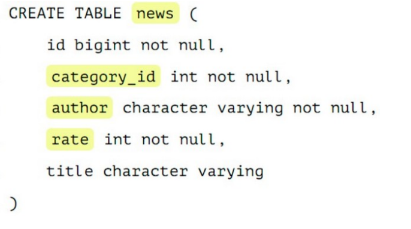
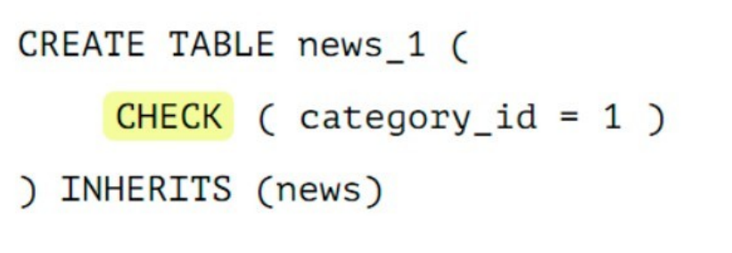

#### [Оглавление](../README.md)

# Базы данных
+ [Что такое _«база данных»_?](#что-такое-база-данных-)
+ [Что такое _«система управления базами данных»_?](#что-такое-система-управления-базами-данных-)
+ [Что такое _«реляционная модель данных»_?](#что-такое-реляционная-модель-данных-)
+ [Дайте определение терминам _«простой»_, _«составной» (composite)_, _«потенциальный» (candidate)_ и _«альтернативный» (alternate)_ ключ.](#дайте-определение-терминам-простой--составной-composite--потенциальный-candidate-и-альтернативный-alternate-ключ)
+ [Что такое _«первичный ключ» (primary key)_? Каковы критерии его выбора?](#что-такое-первичный-ключ-primary-key--каковы-критерии-его-выбора)
+ [Что такое _«внешний ключ» (foreign key)_?](#что-такое-внешний-ключ-foreign-key-)
+ [Что такое _«нормализация»_?](#что-такое-нормализация-)
+ [Какие существуют нормальные формы?](#какие-существуют-нормальные-формы)
+ [Что такое _«денормализация»_? Для чего она применяется?](#что-такое-денормализация--для-чего-она-применяется)
+ [Какие существуют типы связей в базе данных? Приведите примеры.](#какие-существуют-типы-связей-в-базе-данных-Приведите-примеры)
+ [Что такое _«индексы»_? Для чего их используют? В чём заключаются их преимущества и недостатки?](#что-такое-индексы--для-чего-их-используют-в-чём-заключаются-их-преимущества-и-недостатки)
+ [Какие типы индексов существуют?](#какие-типы-индексов-существуют)
+ [В чем отличие между кластерными и некластерными индексами?](#в-чем-отличие-между-кластерными-и-некластерными-индексами)
+ [Имеет ли смысл индексировать данные, имеющие небольшое количество возможных значений?](#имеет-ли-смысл-индексировать-данные-имеющие-небольшое-количество-возможных-значений)
+ [Когда полное сканирование набора данных выгоднее доступа по индексу?](#когда-полное-сканирование-набора-данных-выгоднее-доступа-по-индексу)
+ [Что такое транзакции? Расскажите про принципы ACID](#что-такое-транзакция-)
+ [Назовите основные свойства транзакции.](#назовите-основные-свойства-транзакции)
+ [Какие существуют уровни изолированности транзакций?](#какие-существуют-уровни-изолированности-транзакций)
+ [Какие проблемы могут возникать при параллельном доступе с использованием транзакций?](#какие-проблемы-могут-возникать-при-параллельном-доступе-с-использованием-транзакций)
+ [Что такое TIMESTAMP?](#Что такое TIMESTAMP?)
+ [Шардирование БД](#шардирование-бд)
+ [EXPLAIN](#explain)
+ [Как сделать запрос из двух баз?](#как-сделать-запрос-из-двух-баз)
+ [Что быстрее убирает дубликаты: distinct или group by?](#что-быстрее-убирает-дубликаты--distinct-или-group-by)
_______________________________________________________________________________________________________________________
<span style="display: inline-block; float: right">[содержание](#базы-данных)</span>

## Что такое _«база данных»_?

__База данных__ — организованный и адаптированный для обработки вычислительной системой набор информации.
_______________________________________________________________________________________________________________________
<span style="display: inline-block; float: right">[содержание](#базы-данных)</span>

## Что такое _«система управления базами данных»_?
__Система управления базами данных (СУБД)__ - набор средств общего или специального назначения, обеспечивающий 
создание, доступ к материалам и управление базой данных.

Основные функции СУБД:

+ управление данными
+ журнализация изменений данных
+ резервное копирование и восстановление данных;
+ поддержка языка определения данных и манипулирования ими.
_______________________________________________________________________________________________________________________
<span style="display: inline-block; float: right">[содержание](#базы-данных)</span>

## Что такое _«реляционная модель данных»_?

__Реляционная модель данных__ — это логическая модель данных и прикладная теория построения реляционных баз данных.

Реляционная модель данных включает в себя следующие компоненты:

+ _Структурный аспект_ — данные представляют собой набор отношений.
+ _Аспект целостности_ — отношения отвечают определенным условиям целостности: уровня домена (типа данных), уровня отношения и уровня базы данных.
+ _Аспект обработки (манипулирования)_ — поддержка операторов манипулирования отношениями (реляционная алгебра, реляционное исчисление).
+ _Нормальная форма_ - свойство отношения в реляционной модели данных, характеризующее его с точки зрения избыточности и определённое как совокупность требований, которым должно удовлетворять отношение.
_______________________________________________________________________________________________________________________
<span style="display: inline-block; float: right">[содержание](#базы-данных)</span>

## Дайте определение терминам _«простой»_, _«составной» (composite)_, _«потенциальный» (candidate)_ и _«альтернативный» (alternate)_ ключ

__Простой ключ__ состоит из одного атрибута (поля). __Составной__ - из двух и более.

__Потенциальный ключ__ - простой или составной ключ, который уникально идентифицирует каждую запись набора данных. 
При этом потенциальный ключ должен обладать критерием неизбыточности: при удалении любого из полей набор полей перестает 
уникально идентифицировать запись.

Из множества всех потенциальных ключей набора данных выбирают первичный ключ, все остальные ключи называют __альтернативными__.
_______________________________________________________________________________________________________________________
<span style="display: inline-block; float: right">[содержание](#базы-данных)</span>

## Что такое _«первичный ключ» (primary key)_? Каковы критерии его выбора?

__Первичный ключ (primary key)__ в реляционной модели данных один из _потенциальных ключей_ отношения, выбранный в 
качестве основного ключа (ключа по умолчанию).

Если в отношении имеется единственный потенциальный ключ, он является и первичным ключом. Если потенциальных ключей
несколько, один из них выбирается в качестве первичного, а другие называют _«альтернативными»_.

В качестве первичного обычно выбирается тот из потенциальных ключей, который наиболее удобен. Поэтому в качестве 
первичного ключа, как правило, выбирают тот, который имеет наименьший размер (физического хранения) и/или включает 
наименьшее количество атрибутов. Другой критерий выбора первичного ключа — сохранение его уникальности со временем. 
Поэтому в качестве первичного ключа стараются выбирать такой потенциальный ключ, который с наибольшей вероятностью 
никогда не утратит уникальность.
_______________________________________________________________________________________________________________________
<span style="display: inline-block; float: right">[содержание](#базы-данных)</span>

## Что такое _«внешний ключ» (foreign key)_?

__Внешний ключ (foreign key)__ — подмножество атрибутов некоторого отношения A, значения которых должны совпадать со 
значениями некоторого потенциального ключа некоторого отношения B.
_______________________________________________________________________________________________________________________
<span style="display: inline-block; float: right">[содержание](#базы-данных)</span>

## Что такое _«нормализация»_?

_Нормализация_ - это процесс преобразования отношений базы данных к виду, отвечающему нормальным формам (пошаговый, 
обратимый процесс замены исходной схемы другой схемой, в которой наборы данных имеют более простую и логичную структуру).

Нормализация предназначена для приведения структуры базы данных к виду, обеспечивающему минимальную логическую избыточность, 
и не имеет целью уменьшение или увеличение производительности работы или же уменьшение или увеличение физического объёма
базы данных. Конечной целью нормализации является уменьшение потенциальной противоречивости хранимой в базе данных информации.

Целью является уменьшение потенциальной противоречивости хранимой в базе данных информации.
_______________________________________________________________________________________________________________________
<span style="display: inline-block; float: right">[содержание](#базы-данных)</span>

## Какие существуют нормальные формы?
1. __Первая нормальная форма (1NF)__ - Отношение находится в 1NF, если значения всех его атрибутов атомарны (неделимы).

Требование первой нормальной формы (1NF) очень простое и оно заключается в том, чтобы таблицы соответствовали реляционной 
модели данных и соблюдали определённые реляционные принципы.

Таким образом, чтобы база данных находилась в 1 нормальной форме, необходимо чтобы ее таблицы соблюдали следующие реляционные принципы:
+ В таблице не должно быть дублирующих строк
+ В каждой ячейке таблицы хранится атомарное значение (одно не составное значение)
+ В столбце хранятся данные одного типа
+ Отсутствуют массивы и списки в любом виде

2. __Вторая нормальная форма (2NF)__ - Отношение находится в 2NF, если оно находится в 1NF, и при этом все неключевые
атрибуты зависят только от ключа целиком, а не от какой-то его части.

Чтобы база данных находилась во второй нормальной форме (2NF), необходимо чтобы ее таблицы удовлетворяли следующим требованиям:
+ Таблица должна находиться в первой нормальной форме
+ Таблица должна иметь ключ
+ Все неключевые столбцы таблицы должны зависеть от полного ключа (в случае если он составной)

3. __Третья нормальная форма (3NF)__ - Отношение находится в 3NF, если оно находится в 2NF и все неключевые атрибуты не 
зависят друг от друга.

Требование третьей нормальной формы (3NF) заключается в том, чтобы в таблицах отсутствовала транзитивная зависимость.
__Транзитивная зависимость__ – это когда неключевые столбцы зависят от значений других неключевых столбцов.
+ Нормальная форма Бойса-Кодда, усиленная 3 нормальная форма (BCNF) – когда каждая ее нетривиальная и неприводимая 
слева функциональная зависимость имеет в качестве своего детерминанта некоторый потенциальный ключ.

Требования нормальной формы Бойса-Кодда следующие:
+ Таблица должна находиться в третьей нормальной форме. Здесь все как обычно, т.е. как и у всех остальных нормальных
форм, первое требование заключается в том, чтобы таблица находилась в предыдущей нормальной форме, в данном случае в 
третьей нормальной форме;
+ Ключевые атрибуты составного ключа не должны зависеть от неключевых атрибутов

4. __Четвёртая нормальная форма (4NF)__ - Отношение находится в 4NF , если оно находится в 3NF и если в нем не содержатся 
независимые группы атрибутов, между которыми существует отношение «многие-ко-многим».

Требование четвертой нормальной формы (4NF) заключается в том, чтобы в таблицах отсутствовали нетривиальные многозначные зависимости.

В таблицах многозначная зависимость выглядит следующим образом.

Начнем с того, что таблица должна иметь как минимум три столбца, допустим A, B и C, при этом B и C между собой никак не 
связаны и не зависят друг от друга, но по отдельности зависят от A, и для каждого значения A есть множество значений B, 
а также множество значений C.

В данном случае многозначная зависимость обозначается вот так:

A —> B

A —> C

5. __Пятая нормальная форма (5NF)__ - Отношение находится в 5NF, когда каждая нетривиальная зависимость соединения в ней 
определяется потенциальным ключом (ключами) этого отношения.

6. __Шестая нормальная форма (6NF)__ - Отношение находится в 6NF, когда она удовлетворяет всем нетривиальным зависимостям 
соединения, т.е. когда она неприводима, то есть не может быть подвергнута дальнейшей декомпозиции без потерь. Каждая 
переменная отношения, которая находится в 6NF, также находится и в 5NF. Введена как обобщение пятой нормальной формы 
для хронологической базы данных.

7. __Нормальная форма Бойса-Кодда, усиленная 3 нормальная форма (BCNF)__ - Отношение находится в BCNF, когда каждая её 
нетривиальная и неприводимая слева функциональная зависимость имеет в качестве своего детерминанта некоторый потенциальный ключ.

8. __Доменно-ключевая нормальная форма (DKNF)__ -  Отношение находится в DKNF, когда каждое наложенное на неё ограничение 
является логическим следствием ограничений доменов и ограничений ключей, наложенных на данное отношение.

__Ограничение домена__ – это ограничение, предписывающее использование для определенного атрибута значений только из некоторого з
аданного домена (набора значений).

__Ограничение ключа__ – это ограничение, утверждающее, что некоторый атрибут или комбинация атрибутов представляет собой 
потенциальный ключ.

Таким образом, требование доменно-ключевой нормальной формы заключается в том, чтобы каждое наложенное ограничение на
таблицу являлось логическим следствием ограничений доменов и ограничений ключей, которые накладываются на данную таблицу.
_______________________________________________________________________________________________________________________
<span style="display: inline-block; float: right">[содержание](#базы-данных)</span>

## Что такое _«денормализация»_? Для чего она применяется?

__Денормализация базы данных__ — это процесс осознанного приведения базы данных к виду, в котором она не будет 
соответствовать правилам нормализации. Обычно это необходимо для повышения производительности и скорости извлечения данных, 
за счет увеличения избыточности данных.
_______________________________________________________________________________________________________________________
<span style="display: inline-block; float: right">[содержание](#базы-данных)</span>

## Какие существуют типы связей в базе данных? Приведите примеры.

+ __Один к одному__ - любому значению атрибута А соответствует только одно значение атрибута В, и наоборот.

>Каждый университет гарантированно имеет 1-го ректора: _1 университет → 1 ректор_.

+ __Один ко многим__ - любому значению атрибута А соответствует 0, 1 или несколько значений атрибута В.

>В каждом университете есть несколько факультетов: _1 университет → много факультетов_.

+ __Многие ко многим__ - любому значению атрибута А соответствует 0, 1 или несколько значений атрибута В, и любому 
+ значению атрибута В соответствует 0, 1 или несколько значение атрибута А.

>1 профессор может преподавать на нескольких факультетах, в то же время на 1-ом факультете может преподавать несколько 
> профессоров: _Несколько профессоров ↔ Несколько факультетов_.
_______________________________________________________________________________________________________________________
<span style="display: inline-block; float: right">[содержание](#базы-данных)</span>

## Что такое _«индексы»_? Для чего их используют? В чём заключаются их преимущества и недостатки?

__Индекс (index)__ — объект базы данных, создаваемый с целью повышения производительности выборки данных.

Наборы данных могут иметь большое количество записей, которые хранятся в произвольном порядке, и их поиск по заданному 
критерию путём последовательного просмотра набора данных запись за записью может занимать много времени. Индекс формируется 
из значений одного или нескольких полей и указателей на соответствующие записи набора данных, - таким образом, достигается 
значительный прирост скорости выборки из этих данных.

Преимущества

+ ускорение поиска и сортировки по определенному полю или набору полей.
+ обеспечение уникальности данных.

Недостатки

+ требование дополнительного места на диске и в оперативной памяти и чем больше/длиннее ключ, тем больше размер индекса.
+ замедление операций вставки, обновления и удаления записей, поскольку при этом приходится обновлять сами индексы.

Индексы предпочтительней для:

+ Поля-счетчика, чтобы в том числе избежать и повторения значений в этом поле;
+ Поля, по которому проводится сортировка данных;
+ Полей, по которым часто проводится соединение наборов данных. Поскольку в этом случае данные располагаются в порядке 
возрастания индекса и соединение происходит значительно быстрее;
+ Поля, которое объявлено первичным ключом (primary key);
+ Поля, в котором данные выбираются из некоторого диапазона. В этом случае как только будет найдена первая запись с нужным 
значением, все последующие значения будут расположены рядом.

Использование индексов нецелесообразно для:

+ Полей, которые редко используются в запросах;
+ Полей, которые содержат всего два или три значения, например: _мужской_,  _женский пол_ или значения _«да»_, _«нет»_.
_______________________________________________________________________________________________________________________
<span style="display: inline-block; float: right">[содержание](#базы-данных)</span>

## Какие типы индексов существуют?

__По порядку сортировки__
+ _упорядоченные_ — индексы, в которых элементы упорядочены;
+ _возрастающие_;
+ _убывающие_;
+ _неупорядоченные_ — индексы, в которых элементы неупорядочены.

__По источнику данных__
+ _индексы по представлению (view)_;
+ _индексы по выражениям_.

__По воздействию на источник данных__
+ _кластерный индекс_ - при определении в наборе данных физическое расположение данных перестраивается в соответствии со 
структурой индекса. Логическая структура набора данных в этом случае представляет собой скорее словарь, чем индекс. Данные 
в словаре физически упорядочены, например по алфавиту. Кластерные индексы могут дать существенное увеличение производительности 
поиска данных даже по сравнению с обычными индексами. Увеличение производительности особенно заметно при работе с последовательными данными.
+ _некластерный индекс_ — наиболее типичные представители семейства индексов. В отличие от кластерных, они не перестраивают 
физическую структуру набора данных, а лишь организуют ссылки на соответствующие записи. Для идентификации нужной записи в 
наборе данных некластерный индекс организует специальные указатели, включающие в себя: информацию об идентификационном 
номере файла, в котором хранится запись; идентификационный номер страницы соответствующих данных; номер искомой записи 
на соответствующей странице; содержимое столбца.

__По структуре__
+ _B*-деревья_;
+ _B+-деревья_;
+ _B-деревья_;
+ _Хэши_.

__По количественному составу__
+ _простой индекс (индекс с одним ключом)_ — строится по одному полю;
+ _составной (многоключевой, композитный) индекс_ — строится по нескольким полям при этом важен порядок их следования;
+ _индекс с включенными столбцами_ — некластеризованный индекс, дополнительно содержащий кроме ключевых столбцов еще и 
неключевые;
+ _главный индекс (индекс по первичному ключу)_ — это тот индексный ключ, под управлением которого в данный момент 
находится набор данных. Набор данных не может быть отсортирован по нескольким индексным ключам одновременно. Хотя, если 
один и тот же набор данных открыт одновременно в нескольких рабочих областях, то у каждой копии набора данных может быть 
назначен свой главный индекс.

__По характеристике содержимого__
+ _уникальный индекс_ состоит из множества уникальных значений поля;
+ _плотный индекс_ (NoSQL) — индекс, при котором, каждом документе в индексируемой коллекции соответствует запись в 
индексе, даже если в документе нет индексируемого поля.
+ _разреженный индекс_ (NoSQL) — тот, в котором представлены только те документы, для которых индексируемый ключ имеет 
какое-то определённое значение (существует).
+ _пространственный индекс_ — оптимизирован для описания географического местоположения. Представляет из себя многоключевой 
индекс состоящий из широты и долготы.
+ _составной пространственный индекс_ — индекс, включающий в себя кроме широты и долготы ещё какие-либо мета-данные (например теги). 
Но географические координаты должны стоять на первом месте.
+ _полнотекстовый (инвертированный) индекс_ — словарь, в котором перечислены все слова и указано, в каких местах они встречаются. 
При наличии такого индекса достаточно осуществить поиск нужных слов в нём и тогда сразу же будет получен список документов,
в которых они встречаются.
+ _хэш-индекс_ предполагает хранение не самих значений, а их хэшей, благодаря чему уменьшается размер (а, соответственно, и
увеличивается скорость их обработки) индексов из больших полей. Таким образом, при запросах с использованием хэш-индексов, 
сравниваться будут не искомое со значения поля, а хэш от искомого значения с хэшами полей. Из-за нелинейнойсти хэш-функций данный 
индекс нельзя сортировать по значению, что приводит к невозможности использования в сравнениях 
+ больше/меньше и «is null». Кроме того, так как хэши не уникальны, то для совпадающих хэшей применяются методы разрешения коллизий.
+ _битовый индекс (bitmap index)_ — метод битовых индексов заключается в создании отдельных битовых карт (последовательностей 0 и 1) 
для каждого возможного значения столбца, где каждому биту соответствует запись с индексируемым значением, а его значение равное 1 
означает, что запись, соответствующая позиции бита содержит индексируемое значение для данного столбца или свойства.
+ _обратный индекс (reverse index)_ — B-tree индекс, но с реверсированным ключом, используемый в основном для монотонно 
возрастающих значений (например, автоинкрементный идентификатор) в OLTP системах с целью снятия конкуренции за последний 
листовой блок индекса, т.к. благодаря переворачиванию значения две соседние записи индекса попадают в разные блоки индекса. 
Он не может использоваться для диапазонного поиска.
+ _функциональный индекс, индекс по вычисляемому полю (function-based index)_ — индекс, ключи которого хранят результат 
пользовательских функций. Функциональные индексы часто строятся для полей, значения которых проходят предварительную 
обработку перед сравнением в команде SQL. Например, при сравнении строковых данных без учета регистра символов часто 
используется функция UPPER. Кроме того, функциональный индекс может помочь реализовать любой другой отсутствующий тип 
индексов данной СУБД.
+ _первичный индекс_ — уникальный индекс по полю первичного ключа.
+ _вторичный индекс_ — индекс по другим полям (кроме поля первичного ключа).
+ _XML-индекс_ — вырезанное материализованное представление больших двоичных XML-объектов (BLOB) в столбце с типом данных xml.

__По механизму обновления__
+ _полностью перестраиваемый_ — при добавлении элемента заново перестраивается весь индекс.
+ _пополняемый (балансируемый)_ — при добавлении элементов индекс перестраивается частично (например, одна из ветви) и 
периодически балансируется.

__По покрытию индексируемого содержимого__
+ _полностью покрывающий (полный) индекс_ — покрывает всё содержимое индексируемого объекта.
+ _частичный индекс (partial index)_ — это индекс, построенный на части набора данных, удовлетворяющей определенному 
условию самого индекса. Данный индекс создан для уменьшения размера индекса.
+ _инкрементный (delta) индекс_ — индексируется малая часть данных(дельта), как правило, по истечении определённого 
времени. Используется при интенсивной записи. Например, полный индекс перестраивается раз в сутки, а дельта-индекс 
строится каждый час. По сути это частичный индекс по временной метке.
+ _индекс реального времени (real-time index)_ — особый вид инкрементного индекса, характеризующийся высокой скоростью 
построения. Предназначен для часто меняющихся данных.

__Индексы в кластерных системах__
+ _глобальный индекс_ — индекс по всему содержимому всех сегментов БД (shard).
+ _сегментный индекс_ — глобальный индекс по полю-сегментируемому ключу (shard key). Используется для быстрого 
определения сегмента, на котором хранятся данные в процессе маршрутизации запроса в кластере БД.
+ _локальный индекс_ —  индекс по содержимому только одного сегмента БД.
_______________________________________________________________________________________________________________________
<span style="display: inline-block; float: right">[содержание](#базы-данных)</span>

## В чем отличие между кластерными и некластерными индексами?

Некластерные индексы - данные физически расположены в произвольном порядке, но логически упорядочены согласно индексу. 
Такой тип индексов подходит для часто изменяемого набора данных.

При кластерном индексировании данные физически упорядочены, что серьезно повышает скорость выборок данных (но только в 
случае последовательного доступа к данным). Для одного набора данных может быть создан только один кластерный индекс.
_______________________________________________________________________________________________________________________
<span style="display: inline-block; float: right">[содержание](#базы-данных)</span>

## Имеет ли смысл индексировать данные, имеющие небольшое количество возможных значений?

Примерное правило, которым можно руководствоваться при создании индекса - если объем информации (в байтах) НЕ удовлетворяющей 
условию выборки меньше, чем размер индекса (в байтах) по данному условию выборки, то в общем случае оптимизация приведет к замедлению выборки.
_______________________________________________________________________________________________________________________
<span style="display: inline-block; float: right">[содержание](#базы-данных)</span>

## Когда полное сканирование набора данных выгоднее доступа по индексу?

Полное сканирование производится многоблочным чтением. Сканирование по индексу - одноблочным. Также, при доступе по индексу 
сначала идет сканирование самого индекса, а затем чтение блоков из набора данных. Число блоков, которые надо при этом 
прочитать из набора зависит от фактора кластеризации. Если суммарная стоимость всех необходимых одноблочных чтений больше 
стоимости полного сканирования многоблочным чтением, то полное сканирование выгоднее, и оно выбирается оптимизатором.

Таким образом, полное сканирование выбирается при слабой селективности предикатов запроса и/или слабой кластеризации данных, 
либо в случае очень маленьких наборов данных.
_______________________________________________________________________________________________________________________
<span style="display: inline-block; float: right">[содержание](#базы-данных)</span>

## Что такое _«транзакция»_?

__Транзакция__ - это воздействие на базу данных, переводящее её из одного целостного состояния в другое и выражаемое в 
изменении данных, хранящихся в базе данных.
_______________________________________________________________________________________________________________________
<span style="display: inline-block; float: right">[содержание](#базы-данных)</span>

## Назовите основные свойства транзакции

__Атомарность (atomicity)__ гарантирует, что никакая транзакция не будет зафиксирована в системе частично. Будут либо 
выполнены все её подоперации, либо не выполнено ни одной.

__Согласованность (consistency)__. Транзакция, достигающая своего нормального завершения и, тем самым, фиксирующая 
свои результаты, сохраняет согласованность базы данных.

__Изолированность (isolation)__. Во время выполнения транзакции параллельные транзакции не должны оказывать влияние 
на её результат.

__Долговечность (durability)__. Независимо от проблем на нижних уровнях (к примеру, обесточивание системы или сбои в 
оборудовании) изменения, сделанные успешно завершённой транзакцией, должны остаться сохранёнными после возвращения системы в работу.
_______________________________________________________________________________________________________________________
<span style="display: inline-block; float: right">[содержание](#базы-данных)</span>

## Какие существуют уровни изолированности транзакций?

В порядке увеличения изолированности транзакций и, соответственно, надёжности работы с данными:

+ __Чтение неподтверждённых данных (грязное чтение) (read uncommitted, dirty read)__ — чтение незафиксированных изменений 
как своей транзакции, так и параллельных транзакций. Нет гарантии, что данные, изменённые другими транзакциями, не будут 
в любой момент изменены в результате их отката, поэтому такое чтение является потенциальным источником ошибок. Невозможны 
потерянные изменения, возможны неповторяемое чтение и фантомы.
+ __Чтение подтверждённых данных (read committed)__ — чтение всех изменений своей транзакции и зафиксированных изменений 
параллельных транзакций. Потерянные изменения и грязное чтение не допускается, возможны неповторяемое чтение и фантомы.
+ __Повторяемость чтения (repeatable read, snapshot)__ — чтение всех изменений своей транзакции, любые изменения, 
внесённые параллельными транзакциями после начала своей, недоступны. Потерянные изменения, грязное и неповторяемое 
чтение невозможны, возможны фантомы.
+ __Упорядочиваемость (serializable)__ — результат параллельного выполнения сериализуемой транзакции с другими 
транзакциями должен быть логически эквивалентен результату их какого-либо последовательного выполнения. Проблемы синхронизации не возникают.
_______________________________________________________________________________________________________________________
<span style="display: inline-block; float: right">[содержание](#базы-данных)</span>

## Какие проблемы могут возникать при параллельном доступе с использованием транзакций?

При параллельном выполнении транзакций возможны следующие проблемы:

+ __Потерянное обновление (lost update)__ — при одновременном изменении одного блока данных разными транзакциями одно из 
изменений теряется;
+ __«Грязное» чтение (dirty read)__ — чтение данных, добавленных или изменённых транзакцией, которая впоследствии не 
подтвердится (откатится);
+ __Неповторяющееся чтение (non-repeatable read)__ — при повторном чтении в рамках одной транзакции ранее прочитанные 
данные оказываются изменёнными;
+ __Фантомное чтение (phantom reads)__ — одна транзакция в ходе своего выполнения несколько раз выбирает множество 
записей по одним и тем же критериям. Другая транзакция в интервалах между этими выборками добавляет или удаляет записи 
или изменяет столбцы некоторых записей, используемых в критериях выборки первой транзакции, и успешно заканчивается. 
В результате получится, что одни и те же выборки в первой транзакции дают разные множества записей.
  Предположим, имеется две транзакции, открытые различными приложениями, в которых выполнены следующие SQL-операторы:

| Транзакция 1 |	Транзакция 2 |
|--------------|--------------|
| | SELECT SUM(f2) FROM tbl1; |
| INSERT INTO tbl1 (f1,f2) VALUES (15,20);	| |
| COMMIT;	| |
| | SELECT SUM(f2) FROM tbl1;|

В транзакции 2 выполняется SQL-оператор, использующий все значения поля f2. Затем в транзакции 1 выполняется вставка новой 
строки, приводящая к тому, что повторное выполнение SQL-оператора в транзакции 2 выдаст другой результат. Такая ситуация 
называется чтением фантома (фантомным чтением). От неповторяющегося чтения оно отличается тем, что результат повторного 
обращения к данным изменился не из-за изменения/удаления самих этих данных, а из-за появления новых (фантомных) данных.
_______________________________________________________________________________________________________________________
<span style="display: inline-block; float: right">[содержание](#базы-данных)</span>

## Что такое TIMESTAMP?

DATETIME предназначен для хранения целого числа: YYYYMMDDHHMMSS. И это время не зависит от временной зоны настроенной на сервере. 
Размер 8 байт.

TIMESTAMP хранит значение равное количеству секунд, прошедших с полуночи 1 января 1970 года по усредненному времени Гринвича. 
Тогда была создана Unix. При получении из базы отображается с учетом часового пояса. Размер 4 байта.
_______________________________________________________________________________________________________________________
<span style="display: inline-block; float: right">[содержание](#базы-данных)</span>

## Шардирование БД

При большом количестве данных запросы начинают долго выполняться, и сервер начинает не справляться с нагрузкой. 
Одно из решений – масштабирование базы данных. Например, шардинг или репликация.

Шардинг бывает вертикальным (партицирование) и горизонтальным.

У нас есть большая таблица, например, с пользователями. __Партицирование__ – это когда мы одну большую таблицу разделяем 
на много маленьких по какому-либо принципу. Единственное отличие горизонтального масштабирования от вертикального в том, что
горизонтальное будет разносить данные по разным инстансам в других базах. 

Есть таблица news, в которой есть идентификатор, есть категория, в которой эта новость расположена, есть автор новости.



Нужно сделать 2 действия над табличкой
1. Поставить у нашего шарда, например, news_1, то, что она будет наследоваться от news. Наследованная таблица будет иметь 
все колонки родителя, а также она может иметь свои колонки, которые мы дополнительно туда добавим. Там не будет ограничений, 
индексов и триггеров от родителя. Это важно.
2. Поставить ограничения. Это будет проверка, что в эту таблицу будут попадать данные только с нужным признаком.



Т. е. только записи с category_id=1 будут попадать в эту таблицу. 
На базовую таблицу надо добавить правило. Когда будем работать с таблицей news, вставка на запись с category_id = 1
должна попасть именно в партицию news_1. Правило называем, как хотим.


_______________________________________________________________________________________________________________________
<span style="display: inline-block; float: right">[содержание](#базы-данных)</span>

## EXPLAIN

Когда выполняете какой-нибудь запрос, оптимизатор запросов MySQL пытается придумать оптимальный план выполнения этого запроса. 
Можно посмотреть этот план, используя запрос с ключевым словом EXPLAIN перед оператором SELECT.
   
`EXPLAIN SELECT * FROM categories`

После EXPLAIN в запросе можно использовать ключевое слово `EXTENDED`, и `MySQL` покажет дополнительную информацию о том, 
как выполняется запрос. Чтобы увидеть эту информацию, нужно сразу после запроса с `EXTENDED` выполнить запрос `SHOW WARNINGS`.

`EXPLAIN EXTENDED SELECT City.Name FROM City`

Затем

`SHOW WARNINGS`
_______________________________________________________________________________________________________________________
<span style="display: inline-block; float: right">[содержание](#базы-данных)</span>

## Как сделать запрос из двух баз?

Если в запросе таблица указывается с именем базы данных database1.table1, то таблица выбирается из database1, если просто 
table1, то из активной базы данных.

Надо, чтобы базы были на одном сервере.
```sql 
SELECT t1.*, t2.*
FROM database1.table1 AS t1
INNER JOIN database2.table2 AS t2 ON t1.field1 = t2.field1
```
_______________________________________________________________________________________________________________________
<span style="display: inline-block; float: right">[содержание](#базы-данных)</span>

## Что быстрее убирает дубликаты: distinct или group by?
Если нужны уникальные значения – DISTINCT.

Если нужно группировать значения – GROUP BY.

Если задача заключается именно в поиске дубликатов – GROUP BY будет лучше


