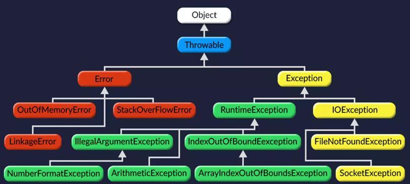

#### [Оглавление](../README.md)

# Исключения
+ [Что такое исключение?](#что-такое-исключение)
+ [Опишите иерархию исключений.](#опишите-иерархию-исключений)
+ [Какие виды исключений в Java вы знаете, чем они отличаются?](#какие-виды-исключений-в-java-вы-знаете-чем-они-отличаются)
+ [Что такое _checked_ и _unchecked exception_?](#что-такое-checked-и-unchecked-exception-)
+ [Какой оператор позволяет принудительно выбросить исключение?](#какой-оператор-позволяет-принудительно-выбросить-исключение)
+ [О чем говорит ключевое слово `throws`?](#о-чем-говорит-ключевое-слово-throws-)
+ [Как написать собственное («пользовательское») исключение?](#как-написать-собственное--пользовательское--исключение)
+ [Какие существуют _unchecked exception_?](#какие-существуют-unchecked-exception-)
+ [Что представляют из себя ошибки класса `Error`?](#что-представляют-из-себя-ошибки-класса-error-)
+ [Что вы знаете о `OutOfMemoryError`?](#что-вы-знаете-о-outofmemoryerror-)
+ [Опишите работу блока _try-catch-finally_](#опишите-работу-блока-try-catch-finally)
+ [Что такое механизм _try-with-resources_?](#что-такое-механизм-try-with-resources-)
+ [Возможно ли использование блока _try-finally_ (без `catch`)?](#возможно-ли-использование-блока-try-finally--без-catch--)
+ [Может ли один блок `catch` отлавливать сразу несколько исключений?](#может-ли-один-блок-catch-отлавливать-сразу-несколько-исключений)
+ [Всегда ли исполняется блок `finally`?](#всегда-ли-исполняется-блок-finally-)
+ [Существуют ли ситуации, когда блок `finally` не будет выполнен?](#существуют-ли-ситуации-когда-блок-finally-не-будет-выполнен)
+ [Может ли метод _main()_ выбросить исключение во вне и если да, то где будет происходить обработка данного исключения?](#может-ли-метод-main-выбросить-исключение-во-вне-и-если-да-то-где-будет-происходить-обработка-данного-исключения)
+ [Предположим, есть метод, который может выбросить `IOException` и `FileNotFoundException` в какой последовательности должны идти блоки `catch`? Сколько блоков `catch` будет выполнено?](#предположим-есть-метод-который-может-выбросить-ioexception-и-filenotfoundexception-в-какой-последовательности)
+ [В каком порядке следует обрабатывать исключения в catch-блоках?](#в-каком-порядке-следует-обрабатывать-исключения-в-catch-блоках)
+ [Опишите механизм try-with-resources?](#опишите-механизм-try-with-resources)
+ [Что произойдет, если исключение будет выброшено из блока catch, после чего другое исключение будет выброшено из блока finally?](#что-произойдет-если-исключение-будет-выброшено-из-блока-catch-после-чего-другое-исключение-будет-выброшено-из-блока-finally)
+ [Что произойдет, если исключение будет выброшено из блока catch, после чего другое исключение будет выброшено из метода close() при использовании try-with-resources?](#что-произойдет-если-исключение-будет-выброшено-из-блока-catch-после-чего-другое-исключение-будет-выброшено-из-метода-close---при-использовании-try-with-resources)

_______________________________________________________________________________________________________________________
<span style="display: inline-block; float: right">[содержание](#исключения)</span>
## Что такое исключение?

___Исключение___ – это ошибка (является объектом), возникающая во время выполнения программы.
_______________________________________________________________________________________________________________________
<span style="display: inline-block; float: right">[содержание](#исключения)</span>

## Опишите иерархию исключений.



Исключения делятся на несколько классов, но все они имеют общего предка — класс `Throwable`, потомками которого 
являются классы `Exception` и `Error`.

__Ошибки (Errors)__ представляют собой более серьёзные проблемы, которые, согласно спецификации Java, не следует 
обрабатывать в собственной программе, поскольку они связаны с проблемами уровня JVM. Например, исключения такого рода 
возникают, если закончилась память доступная виртуальной машине.

__Исключения (Exceptions)__ являются результатом проблем в программе, которые, в принципе, решаемы, предсказуемы и 
последствия которых, возможно, устранить внутри программы. Например, произошло деление целого числа на ноль.
_______________________________________________________________________________________________________________________
<span style="display: inline-block; float: right;">[содержание](#исключения)</span>

## Какие виды исключений в Java вы знаете, чем они отличаются?
checked и unchecked
_______________________________________________________________________________________________________________________
<span style="display: inline-block; float: right;">[содержание](#исключения)</span>

## Что такое _checked_ и _unchecked exception_?

В Java все исключения делятся на два типа:

+ __checked (контролируемые/проверяемые исключения)__ исключения, которые мы должны обрабатывать блоком `catch` или описываться в заголовке
метода (например, `throws IOException`). Наличие такого обработчика/модификатора в заголовке метода проверяется на 
этапе компиляции. Пример исключений при работе с файлами, БД - все классы, которые открывают соединения с внешними 
ресурсами, например IOException, Input-Output Exception;

+ __unchecked (неконтролируемые/непроверяемые исключения)__ исключения, которые обрабатывать необязательно и к которым относятся 
ошибки `Error` (например,`OutOfMemoryError`), обрабатывать которые не рекомендуется и исключения времени выполнения, 
представленные классом`RuntimeException` и его наследниками (например, `NullPointerException`), которые могут не 
обрабатываться блоком `catch` и не быть описанными в заголовке метода.
_______________________________________________________________________________________________________________________
<span style="display: inline-block; float: right">[содержание](#исключения)</span>

## Какой оператор позволяет принудительно выбросить исключение?

Это оператор `throw`:

```java
throw new Exception();
```
_______________________________________________________________________________________________________________________
<span style="display: inline-block; float: right">[содержание](#исключения)</span>

## О чем говорит ключевое слово `throws`?

Модификатор `throws` прописывается в сигнатуре метода и указывает на то, что метод потенциально может выбросить 
исключение с указанным типом.
_______________________________________________________________________________________________________________________
<span style="display: inline-block; float: right">[содержание](#исключения)</span>

## Как написать собственное («пользовательское») исключение?

Необходимо унаследоваться от базового класса требуемого типа исключений (например, от `Exception` или `RuntimeException`).

```java
class CustomException extends Exception {
    public CustomException() {
        super();
    }

    public CustomException(final String string) {
        super(string + " is invalid");
    }

    public CustomException(final Throwable cause) {
        super(cause);
    }
}
```
_______________________________________________________________________________________________________________________
<span style="display: inline-block; float: right">[содержание](#исключения)</span>

## Какие существуют _unchecked exception_?

Наиболее часто встречающиеся: `ArithmeticException`, `ClassCastException`, `ConcurrentModificationException`, 
`IllegalArgumentException`, `IllegalStateException`, `IndexOutOfBoundsException`, `NoSuchElementException`, 
`NullPointerException`, `UnsupportedOperationException`.
_______________________________________________________________________________________________________________________
<span style="display: inline-block; float: right">[содержание](#исключения)</span>

## Что представляют из себя ошибки класса `Error`?

Ошибки класса `Error` представляют собой наиболее серьёзные проблемы уровня JVM. Например, исключения такого рода 
возникают, если закончилась память доступная виртуальной машине. Обрабатывать такие ошибки не запрещается, но делать 
этого не рекомендуется.
_______________________________________________________________________________________________________________________
<span style="display: inline-block; float: right">[содержание](#исключения)</span>

## Что вы знаете о `OutOfMemoryError`?

`OutOfMemoryError` выбрасывается, когда виртуальная машина Java не может создать (разместить) объект из-за нехватки 
памяти, а сборщик мусора не может высвободить достаточное её количество.

Область памяти, занимаемая java процессом, состоит из нескольких частей. Тип `OutOfMemoryError` зависит от того, в 
какой из них не хватило места:

+ `java.lang.OutOfMemoryError: Java heap space`: Не хватает места в куче, а именно, в области памяти в которую 
помещаются объекты, создаваемые в приложении программно. Обычно проблема кроется в утечке памяти. Размер задается 
параметрами `-Xms` и `-Xmx`.
+ `java.lang.OutOfMemoryError: PermGen space`: (до версии Java 8) Данная ошибка возникает при нехватке места в
_Permanent_ области, размер которой задается параметрами `-XX:PermSize` и `-XX:MaxPermSize`.
+ `java.lang.OutOfMemoryError: GC overhead limit exceeded`: Данная ошибка может возникнуть как при переполнении 
первой, так и второй областей. Связана она с тем, что памяти осталось мало и сборщик мусора постоянно работает, 
пытаясь высвободить немного места. Данную ошибку можно отключить с помощью параметра `-XX:-UseGCOverheadLimit`.
+ `java.lang.OutOfMemoryError: unable to create new native thread`: Выбрасывается, когда нет возможности создавать
новые потоки.
_______________________________________________________________________________________________________________________
<span style="display: inline-block; float: right">[содержание](#исключения)</span>

## Опишите работу блока _try-catch-finally_

`try` — данное ключевое слово используется для отметки начала блока кода, который потенциально может привести к ошибке.
`catch` — ключевое слово для отметки начала блока кода, предназначенного для перехвата и обработки исключений в случае 
их возникновения.
`finally` — ключевое слово для отметки начала блока кода, который является дополнительным. Этот блок помещается после 
последнего блока `catch`. Управление передаётся в блок `finally` в любом случае, было выброшено исключение или нет.

Общий вид конструкции для обработки исключительной ситуации выглядит следующим образом:

```java
try { 
    //код, который потенциально может привести к исключительной ситуации 
} 
catch(SomeException e ) { //в скобках указывается класс конкретной ожидаемой ошибки  
    //код обработки исключительной ситуации
} 
finally {
    //необязательный блок, код которого выполняется в любом случае
}
```
_______________________________________________________________________________________________________________________
<span style="display: inline-block; float: right">[содержание](#исключения)</span>

## Что такое механизм _try-with-resources_?

Данная конструкция, которая появилась в Java 7, позволяет использовать блок _try-catch_ не заботясь о закрытии ресурсов, 
используемых в данном сегменте кода.
Ресурсы объявляются в скобках сразу после `try`, а компилятор уже сам неявно создаёт секцию `finally`, в которой и 
происходит освобождение занятых в блоке ресурсов. Под ресурсами подразумеваются сущности, реализующие интерфейс 
`java.lang.Autocloseable`.

Общий вид конструкции:

```java
try(/*объявление ресурсов*/) {
    //...
} catch(Exception ex) {
    //...
} finally {
    //...
}
```

Стоит заметить, что блоки `catch` и явный `finally` выполняются уже после того, как закрываются ресурсы в неявном 
`finally`.
_______________________________________________________________________________________________________________________
<span style="display: inline-block; float: right">[содержание](#исключения)</span>

## Возможно ли использование блока _try-finally_ (без `catch`)?

Такая запись допустима, но смысла в такой записи не так много, всё же лучше иметь блок `catch`, в котором будет 
обрабатываться необходимое исключение.
_______________________________________________________________________________________________________________________
<span style="display: inline-block; float: right">[содержание](#исключения)</span>

## Может ли один блок `catch` отлавливать сразу несколько исключений?

В Java 7 стала доступна новая языковая конструкция, с помощью которой можно перехватывать несколько исключений одним
блоком `catch`:

```java
try {  
    //...
} catch(IOException | SQLException ex) {
    //...
}
```
_______________________________________________________________________________________________________________________
<span style="display: inline-block; float: right">[содержание](#исключения)</span>

## Всегда ли исполняется блок `finally`?

Код в блоке `finally` будет выполнен всегда, независимо от того, выброшено исключение или нет.
_______________________________________________________________________________________________________________________
<span style="display: inline-block; float: right">[содержание](#исключения)</span>

## Существуют ли ситуации, когда блок `finally` не будет выполнен?

Например, когда JVM «умирает» - в такой ситуации `finally` недостижим и не будет выполнен, так как происходит 
принудительный системный выход из программы:

```java
try { 
    System.exit(0); 
} catch(Exception e) { 
    e.printStackTrace(); 
} finally { }
```
_______________________________________________________________________________________________________________________
<span style="display: inline-block; float: right">[содержание](#исключения)</span>

## Может ли метод _main()_ выбросить исключение во вне и если да, то где будет происходить обработка данного исключения?

Может и оно будет передано в виртуальную машину Java (JVM).
_______________________________________________________________________________________________________________________
<span style="display: inline-block; float: right">[содержание](#исключения)</span>

## Предположим, есть метод, который может выбросить `IOException` и `FileNotFoundException` в какой последовательности 

должны идти блоки `catch`? Сколько блоков `catch` будет выполнено?
Общее правило: обрабатывать исключения нужно от «младшего» к старшему. Т.е. нельзя поставить в первый блок 
`catch(Exception ex) {}`, иначе все дальнейшие блоки `catch()` уже ничего не смогут обработать, т.к. любое исключение 
будет соответствовать обработчику `catch(Exception ex)`.

Таким образом, исходя из факта, что `FileNotFoundException extends IOException` сначала нужно обработать 
`FileNotFoundException`, а затем уже `IOException`:

```java
void method() {
    try {
        //...
    } catch (FileNotFoundException ex) {
        //...
    } catch (IOException ex) {
        //...
    }
}
```
_______________________________________________________________________________________________________________________
<span style="display: inline-block; float: right">[содержание](#исключения)</span>

## В каком порядке следует обрабатывать исключения в catch-блоках?

От наследника к предку.
_______________________________________________________________________________________________________________________
<span style="display: inline-block; float: right">[содержание](#исключения)</span>

## Опишите механизм try-with-resources?

Данная конструкция, которая появилась в Java 7, позволяет использовать блок try-catch, не заботясь о закрытии ресурсов,
используемых в данном сегменте кода. Ресурсы объявляются в скобках сразу после try, а компилятор уже сам неявно создает 
секцию finally, в которой и происходит освобождение занятых в блоке ресурсов. Под ресурсами подразумеваются сущности, 
реализующие интерфейс java.lang.Autocloseable.

Стоит заметить, что блоки catch и явный finally выполняются уже после того, как закрываются ресурсы в неявном finally.
_______________________________________________________________________________________________________________________
<span style="display: inline-block; float: right">[содержание](#исключения)</span>

## Что произойдет, если исключение будет выброшено из блока catch, после чего другое исключение будет выброшено из блока finally?

finally-секция может «перебить» throw/return при помощи другого `throw/return`.
_______________________________________________________________________________________________________________________
<span style="display: inline-block; float: right">[содержание](#исключения)</span>

## Что произойдет, если исключение будет выброшено из блока catch, после чего другое исключение будет выброшено из метода close() при использовании try-with-resources?

В try-with-resources добавлена возможность хранения «подавленных» исключений, и брошенное try-блоком исключение имеет 
больший приоритет, чем исключения, получившиеся во время закрытия.