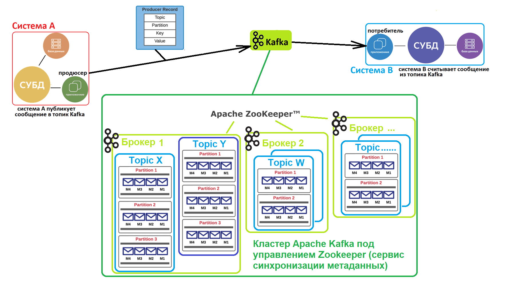

#### [Оглавление](../README.md)

# Kafka

+ [Что такое Kafka](#что-такое-kafka)
+ [Семантики](#семантики)

_______________________________________________________________________________________________________________________
[содержание](#kafka)

## Что такое Kafka

+ __Kafka __— брокер сообщений, с помощью которого разные микросервисы общаются друг с другом. Также используется для 
отправки логов (например в Graylog и Elastic), хранения данных и т. д.

+ __Брокер__ — узел Kafka, отвечает за прием, сохранение и передачу сообщений между продюсерами (Producer) и консюмерами 
(Consumer)

+ __Консюмер (Consumer)__ — получатель сообщения

+ __Продюсер (Producer)__ — отправитель сообщения

+ __Zookepeer__ — хранит конфигурации, состояния, обнаруживает брокеров, выбирает контроллер кластера, отслеживает 
состояние узлов и обеспечивает функциональность и надёжность кластера

+ __Контроллер кластера__ — отвечает за назначение мастеров партиций и отслеживает состояние брокеров

+ __Offset Kafka__ — это понятие, которое используется для обозначения позиции в потоке сообщений. Offset отслеживает, 
на каком месте в потоке находится каждый консюмер, чтобы он мог читать сообщения с нужной позиции.  
Каждый раз, когда потребитель читает сообщение, его позиция сдвигается на одно сообщение вперед.

+ __Партиция (Particion)__ — единица многопоточности в Kafka. Число партиций в топике можно лишь увеличивать. Партиции 
это те самые шарды, которые используются для шардирования в Kafka.

+ __Реплика (Replica)__ — копия партиции. Реплика может быть размещена на другом узле для обеспечения отказоустойчивости. 
Обеспечивает репликацию данных.

+ __Топик (topic)__ — служит для записи и чтения сообщений.

+ __Консюмер группа (Consumer group)__ — группа получателей сообщений.

_______________________________________________________________________________________________________________________
[содержание](#kafka)

## Семантики

__At most once__: В этой семантике продюсер считает сообщение успешно доставленным, как только оно отправлено брокеру, 
независимо от его фактической доставки потребителю. Это означает, что сообщения могут быть потеряны, если брокер не смог 
доставить их потребителям. Эта семантика обеспечивает максимальную пропускную способность, но не гарантирует доставку 
сообщений.

__At least once__: В этой семантике продюсер ждет подтверждения (ACK) от брокера о доставке сообщения. Если продюсер не 
получает подтверждения в течение заданного времени, он повторно отправляет сообщение. Это гарантирует, что сообщения будут 
доставлены, но может привести к дублированию сообщений в случае сбоев и повторных отправок.

__Exactly once__: В этой семантике гарантируется, что каждое сообщение будет доставлено ровно один раз, без дублирования. 
Продюсер отправляет сообщения в рамках транзакции, и брокер подтверждает их только после успешной записи в журнал и передачи 
потребителям. Эта семантика обеспечивает наивысший уровень гарантий, но требует дополнительных механизмов и может снижать 
пропускную способность.

Семантика Exactly once очень дорогая и влечёт вместе с собой определенные риски. Так например, мы можем получить блокировку 
при отправке, поскольку данные могут не реплицироваться из‑за упавшей реплики или же уже после обработки сообщения, может 
произойти непредвиденная ситуация, извещение о доставке не будет получено и случится дубликат. Стремится к ней не стоит.

