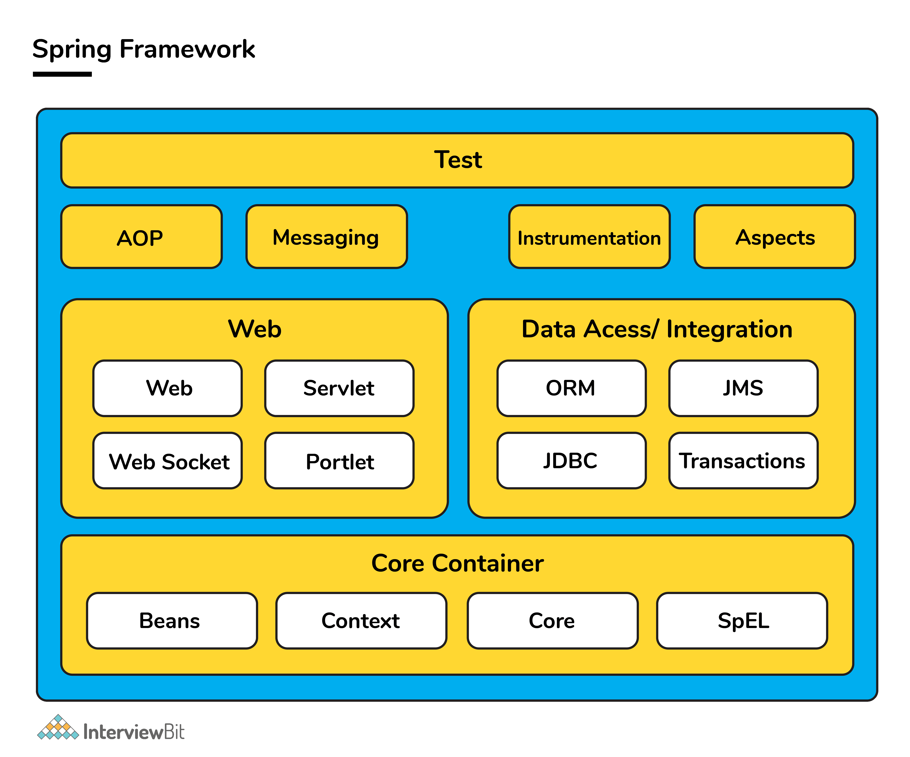
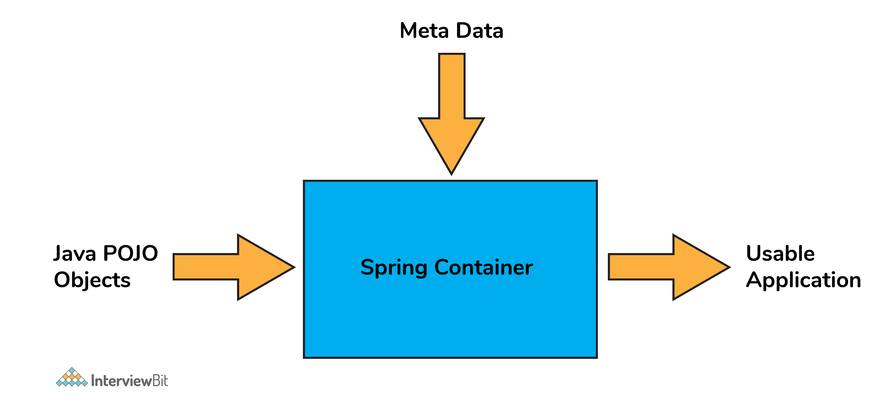
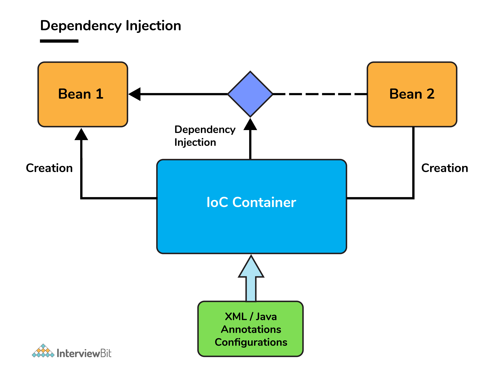
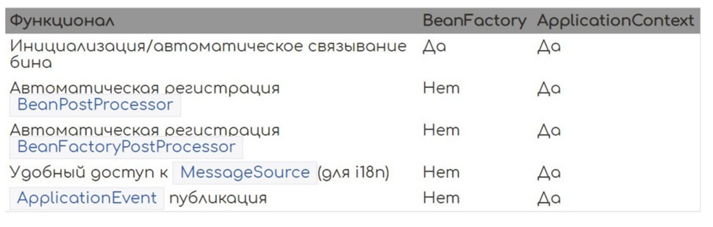
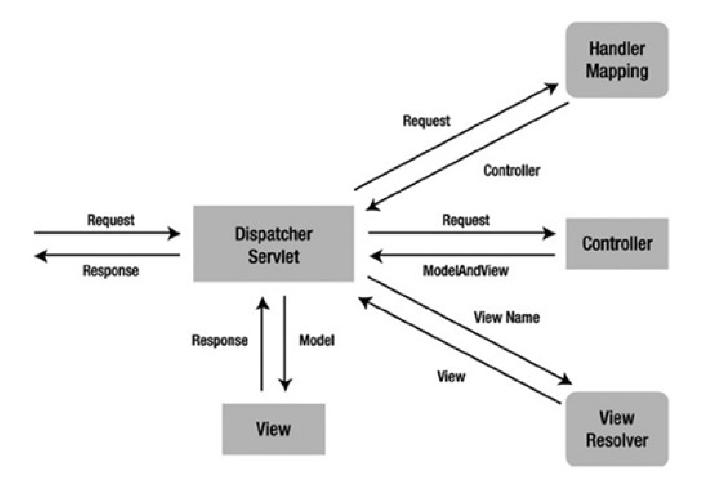

#### [Оглавление](../README.md)

# Spring
+ [Что такое Spring Framework?](#что-такое-spring-framework)
+ [Что такое инверсия контроля (IoC) и внедрение зависимостей (DI)? Как эти принципы реализованы в Spring?](#что-такое-инверсия-контроля--ioc--и-внедрение-зависимостей--di---как-эти-принципы-реализованы-в-spring)
+ [Что такое IoC контейнер?](#что-такое-ioc-контейнер)
+ [Что такое Dependency Injection?](#что-такое-dependency-injection)
+ [Расскажите про ApplicationContext и BeanFactory, чем отличаются? В каких случаях что стоит использовать?](#расскажите-про-applicationcontext-и-beanfactory-чем-отличаются-в-каких-случаях-что-стоит-использовать)
+ [Расскажите про аннотацию @Bean?](#расскажите-про-аннотацию-bean)
+ [Расскажите про аннотацию @Component?](#расскажите-про-аннотацию-component)
+ [Чем отличаются аннотации @Bean и @Component?](#чем-отличаются-аннотации-bean-и-component)
+ [Расскажите про аннотации @Service и @Repository. Чем они отличаются?](#расскажите-про-аннотации-service-и-repository-чем-они-отличаются)
+ [Расскажите про аннотацию @Autowired](#расскажите-про-аннотацию-autowired)
+ [Расскажите про аннотацию @Resource](#расскажите-про-аннотацию-resource)
+ [Расскажите про аннотацию @Inject](#расскажите-про-аннотацию-inject)
+ [Расскажите про аннотацию @Lookup](#расскажите-про-аннотацию-lookup)
+ [Можно ли вставить бин в статическое поле? Почему?](#можно-ли-вставить-бин-в-статическое-поле-почему)
+ [Расскажите про аннотации @Primary и @Qualifier](#расскажите-про-аннотации-primary-и-qualifier)
+ [Как заинжектить примитив?](#как-заинжектить-примитив)
+ [Как заинжектить коллекцию?](#как-заинжектить-коллекцию)
+ [Расскажите про аннотацию @Conditional](#расскажите-про-аннотацию-conditional)
+ [Расскажите про аннотацию @Profile](#расскажите-про-аннотацию-profile)
+ [Расскажите про жизненный цикл бина, аннотации @PostConstruct и @PreDestroy()](#расскажите-про-жизненный-цикл-бина-аннотации-postconstruct-и-predestroy--)
+ [Расскажите про скоупы бинов? Какой скоуп используется по умолчанию? Что изменилось в Spring 5?](#расскажите-про-скоупы-бинов-какой-скоуп-используется-по-умолчанию-что-изменилось-в-spring-5)
+ [Расскажите про аннотацию @ComponentScan](#расскажите-про-аннотацию-componentscan)
+ [Как спринг работает с транзакциями? Расскажите про аннотацию @Transactional](#как-спринг-работает-с-транзакциями-расскажите-про-аннотацию-transactional)
+ [Что произойдет, если один метод с @Transactional вызовет другой метод с @Transactional?](#что-произойдет-если-один-метод-с-transactional-вызовет-другой-метод-с-transactional)
+ [Что произойдет, если один метод БЕЗ @Transactional вызовет другой метод с @Transactional?](#что-произойдет-если-один-метод-без-transactional-вызовет-другойметод-с-transactional)
+ [Будет ли транзакция отменена, если будет брошено исключение, которое указано в контракте метода?](#будет-ли-транзакция-отменена-если-будет-брошено-исключение-котороеуказано-в-контракте-метода)
+ [Расскажите про аннотации @Controller и @RestController. Чем они отличаются?](#расскажите-про-аннотации-controller-и-restcontroller-чем-они-отличаются)
+ [Как вернуть ответ со своим статусом (например 213)?](#как-вернуть-ответ-со-своим-статусом--например-213--)
+ [Что такое ViewResolver?](#что-такое-viewresolver)
+ [Чем отличаются Model, ModelMap и ModelAndView?](#чем-отличаются-model-modelmap-и-modelandview)
+ [Расскажите про паттерн Front Controller, как он реализован в Spring?](#расскажите-про-паттерн-front-controller-как-он-реализован-в-spring)
+ [Расскажите про паттерн MVC, как он реализован в Spring?](#расскажите-про-паттерн-mvc-как-он-реализован-в-spring)
+ [Что такое АОП? Как реализовано в спринге?](#что-такое-аоп-как-реализовано-в-спринге)
+ [В чем разница между Filters, Listeners and Interceptors?](#в-чем-разница-между-filters-listeners-and-interceptors)
+ [Можно ли передать в запросе один и тот же параметр несколько раз? Как?](#можно-ли-передать-в-запросе-один-и-тот-же-параметр-несколько-раз-как)
+ [Как работает Spring Security? Как сконфигурировать? Какие интерфейсы используются?](#как-работает-spring-security-как-сконфигурировать-какие-интерфейсы-используются)
+ [Что такое SpringBoot? Какие у него преимущества? Как конфигурируется? Подробно](#что-такое-springboot-какие-у-него-преимущества-как-конфигурируется)
+ [Расскажите про нововведения Spring 5](#расскажите-про-нововведения-spring-5)

_______________________________________________________________________________________________________________________
<span style="display: inline-block; float: right">[содержание](#spring)</span>

## Что такое Spring Framework?
__Spring Framework__ — это мощная, слабосвязанная, легкая Java-инфраструктура с открытым исходным кодом, предназначенная 
для упрощения разработки приложений корпоративного уровня. Эту платформу также называют «фреймворком фреймворков», 
поскольку Spring обеспечивает поддержку различных других важных фреймворков, таких как JSF, Hibernate, Structs, EJB и т. д. 

Существует около 20 модулей, которые обобщены на следующие типы: 
+ Core Container
+ Data Access/Integration
+ Web
+ AOP (Aspect Oriented Programming)
+ Instrumentation
+ Messaging
+ Test



Spring регулирует все аспекты, связанные с инфраструктурой, что позволяет программисту сосредоточиться в основном на 
разработке приложений.
_______________________________________________________________________________________________________________________
<span style="display: inline-block; float: right">[содержание](#spring)</span>

## Что такое инверсия контроля (IoC) и внедрение зависимостей (DI)? Как эти принципы реализованы в Spring?

__`Inversion of Control`__ – подход, который позволяет конфигурировать и управлять объектами Java с помощью рефлексии. 
Вместо ручного внедрения зависимостей фреймворк забирает ответственность за это через IoC-контейнер. 
Контейнер отвечает за управление жизненным циклом объектов: создание объектов, вызов методов инициализации и 
конфигурирование объектов через связывание их между собой.
Контейнер Spring - ядро Spring Framework. 

Объекты, создаваемые контейнером, называются __`beans`__. Конфигурирование контейнера осуществляется через внедрение 
аннотаций, но есть возможность, по старинке, загрузить XML-файлы, содержащие определение bean’ов и предоставляющие 
информацию, необходимую для создания bean’ов.

__`Dependency Injection`__ является одним из способов реализации принципа IoC в Spring. Это шаблон проектирования, в 
котором контейнер передает экземпляры объектов по их типу другим объектам с помощью конструктора или метода класса 
(setter), что позволяет писать слабосвязный код.
_______________________________________________________________________________________________________________________
<span style="display: inline-block; float: right">[содержание](#spring)</span>

## Что такое IoC контейнер?

В среде Spring IoC-контейнер представлен интерфейсом ApplicationContext, который является оберткой над BeanFactory, 
предоставляющей дополнительные возможности, например AOP и транзакции. Интерфейс BeanFactory предоставляет фабрику для 
бинов, которая в то же время является IoC-контейнером приложения. Управление бинами основано на конфигурации 
(аннотации или xml). Контейнер создает объекты на основе конфигураций и управляет их жизненным циклом от создания объекта 
до уничтожения.


_______________________________________________________________________________________________________________________
<span style="display: inline-block; float: right">[содержание](#spring)</span>

## Что такое Dependency Injection?

Основная идея внедрения зависимостей заключается в том, что вам не нужно создавать объекты, а достаточно описать, 
как их следует создавать.

Компоненты и сервисы не нужно создавать напрямую в коде. Нужно описать, какие службы каким компонентам необходимы в 
файле конфигурации или через аннотации. Контейнер IoC, представленный в Spring, соединит их вместе.



Способы конфигурации Spring Container:
+ XML-file (устаревший).
+ Аннотации.
+ Java code.

Способы внедрения зависимостей:
+ через поле
+ через метод
+ через конструктор
_______________________________________________________________________________________________________________________
<span style="display: inline-block; float: right">[содержание](#spring)</span>

## Расскажите про ApplicationContext и BeanFactory, чем отличаются? В каких случаях что стоит использовать?



`ApplicationContext` является наследником BeanFactory и полностью реализует его функционал, добавляя больше специфических 
enterprise-функций. Может работать с бинами всех скоупов.

`BeanFactory` – это фактический контейнер, который создает, настраивает и управляет рядом bean-компонентов. Эти бины 
обычно взаимодействуют друг с другом и имеют зависимости между собой. Эти зависимости отражены в данных конфигурации, 
используемых BeanFactory. Может работать с бинами singleton и prototype.

BeanFactory обычно используется тогда, когда ресурсы ограничены (мобильные устройства), так как он легче по сравнению с
ApplicationContext. Поэтому, если ресурсы не сильно ограничены, то лучше использовать ApplicationContext.

ApplicationContext загружает все бины при запуске, а BeanFactory по требованию.
_______________________________________________________________________________________________________________________
<span style="display: inline-block; float: right">[содержание](#spring)</span>

## Расскажите про аннотацию @Bean?

Аннотация @Bean используется для указания того, что метод создает, настраивает и инициализирует новый объект, управляемый 
IoC-контейнером. Такие методы можно использовать как в классах с аннотацией @Configuration, так и в классах с аннотацией
`@Component` (или ее наследниках).

Имеет следующие свойства:
+ destroyMethod, initMethod – варианты переопределения методов инициализации и удаления бина при указании их имен в аннотации;
+ name – имя бина, по умолчанию именем бина является имя метода;
+ value – алиас для name().
_______________________________________________________________________________________________________________________
<span style="display: inline-block; float: right">[содержание](#spring)</span>

## Расскажите про аннотацию @Component?

`@Component` используется для указания класса в качестве компонента Spring. Такой класс будет сконфигурирован как spring Bean.
_______________________________________________________________________________________________________________________
<span style="display: inline-block; float: right">[содержание](#spring)</span>

## Чем отличаются аннотации @Bean и @Component?

`@Bean` ставится над методом и позволяет добавить bean, уже реализованного сторонней библиотекой класса, в контейнер, а 
`@Component` используется для указания класса,  написанного программистом.
_______________________________________________________________________________________________________________________
<span style="display: inline-block; float: right">[содержание](#spring)</span>

## Расскажите про аннотации @Service и @Repository. Чем они отличаются?
`@Repository` указывает, что класс используется для работы с поиском, получением и хранением данных. Аннотация может 
использоваться для реализации шаблона DАО.

`@Service `указывает, что класс является сервисом для реализации бизнес-логики.

`@Repository`, `@Service`, `@Controller` и `@Configuration` являются алиасами @Component, их также называют стереотипными 
аннотациями.

Задача `@Repository` заключается в том, чтобы отлавливать определенные исключения персистентности и пробрасывать их 
как одно непроверенное исключение Spring Framework.

Для этого в контекст должен быть добавлен класс `PersistenceExceptionTranslationPostProcessor`.
_______________________________________________________________________________________________________________________
<span style="display: inline-block; float: right">[содержание](#spring)</span>

## Расскажите про аннотацию @Autowired

`@Autowired `– автоматическое внедрение подходящего бина:
1. Контейнер определяет тип объекта для внедрения.
2. Контейнер ищет соответствующий тип бина в контексте (он же контейнер).
3. Если есть несколько кандидатов и один из них помечен как @Primary, то внедряется он.
4. Если используется @Qualifier, то контейнер будет использовать информацию из `@Qualifier`, чтобы понять, какой компонент внедрять.
5. В противном случае контейнер внедрит бин, основываясь на его имени или ID.
6. Если ни один из способов не сработал, то будет выброшено исключение.
   
Контейнер обрабатывает DI с помощью AutowiredAnnotationBeanPostProcessor. В связи с этим аннотация не может быть 
использована ни в одном BeanFactoryPP или BeanPP.
   
В аннотации есть один параметр required = true/fals. Он указывает, обязательно ли делать DI. По умолчанию true. Либо можно 
не выбрасывать исключение, а оставить поле c null, если нужный бин не был найден – false.
   
При циклической зависимости, когда объекты ссылаются друг на друга, нельзя ставить над конструктором.
Однако при внедрении прямо в поля не нужно предоставлять прямого способа создания экземпляра класса со всеми необходимыми 
зависимостями. Это означает, что:
+ существует способ (через вызов конструктора по умолчанию) создать объект с использованием new в состоянии, когда 
ему не хватает некоторых из его обязательных зависимостей, и использование приведет к NullPointerException;
+ такой класс не может быть использован вне DI-контейнеров (тесты, другие модули) и нет способа кроме рефлексии предоставить ему необходимые зависимости;
+ неизменность;
   
В отличие от способа с использованием конструктора внедрение через поля не может использоваться для присвоения 
зависимостей final-полям, что приводит к тому, что объекты становятся изменяемыми.
_______________________________________________________________________________________________________________________
<span style="display: inline-block; float: right">[содержание](#spring)</span>

## Расскажите про аннотацию @Resource

`@Resource` (аннотация java) пытается получить зависимость: по имени, по типу, затем по описанию (Qualifier). 
Имя извлекается из имени аннотируемого сеттера или поля либо берется из параметра name.
   
`@Resource` //По умолчанию поиск бина с именем "context"
```jsvs
private ApplicationContext context;
@Resource(name="greetingService") //Поиск бина с именем "greetingService"
public void setGreetingService(GreetingService service) {
    this.greetingService = service;
}
```
   
Отличие от @Autowired:
+ ищет бин сначала по имени, а потом по типу;
+ не нужна дополнительная аннотация для указания имени конкретного бина;
+ @Autowired позволяет отметить место вставки бина как необязательное @Autowired(required = false);
+ при замене Spring Framework на другой фреймворк менять аннотацию @Resource не нужно.
_______________________________________________________________________________________________________________________
<span style="display: inline-block; float: right">[содержание](#spring)</span>

## Расскажите про аннотацию @Inject

__`@Inject`__ входит в пакет `javax.inject`. Чтобы ее использовать, нужно добавить зависимость:
```
<dependency>
   <groupId>javax.inject</groupId>
   <artifactId>javax.inject</artifactId>
   <version>1</version>
</dependency>
```
   
`@Inject` (аннотация java) – аналог `@Autowired` (аннотация spring) в первую очередь пытается подключить зависимость по 
типу, затем по описанию и только потом по имени. В ней нет параметров. Поэтому при использовании конкретного имени (Id) 
бина используется @Named:
```
@Inject
@Named("yetAnotherFieldInjectDependency")
private ArbitraryDependency yetAnotherFieldInjectDependency;
```
_______________________________________________________________________________________________________________________
<span style="display: inline-block; float: right">[содержание](#spring)</span>

## Расскажите про аннотацию @Lookup

Обычно бины в приложении Spring являтся синглтонами и для внедрения зависимостей используется конструктор или сеттер. Но
бывает и другая ситуация: имеется бин Car – синглтон (singleton bean) – и ему требуется каждый раз новый экземпляр бина 
Passenger. То есть Car – синглтон, а Passenger – так называемый прототипный бин (prototype bean).

Жизненные циклы бинов разные. Бин Car создается контейнером только раз, а бин Passenger создается каждый раз новый. 
Допустим, это происходит каждый раз при вызове какого-то метода бина Car. Вот здесь и пригодится внедрение бина с помощью 
метода Lookup. Оно происходит не при инициализации контейнера, а позднее: каждый раз, когда вызывается метод. Суть в 
том, что создается метод-заглушка в бине Car и он помечается специальным образом – аннотацией @Lookup. Этот метод должен 
возвращать бин Passenger, каждый раз новый. 

Контейнер Spring под капотом создаст подкласс и переопределит этот метод и будет выдавать новый экземпляр бина Passenger 
при каждом вызове аннотированного метода. Даже если в заглушке он возвращает null (а так и надо делать, все равно этот 
метод будет переопределен).
_______________________________________________________________________________________________________________________
<span style="display: inline-block; float: right">[содержание](#spring)</span>

## Можно ли вставить бин в статическое поле? Почему?

Spring не позволяет внедрять бины напрямую в статические поля. Это связано с тем, что когда загрузчик классов загружает 
статические значения, контекст Spring еще не загружен.
   
Чтобы исправить это, можно создать нестатический сеттер-метод с @Autowired:
```
private static OrderItemService orderItemService;
@Autowired
public void setOrderItemService(OrderItemService orderItemService) {
   TestDataInit.orderItemService = orderItemService;
}
```
_______________________________________________________________________________________________________________________
<span style="display: inline-block; float: right">[содержание](#spring)</span>

## Расскажите про аннотации @Primary и @Qualifier
__`@Qualifier`__ применяется, если кандидатов для автоматического связывания несколько, аннотация позволяет указать в 
качестве аргумента имя конкретного бина, который следует внедрить. Она может быть применена к отдельному полю класса, к 
отдельному аргументу метода или конструктора:
```java
public class AutowiredClass {
   @Autowired //к полям класса
   @Qualifier("main")
   private GreetingService greetingService;
   @Autowired //к отдельному аргументу конструктора или метода
   public void prepare(@Qualifier("main") GreetingService greetingService){
        /* что-то делаем... */
   };
}
```

Поэтому у одной из реализации GreetingService должна быть установлена соответствующая аннотация `@Qualifier`:
```java
@Component
@Qualifier("main")
public class GreetingServiceImpl implements GreetingService {
   //...
}
```
   
`@Primary` тоже используется, чтобы отдавать предпочтение бину, когда есть несколько бинов одного типа, но в ней нельзя 
задать имя бина, она определяет значение по умолчанию, в то время как @Qualifier более специфичен.
   
Если присутствуют аннотации `@Qualifier` и `@Primary`, то аннотация __`@Qualifier`__ будет иметь __приоритет__.
_______________________________________________________________________________________________________________________
<span style="display: inline-block; float: right">[содержание](#spring)</span>

## Как заинжектить примитив?

Для этого можно использовать аннотацию @Value. Можно ставить над полем, конструктором, методом.
   
Такие значения можно получать из property файлов, из бинов, и т. п.
```java
@Value("${some.key}")
public String stringWithDefaultValue;
```

В эту переменную будет внедрена строка, например, из property или из view. Кроме того, для внедрения значений можно 
использовать язык `SpEL` (Spring Expression Language).
_______________________________________________________________________________________________________________________
<span style="display: inline-block; float: right">[содержание](#spring)</span>

## Как заинжектить коллекцию?

Если внедряемый объект массив, коллекция или map с дженериком, то, используя аннотацию @Autowired, Spring внедрит все бины, 
подходящие по типу в этот массив (или другую структуру данных). В случае с map ключом будет имя бина.

Используя аннотацию @Qualifier можно настроить тип искомого бина. 

Бины могут быть упорядочены, если вставляются в списки (не Set или Map) или массивы. Поддерживаются как аннотация @Order, 
так и интерфейс Ordered.
_______________________________________________________________________________________________________________________
<span style="display: inline-block; float: right">[содержание](#spring)</span>

## Расскажите про аннотацию @Conditional

Spring предоставляет возможность на основе используемого алгоритма включить или выключить определение бина или всей 
конфигурации через @Conditional, в качестве параметра которой указывается класс, реализующий интерфейс Condition, с 
единственным методом matches(ConditionContext var1, AnnotatedTypeMetadata var2), возвращающий boolean.
   
Для создания более сложных условий можно использовать классы `AnyNestedCondition`, `AllNestedConditions` и `NoneNestedConditions`.
   
Аннотация `@Conditional` указывает, что компонент имеет право на регистрацию в контексте только тогда, когда все условия соответствуют.
   
Условия проверяются непосредственно перед тем, как должен быть зарегистрирован `BeanDefinition` компонента, и они могут 
помешать регистрации данного BeanDefinition. Поэтому при проверке условий нельзя допускать взаимодействия с бинами, 
которых еще не существует, с их BeanDefinition-ами можно.
   
Для того, чтобы проверить несколько условий, можно передать в @Conditional несколько классов с условиями:

`@Conditional(HibernateCondition.class, OurConditionClass.class)`

Если класс `@Configuration` помечен как `@Conditional`, то на все методы `@Bean`, аннотации`@Import` и аннотации `@ComponentScan`,
связанные с этим классом, также будут распространяться указанные условия.
_______________________________________________________________________________________________________________________
<span style="display: inline-block; float: right">[содержание](#spring)</span>

## Расскажите про аннотацию @Profile

__Профили__ – это ключевая особенность Spring Framework, позволяющая относить бины к разным профилям (логическим группам), 
например, dev, local, test, prod. 

Можно активировать разные профили в разных средах, чтобы загрузить только те бины, которые нужны.
   
Используя аннотацию `@Profile` относим бин к конкретному профилю. Ее можно применять на уровне класса или метода. 
Аннотация `@Profile` принимает в качестве аргумента имя одного или нескольких профилей. Она фактически реализована с 
помощью более гибкой аннотации `@Conditional`.
   
Ее можно ставить на `@Configuration` и `Component` классы.
_______________________________________________________________________________________________________________________
<span style="display: inline-block; float: right">[содержание](#spring)</span>

## Расскажите про жизненный цикл бина, аннотации @PostConstruct и @PreDestroy()

1. Парсирование конфигурации и создание `BeanDefinition`.
+ xml-конфигурация – `ClassPathXmlApplicationContext(“context.xml”)`;
+ конфигурация через аннотации с указанием пакета для сканирования – `AnnotationConfigApplicationContext(“package.name”)`;
+ конфигурация через аннотации с указанием класса (или массива классов), помеченного 
аннотацией `@Configuration` –`AnnotationConfigApplicationContext(JavaConfig.class)`, этот способ конфигурации называется JavaConfig;
+ groovy-конфигурация – `GenericGroovyApplicationContext(“context.groovy”)`.
   
Если заглянуть внутрь `AnnotationConfigApplicationContext`, то можно увидеть два поля.
```java
private final AnnotatedBeanDefinitionReader reader;
private final ClassPathBeanDefinitionScanner scanner;
```
   
`ClassPathBeanDefinitionScanner` сканирует указанный пакет на наличие классов, помеченных аннотацией `@Component` (или ее алиаса). 
Найденные классы парсируются и для них создаются `BeanDefinition`. Чтобы было запущено сканирование, в конфигурации должен быть 
указан пакет для сканирования `@ComponentScan({"package.name"})`.
   
`AnnotatedBeanDefinitionReader` работает в несколько этапов.

__Первый этап__ – это регистрация всех `@Configuration` для дальнейшего парсирования. Если в конфигурации используются `Conditional`, 
то будут зарегистрированы только те конфигурации, для которых Condition вернет true.
   
__Второй этап__ – это регистрация `BeanDefinitionRegistryPostProcessor`, который при помощи класса `ConfigurationClassPostProcessor` 
парсирует `JavaConfig` и создает BeanDefinition.
   
Цель первого этапа – это создание всех `BeanDefinition`. `BeanDefinition` – это специальный интерфейс, через который можно получить доступ к метаданным будущего бина. 
В зависимости от конфигурации будет использоваться тот или иной механизм парсирования конфигурации.
   
__`BeanDefinition`__ – это объект, который хранит в себе информацию о бине. Сюда входит: из какого класса бин надо создать, 
scope, установлена ли ленивая инициализация, нужно ли перед данным бином инициализировать другой, init и destroy методы, 
зависимости. Все полученные `BeanDefinition`’ы складываются в `ConcurrentHashMap`, в которой ключом является имя бина, а 
объектом – сам BeanDefinition. При старте приложения в IoC контейнер попадут бины, которые имеют scope Singleton (устанавливается по умолчанию), 
остальные создаются тогда, когда они нужны.

2. Настройка созданных BeanDefinition.
   
Есть возможность повлиять на бины до их создания, т. е. получить доступ к метаданным класса. Для этого существует 
специальный интерфейс BeanFactoryPostProcessor, реализовав который получаем доступ к созданным `BeanDefinition` и можем их 
изменять. В нем один метод.
   
Метод `postProcessBeanFactory` принимает параметром `ConfigurableListableBeanFactory`. Данная фабрика содержит много полезных 
методов, в том числе `getBeanDefinitionNames`, через который можно получить все `BeanDefinitionNames`, а уже потом по 
конкретному имени получить `BeanDefinition` для дальнейшей обработки метаданных.
   
Разберем одну из родных реализаций интерфейса `BeanFactoryPostProcessor`. Обычно настройки подключения к базе данных 
выносятся в отдельный property-файл, потом при помощи `PropertySourcesPlaceholderConfigurer` они загружаются и делается 
inject этих значений в нужное поле. Так как inject делается по ключу, то до создания экземпляра бина нужно заменить 
этот ключ на само значение из property-файла. Эта замена происходит в классе, который реализует интерфейс 
`BeanFactoryPostProcessor`. Название этого класса – `PropertySourcesPlaceholderConfigurer`. Он должен быть объявлен как `static`:
```java
@Bean
public static PropertySourcesPlaceholderConfigurer configurer() {
   return new PropertySourcesPlaceholderConfigurer();
}
```
3. Создание кастомных FactoryBean.
   
__FactoryBean__ – это generic-интерфейс, которому можно делегировать процесс создания бинов определенного типа. Когда 
конфигурация была исключительно в xml, разработчикам был необходим механизм, с помощью которого они бы могли 
управлять процессом создания бинов. Именно для этого и был сделан этот интерфейс.
   
Создадим фабрику, которая будет отвечать за создание всех бинов типа Color:
```java
public class ColorFactory implements FactoryBean<Color> {
   @Override
   public Color getObject() throws Exception {
       Random random = new Random();
       Color color = new Color(random.nextInt(255), random.nextInt(255), random.nextInt(255));
       return color;
   }
   
   @Override
   public Class<?> getObjectType() {
       return Color.class;
   }
   
   @Override
   public boolean isSingleton() {
       return false;
   }
}
 ```
   
Теперь создание бина типа Color.class будет делегироваться ColorFactory, у которого при каждом создании нового бина 
будет вызываться метод getObject.
   
Для тех, кто пользуется JavaConfig, этот интерфейс будет абсолютно бесполезен.

4. Создание экземпляров бинов.
   
Сначала `BeanFactory` из коллекции `Map` с объектами `BeanDefinition` достает те, из которых создает все `BeanPostProcessor`-ы 
(инфраструктурные бины), необходимые для настройки обычных бинов.
   
Создаются экземпляры бинов через `BeanFactory` на основе ранее созданных `BeanDefinition`.
   
Созданием экземпляров бинов занимается BeanFactory на основе ранее созданных `BeanDefinition`. Из `Map<BeanName, BeanDefinition>` 
получаем `Map<BeanName, Bean>`.
   
Создание бинов может делегироваться кастомным FactoryBean.

5. Настройка созданных бинов.
   
На данном этапе бины уже созданы, их можно лишь донастроить.

Интерфейс `BeanPostProcessor` позволяет вклиниться в процесс настройки бинов до того, как они попадут в контейнер. 
`ApplicationContext` автоматически обнаруживает любые бины с реализацией `BeanPostProcessor` и помечает их как 
«post-processors» для того, чтобы создать их определенным способом. Например, в Spring есть реализации `BeanPostProcessor`-ов, 
которые обрабатывают аннотации `@Autowired`, `@Inject`, `@Value` и `@Resource`.
  
Интерфейс несет в себе два метода: `postProcessBeforeInitialization(Object bean, String beanName)` и 
`postProcessAfterInitialization(Object bean, String beanName)`. У обоих методов параметры абсолютно одинаковые. 
Разница только в порядке их вызова. Первый вызывается до init-метода, второй – после.

Как правило, `BeanPostProcessor`-ы, которые заполняют бины через маркерные интерфейсы или тому подобное, реализовывают 
метод `postProcessBeforeInitialization(Object bean, String beanName)`, тогда как `BeanPostProcessor`-ы, которые оборачивают 
бины в прокси, обычно реализуют `postProcessAfterInitialization(Object bean, String beanName)`.

__Прокси__ – это класс-декорация над бином. Например, можно добавить логику бину, но джава-код уже скомпилирован, 
поэтому нужно на лету сгенерировать новый класс. Этим классом необходимо заменить оригинальный класс так, чтобы никто 
не заметил подмены.
   
Есть два варианта создания этого класса:
+ либо он должен наследоваться от оригинального класса (`CGLIB`) и переопределять его методы, добавляя нужную логику;
+ либо он должен имплементировать те же самые интерфейсы, что и первый класс (`Dynamic Proxy`).
   
По конвенции спринга, если какой-то из `BeanPostProcessor`-ов меняет что-то в классе, то он должен это делать на этапе 
`postProcessAfterInitialization()`. Таким образом есть уверенность, что initMethod у данного бина работает на оригинальный 
метод до того, как на него накрутился прокси.
   
Хронология событий:
Сначала сработает метод `postProcessBeforeInitialization()` всех имеющихся `BeanPostProcessor`-ов. 

Затем, при наличии, будет вызван метод, аннотированный `@PostConstruct`.  Если бин имплементирует `InitializingBean`, 
то Spring вызовет метод `afterPropertiesSet()`. Не рекомендуется к использованию как устаревший. При наличии будет вызван 
метод, указанный в параметре `initMethod` аннотации @Bean. 

В конце бины пройдут через `postProcessAfterInitialization(Object bean, String beanName)`. Именно на данном этапе создаются 
прокси стандартными BeanPostProcessor-ами. Затем отработают кастомные `BeanPostProcessor`-ы и применят логику к прокси-объектам. 

После чего все бины окажутся в контейнере, который будет обязательно обновлен методом `refresh()`. 

Но даже после этого можно донастроить бины `ApplicationListener`-ами.

6. Бины созданы. Их можно получить с помощью метода `ApplicationContext.getBean()`.

7. Закрытие контекста. Когда контекст закрывается (метод `close()` из `ApplicationContext`), бин уничтожается. Если в бине есть 
метод, аннотированный @PreDestroy, то перед уничтожением вызовется этот метод. 

Если в аннотации `@Bean` определен метод destroyMethod, то будет вызван и он.
   
__Аннотация PostConstruct__

Spring вызывает методы, аннотированные `@PostConstruct`, только один раз сразу после инициализации свойств компонента. 
За данную аннотацию отвечает один из `BeanPostProcessorов`.
   
Метод, аннотированный `@PostConstruct`, может иметь любой уровень доступа, может иметь любой тип возвращаемого значения
(хотя тип возвращаемого значения игнорируется Spring-ом), метод не должен принимать аргументы. Он также может быть 
статическим, но преимуществ такого использования метода нет, т. к. доступ у него будет только к статическим полям/методам 
бина, и в таком случае смысл его использования для настройки бина пропадает.

Одним из примеров использования `@PostConstruct` является заполнение базы данных. Например, во время разработки может 
потребоваться создание пользователей по умолчанию.
   
__Аннотация PreDestroy__
   
Метод, аннотированный `@PreDestroy`, запускается только один раз непосредственно перед тем, как Spring удаляет компонент 
из контекста приложения.
   
Как и в случае с `@PostConstruct`, методы, аннотированные `@PreDestroy`, могут иметь любой уровень доступа, но не могут 
быть статическими. Целью этого метода может быть освобождение ресурсов или выполнение любых других задач очистки до 
уничтожения бина, например, закрытие соединения с базой данных.
   
Класс, имплементирующий BeanPostProcessor, обязательно должен быть бином, поэтому его помечают аннотацией @Component.
_______________________________________________________________________________________________________________________
<span style="display: inline-block; float: right">[содержание](#spring)</span>

## Расскажите про скоупы бинов? Какой скоуп используется по умолчанию? Что изменилось в Spring 5?

__SCOPE_SINGLETON__ – инициализация произойдет один раз на этапе поднятия контекста.

__SCOPE_PROTOTYPE__ – инициализация будет выполняться каждый раз по запросу. Причем во втором случае бин будет проходить 
через все BeanPostProcessor-ы, что может значительно снизить производительность.

Существует 2 области видимости по умолчанию.

__Singleton__ – область видимости по умолчанию. В контейнере будет создан только один бин, и все запросы на него будут 
возвращать один и тот же бин.
   
__Prototype__ – приводит к созданию нового бина каждый раз, когда он запрашивается.
   
Для бинов со scope «prototype» Spring не вызывает метод destroy(), так как не берет на себя контроль полного жизненного 
цикла этого бина. Spring не хранит такие бины в своем контексте (контейнере), а отдает их клиенту и больше о них не 
заботится (в отличие от синглтон-бинов).
   
4 области видимости в веб-приложении.
   
__Request__ – область видимости – 1 HTTP запрос. На каждый запрос создается новый бин.
   
__Session__ – область видимости – 1 сессия. На каждую сессию создается новый бин.
   
__Application__ – область видимости – жизненный цикл ServletContext.
   
__WebSocket__ – область видимости – жизненный цикл WebSocket.
   
Жизненный цикл web csope полный.
   
В пятой версии Spring Framework не стало Global session scope. Но появились Application и WebSocket.
_______________________________________________________________________________________________________________________
<span style="display: inline-block; float: right">[содержание](#spring)</span>

## Расскажите про аннотацию @ComponentScan

Первый шаг для описания конфигурации Spring – это добавление аннотаций @Component или наследников.
   
Однако Spring должен знать, где искать их. В @ComponentScan указываются пакеты, которые должны сканироваться. Можно указать массив строк.
Spring будет искать бины и в их подпакетах.
   
Можно расширить это поведение с помощью параметров includeFilters и excludeFilters в аннотации.
  
 Для ComponentScan.Filter доступно пять типов фильтров:
+ ANNOTATION
+ ASSIGNABLE_TYPE
+ ASPECTJ
+ REGEX
+ CUSTOM
   
Можно, например, в каком-то ненужном классе в не нашей библиотеке создать для него фильтр, чтобы его бин не инициализировался.
_______________________________________________________________________________________________________________________
<span style="display: inline-block; float: right">[содержание](#spring)</span>

## Как спринг работает с транзакциями? Расскажите про аннотацию @Transactional
   
Хорошая статья – https://www.marcobehler.com/guides/spring-transaction-managementtransactional-in-depth
   
__Коротко:__

Spring создает прокси для всех классов, помеченных @Transactional (либо если любой из методов класса помечен этой аннотацией), 
что позволяет вводить транзакционную логику до и после вызываемого метода. При вызове такого метода происходит следующее:
+ proxy, который создал Spring, создает persistence context (или соединение с базой);
+ открывает в нем транзакцию и сохраняет в контексте нити исполнения (в ThreadLocal);
+ по мере надобности все сохраненное достается и внедряется в бины.
   
Таким образом, если в коде есть несколько параллельных нитей, то будет и несколько параллельных транзакций, которые будут 
взаимодействовать друг с другом согласно уровням изоляции.
   
__Значения атрибута propagation у аннотации:__

__REQUIRED__ – применяется по умолчанию. При входе в @Transactional метод будет использована уже существующая транзакция 
или создана новая транзакция, если никакой еще нет.

__REQUIRES_NEW__ – новая транзакция всегда создается при входе метод, ранее созданные транзакции приостанавливаются до 
момента возврата из метода.

__NESTED__ – корректно работает только с базами данных, которые умеют savepoints. При входе в метод в уже существующей 
транзакции создается savepoint, который по результатам выполнения метода будет либо сохранен, либо отменен. Все изменения, 
внесенные методом, подтвердятся только позднее с подтверждением всей транзакции. Если текущей транзакции не существует, 
будет создана новая.
   
__MANDATORY__ – всегда используется существующая транзакция и кидается исключение, если текущей транзакции нет.
   
__SUPPORTS__ – метод будет использовать текущую транзакцию, если она есть, либо будет исполнятся без транзакции, если ее нет.
   
__NOT_SUPPORTED__ – при входе в метод текущая транзакция, если она есть, будет приостановлена, и метод будет выполняться 
без транзакции.
   
__NEVER__ – явно запрещает исполнение в контексте транзакции. Если при входе в метод будет существовать транзакция, 
будет выброшено исключение
   
__Остальные атрибуты:__
+ `rollbackFor = Exception.class `– если какой-либо метод выбрасывает указанное исключение, контейнер всегда откатывает 
текущую транзакцию. По умолчанию отлавливает`RuntimeException`.
   
+ `noRollbackFor = Exception.class` – указание того, что любое исключение, кроме заданного, должно приводить к откату транзакции.
   
+ `rollbackForClassName` и `noRollbackForClassName` – для задания имен исключений в строковом виде.
  
+ `readOnly` – разрешает только операции чтения.
   
В свойстве `transactionManager` хранится ссылка на менеджер транзакций, определенный в конфигурации Spring.
   
+ `timeOut` – по умолчанию используется таймаут, установленный по умолчанию для базовой транзакционной системы. 
Сообщает менеджеру tx о продолжительности времени, чтобы дождаться простоя tx, прежде чем принять решение об откате не 
отвечающих транзакций.

+ `isolation` – уровень изолированности транзакций.
   
__Подробно:__
   
Для работы с транзакциями Spring Framework использует AOP-прокси:
   
Для включения возможности управления транзакциями нужно разместить аннотацию `@EnableTransactionManagement` у класса конфигурации `@Configuration`.
   
Она означает, что классы, помеченные @Transactional, должны быть обернуты аспектом транзакций. Отвечает за регистрацию 
необходимых компонентов Spring, таких как `TransactionInterceptor` и советы прокси. Регистрируемые компоненты помещают 
перехватчик в стек вызовов при вызове методов @Transactional. Если используем Spring Boot и имеем зависимости 
spring-data-* или spring-tx, то управление транзакциями будет включено по умолчанию.
   
Пропагейшн работает, только если метод вызывает другой метод в другом сервисе. Если метод вызывает другой метод в этом же 
сервисе, то используется this и вызов проходит мимо прокси. Это ограничение можно обойти при помощи self-injection.
   
Слой логики (Service) – лучшее место для @`Transactional`.
   
Если пометить `@Transactional` класс `@Service`, то все его методы станут транзакционными. Так, при вызове, например, 
метода `save()` произойдет примерно следующее:

1. Вначале имеем:
+ класс TransactionInterceptor, у которого вызывается метод invoke(...), внутри которого вызывается метод класса-родителя 
`TransactionAspectSupport: invokeWithinTransaction(...),` в рамках которого происходит магия транзакций.
+ `TransactionManager`: решает, создавать ли новый `EntityManager` и/или транзакцию.
+ `EntityManager proxy`: `EntityManager` – это интерфейс, и то, что внедряется в бин в слое DAO на самом деле не является 
реализацией EntityManager. В это поле внедряется EntityManager proxy, который будет перехватывать обращение к полю EntityManager и
делегировать выполнение конкретному EntityManager в рантайме. Обычно EntityManager proxy представлен классом 
SharedEntityManagerInvocationHandler.

2. Transaction Interceptor.
   
В TransactionInterceptor отработает код до работы метода save(), в котором будет определено, выполнить ли метод save() в 
пределах уже существующей транзакции БД или должна стартовать новая отдельная транзакция. TransactionInterceptor сам не 
содержит логики по принятию решения, решение начать новую транзакцию, если это нужно, делегируется TransactionManager. 
Грубо говоря, на данном этапе метод будет обернут в trycatch и будет добавлена логика до его вызова и после:
```java
try {
    transaction.begin(); // логика до
    service.save();
    transaction.commit(); // логика после
} catch(Exception ex) {
    transaction.rollback();
    throw ex;
}
```

3. TransactionManager.
   
Менеджер транзакций должен предоставить ответ на два вопроса:
+ должен ли создаться новый EntityManager?
+ должна ли стартовать новая транзакция БД?

Решение принимается, основываясь на следующих фактах:
+ выполняется ли хоть одна транзакция в текущий момент или нет;
+ атрибута «propagation» в @Transactional.
   
Если TransactionManager решил создать новую транзакцию, тогда:
+ создается новый EntityManager;
+ EntityManager «привязывается» к текущему потоку (Thread);
+ «получается» соединение из пула соединений БД;
+ соединение «привязывается» к текущему потоку.
  
И EntityManager и соединение привязываются к текущему потоку, используя переменные ThreadLocal.

4. EntityManager proxy.
   
Если метод `save()` слоя `Service` делает вызов метода `save()` слоя DAO, внутри которого вызывается, например, `entityManager.persist()`, 
то не происходит вызов метода `persist()` напрямую у `EntityManager`, записанного в поле класса DAO. Вместо этого метод 
вызывает `EntityManager` proxy, который достает текущий `EntityManager` для потока, и у него вызывается метод `persist()`.

5. Отрабатывает DAO-метод save().

6. `TransactionInterceptor`.
   
Отработает код после работы метода save(). Другими словами, будет принято решение по коммиту/откату транзакции.
   
Кроме того, если в рамках одного метода сервиса обращаемся не только к методу `save()`, а к разным методам Service и DAO, 
то все они буду работать в рамках одной транзакции, которая оборачивает данный метод сервиса.
   
Вся работа происходит через прокси-объекты разных классов. Представим, что у нас в классе сервиса только один метод с 
аннотацией `@Transactional`, а остальные нет. Если вызовем метод с `@Transactional`, из которого вызовем метод без 
@Transactional, то оба будут отработаны в рамках прокси и будут обернуты в нашу транзакционную логику. Однако, если
вызовем метод без @Transactional, из которого вызовем метод с @Transactional, то они уже не будут работать в рамках прокси и 
не будут обернуты в транзакционную логику.
_______________________________________________________________________________________________________________________
<span style="display: inline-block; float: right">[содержание](#spring)</span>

## Что произойдет, если один метод с @Transactional вызовет другой метод с @Transactional?

Если это происходит в рамках одного сервиса, то второй транзакционный метод будет считаться частью первого, 
так как вызван у него изнутри, а так как спринг не знает о внутреннем вызове, то не создаст прокси для второго метода.
_______________________________________________________________________________________________________________________
<span style="display: inline-block; float: right">[содержание](#spring)</span>

## Что произойдет, если один метод БЕЗ @Transactional вызовет другойметод с @Transactional?
   
Так как Spring не знает о внутреннем вызове, то не создаст прокси для второго метода.
_______________________________________________________________________________________________________________________
<span style="display: inline-block; float: right">[содержание](#spring)</span>

## Будет ли транзакция отменена, если будет брошено исключение, котороеуказано в контракте метода?
   
Если в контракте описано это исключение, то она не откатится. Unchecked-исключения в транзакционном методе можно ловить, 
а можно и не ловить.
_______________________________________________________________________________________________________________________
<span style="display: inline-block; float: right">[содержание](#spring)</span>

## Расскажите про аннотации @Controller и @RestController. Чем они отличаются? 
## Как вернуть ответ со своим статусом (например 213)?

`@Controller `– специальный тип класса, обрабатывает HTTP-запросы и часто используется с аннотацией @RequestMapping.

`@RestController` ставится на класс-контроллер вместо `@Controller`. Она указывает, что этот класс оперирует не моделями, 
а данными. Она состоит из аннотаций `@Controller` и `@ResponseBody`. Была введена в Spring 4.0 для упрощения создания `RESTful` веб-сервисов.
  
`@ResponseBody` сообщает контроллеру, что возвращаемый объект автоматически сериализуется (используя Jackson message converter) 
в json или xml и передается обратно в объект HttpResponse.
  
`ResponseEntity` используется для формирования кастомизированного HTTP-ответа с пользовательскими параметрами (заголовки, 
код статуса и тело ответа). Во всех остальных случаях достаточно использовать @ResponseBody.
   
Если хотим использовать ResponseEntity, то должны вернуть его из метода, Spring позаботится обо всем остальном.
`return ResponseEntity.status(213);`
_______________________________________________________________________________________________________________________
<span style="display: inline-block; float: right">[содержание](#spring)</span>

## Что такое ViewResolver?

__ViewResolver__ – распознаватель представлений, это способ работы с представлениями (html-файлы), который 
поддерживает их распознавание на основе имени, возвращаемого контроллером.
   
Spring Framework поставляется с большим количеством реализаций ViewResolver.
   
Например, класс `UrlBasedViewResolver` поддерживает прямое преобразование логических имен в URL.
   
`InternalResourceViewResolver` – реализация ViewResolver по умолчанию, которая позволяет находить представления, 
которые возвращает контроллер для последующего перехода к ним. Ищет по заданному пути, префиксу, суффиксу и имени.
   
Любым реализациям `ViewResolver` желательно поддерживать интернационализацию, то есть множество языков.
   
Существует также несколько реализаций для интеграции с различными технологиями представлений, такими как 
`FreeMarker (FreeMarkerViewResolver)`, `Velocity (VelocityViewResolver)` и `JasperReports (JasperReportsViewResolver)`.
_______________________________________________________________________________________________________________________
<span style="display: inline-block; float: right">[содержание](#spring)</span>

## Чем отличаются Model, ModelMap и ModelAndView?

__Model__ – интерфейс, представляет коллекцию пар ключ-значение Map<String, Object>.
   
Содержимое модели используется для отображения данных во View.
   
Например, если View выводит информацию об объекте Customer, то она может ссылаться к ключам модели, например, customerName,
customerPhone, и получать значения для этих ключей.
   
Объекты-значения из модели также могут содержать бизнес-логику.

__ModelMap__ – класс, наследуется от LinkedHashMap, используется для передачи значений для визуализации представления.
   
Преимущество ModelMap заключается в том, что он дает возможность передавать коллекцию значений и обрабатывать эти 
значения, как если бы они были внутри Map.
   
__ModelAndView__ – это контейнер для ModelMap, объект View и HttpStatus. Это позволяет контроллеру возвращать все значения как одно.
   
__View__ используется для отображения данных приложения пользователю.
   
Spring MVC поддерживает несколько поставщиков View (они называются шаблонизаторы) – JSP, JSF, Thymeleaf, и т. п.
   
Интерфейс View преобразует объекты в обычные сервлеты.
_______________________________________________________________________________________________________________________
<span style="display: inline-block; float: right">[содержание](#spring)</span>

## Расскажите про паттерн Front Controller, как он реализован в Spring?
  
Front Controller обеспечивает единую точку входа для всех входящих запросов. Все запросы обрабатываются одним 
обработчиком – DispatcherServlet с маппингом “/”. Этот обработчик может выполнить аутентификацию, авторизацию, регистрацию или
отслеживание запроса, а затем распределяет их между контроллерами, обрабатывающими разные URL. Это и есть реализация 
паттерна Front Controller.
   
Веб-приложение может определять любое количество DispatcherServlet-ов. Каждый из них будет работать в собственном 
пространстве имен, загружая собственный дочерний WebApplicationContext с вьюшками, контроллерами и т. д.
+ один из контекстов будет корневым, а все остальные контексты будут дочерними;
+ все дочерние контексты могут получить доступ к бинам, определенным в корневом контексте, но не наоборот;
+ каждый дочерний контекст внутри себя может переопределить бины из корневого контекста.
   
WebApplicationContext расширяет ApplicationContext (создает и управляет бинами и т. д.), но помимо этого имеет 
дополнительный метод getServletContext(), через который у него есть возможность получать доступ к ServletContext-у.
   
ContextLoaderListener создает корневой контекст приложения и будет использоваться всеми дочерними контекстами, 
созданными всеми DispatcherServlet-ами.
_______________________________________________________________________________________________________________________
<span style="display: inline-block; float: right">[содержание](#spring)</span>

## Расскажите про паттерн MVC, как он реализован в Spring?
__MVC__ – это шаблон проектирования, делящий программу на 3 вида компонентов:
1. Model – модель отвечает за хранение данных.
2. View – отвечает за вывод данных на фронтенде.
3. Controller – оперирует моделями и отвечает за обмен данными model с view.
   
Основная цель следования принципам MVC – отделить реализацию бизнес-логики приложения (модели) от ее визуализации (view).
   
__Spring MVC__ – это веб-фреймворк, основанный на Servlet API с использованием двух шаблонов проектирования Front controller и MVC.
   
Spring MVC реализует четкое разделение задач, что позволяет легко разрабатывать и тестировать приложения. Данные задачи 
разбиты между разными компонентами: Dispatcher Servlet, Controllers, View Resolvers, Views, Models, ModelAndView, 
Model and Session Attributes, которые полностью независимы друг от друга и отвечают только за одно направление. 
Поэтому MVC предоставляет большую гибкость. Он основан на интерфейсах (с классами реализации), и можно настраивать 
каждую часть фреймворка с помощью пользовательских интерфейсов.

__Основные интерфейсы для обработки запросов:__

__DispatcherServlet__ является главным контроллером, который получает запросы и распределяет их между другими контроллерами. 
@RequestsMapping указывает, какие именно запросы будут обрабатываться в конкретном контроллере. Может быть несколько
экземпляров DispatcherServlet, отвечающих за разные задачи (обработка запросов пользовательского интерфейса, REST служб 
и т. д.). Каждый экземпляр DispatcherServlet имеет собственную конфигурацию WebApplicationContext.
   
__HandlerMapping__. Выбор класса и его метода, которые должны обработать данный входящий запрос на основе любого внутреннего
или внешнего для этого запроса атрибута или состояния.
   
__Controller оперирует моделями и отвечает за обмен данными model с view.
   
__ViewResolver. Выбор, какое именно View должно быть показано клиенту на основе имени, полученного от контроллера.
   
__View__. Отвечает за возвращение ответа клиенту в виде текстов и изображений. Используются встраиваемые шаблонизаторы 
(Thymeleaf, FreeMarker и т. д.), так как у Spring нет родных. Некоторые запросы могут идти прямо во View, не заходя в Model, 
другие проходят через все слои.
   
__HandlerAdapter__. Помогает DispatcherServlet вызвать и выполнить метод для обработки входящего запроса.
   
__ContextLoaderListener__ – слушатель при старте и завершении корневого класса Spring WebApplicationContext. Основным назначением 
является связывание жизненного цикла ApplicationContext и ServletContext, а также автоматического создания ApplicationContext. 
Можно использовать этот класс для доступа к бинам из различных контекстов спринга. Ниже приведена последовательность 
событий, соответствующая входящему HTTP-запросу:



+ после получения HTTP-запроса DispatcherServlet обращается к интерфейсу HandlerMapping, который определяет, 
какой контроллер (Controller) должен быть вызван, после чего HandlerAdapter отправляет запрос в нужный метод контроллера;
+ контроллер принимает запрос и вызывает соответствующий метод, вызванный метод
формирует данные Model и возвращает их в DispatcherServlet вместе с именем View (как правило имя html-файла);
+ при помощи интерфейса ViewResolver DispatcherServlet определяет, какое View нужно использовать на основании имени, 
полученного от контроллера;
+ если это REST-запрос на сырые данные (JSON/XML), то DispatcherServlet сам его отправляет, минуя ViewResolver;
+ если обычный запрос, то DispatcherServlet отправляет данные Model в виде атрибутов во View-шаблонизаторы Thymeleaf, 
FreeMarker и т. д., которые сами отправляют ответ.

Таким образом, все действия происходят через один DispatcherServlet.
_______________________________________________________________________________________________________________________
<span style="display: inline-block; float: right">[содержание](#spring)</span>

## Что такое АОП? Как реализовано в спринге?

__Аспектно-ориентированное программирование (АОП)__ – это парадигма программирования, целью которой является повышение 
модульности за счет разделения междисциплинарных задач. Это достигается путем добавления дополнительного поведения 
к существующему коду без изменения самого кода.

АОП предоставляет возможность реализации сквозной логики в одном месте, т. е. логики, которая применяется к множеству
частей приложения, и обеспечения автоматического применения этой логики по всему приложению.

__Аспект в АОП__ – это модуль или класс, реализующий сквозную функциональность. Аспект изменяет поведение остального кода, 
применяя совет в точках соединения, определенных некоторым срезом.

__Совет (advice)__ – дополнительная логика, код, который должен быть вызван из точки соединения.

__Точка соединения (join point)__ – место в выполняемой программе (вызов метода, создание объекта, обращение к переменной),
где следует применить совет.

__Срез (pointcut)__ – набор точек соединения.

Подход Spring к АОП заключается в создании «динамических прокси» для целевых объектов и «привязывании» объектов к
конфигурированному совету для выполнения сквозной логики.

Есть два варианта создания прокси-класса:
+ либо он должен наследоваться от оригинального класса (CGLIB) и переопределять его методы, добавляя нужную логику;
+ либо он должен имплементировать те же самые интерфейсы, что и первый класс(Dynamic Proxy).
_______________________________________________________________________________________________________________________
<span style="display: inline-block; float: right">[содержание](#spring)</span>

## В чем разница между Filters, Listeners and Interceptors?

__Filter__ выполняет задачи фильтрации либо по пути запроса к ресурсу, либо по пути ответа от ресурса, либо в обоих направлениях.

Фильтры выполняют фильтрацию в методе `doFilter`. Каждый фильтр имеет доступ к объекту `FilterConfig`, из которого он может 
получить параметры инициализации, и ссылку на `ServletContext`. Фильтры настраиваются в дескрипторе развертывания веб-приложения.

При создании цепочки фильтров, веб-сервер решает, какой фильтр вызывать первым, в соответствии с порядком регистрации фильтров.

Когда вызывается метод `doFilter(...) `первого фильтра, веб-сервер создает объект FilterChain, представляющий цепочку 
фильтров, и передает ее в метод.

Фильтры зависят от контейнера сервлетов, могут работать с js, css.

__Interceptor__ являются аналогом Filter в Spring. Перехватить запрос клиента можно в трех местах: `preHandle,` `postHandle` и `afterCompletion`.

Перехватчики работают с HandlerMapping и поэтому должны реализовывать интерфейс `HandlerInterceptor` или наследоваться от 
готового класса `HandlerInterceptorAdapter`, после чего переопределить указанные методы.

Чтобы добавить перехватчики в конфигурацию Spring, необходимо переопределить метод `addInterceptors()` внутри класса, который реализует WebMvcConfigurer.
`Interceptor` основан на механизме `Reflection`, а фильтр основан на обратном вызове функции.

__preHandle__ – метод используется для обработки запросов, которые еще не были переданы в метод контроллера. 
Должен вернуть true для передачи следующему перехватчику или в handler method. False укажет на обработку запроса самим
обработчиком и отсутствию необходимости передавать его дальше. Метод имеет возможность выкидывать исключения и 
пересылать ошибки к представлению.

__postHandle__ – вызывается после handler method, но до обработки DispatcherServlet для передачи представлению. 
Может использоваться для добавления параметров в объект ModelAndView.

__afterCompletion__ – вызывается после отрисовки представления.

__Listener__ – это класс, имплементирующий интерфейс ServletContextListener с аннотацией `@WebListener`. Listener ждет, 
когда произойдет указанное событие, затем «перехватывает» событие и запускает собственное событие. Он инициализируется 
только один раз при запуске веб-приложения и уничтожается при остановке веб-приложения. Все `ServletContextListeners` 
уведомляются об инициализации контекста до инициализации любых фильтров или сервлетов в веб-приложении и об уничтожении 
контекста после того, как все сервлеты и фильтры уничтожены.
_______________________________________________________________________________________________________________________
<span style="display: inline-block; float: right">[содержание](#spring)</span>

## Можно ли передать в запросе один и тот же параметр несколько раз? Как?
Да, можно принять все значения, используя массив в методе контроллера:

http://localhost:8080/login?name=Ranga&name=Ravi&name=Sathish
public String method(@RequestParam(value="name") String[] names){...}
http://localhost:8080/api/foos?id=1,2,3
public String getFoos(@RequestParam List<String> id){...}
_______________________________________________________________________________________________________________________
<span style="display: inline-block; float: right">[содержание](#spring)</span>

## Как работает Spring Security? Как сконфигурировать? Какие интерфейсы используются?

Кратко:

Основными блоками Spring Security являются:

+ SecurityContextHolder, чтобы обеспечить доступ к SecurityContext;
+ SecurityContext содержит объект Authentication и в случае необходимости
информацию системы безопасности, связанную с запросом;
+ Authentication представляет принципала с точки зрения Spring Security;
+ GrantedAuthority отражает разрешения, выданные доверителю в масштабе всего приложения;
+ UserDetails предоставляет необходимую информацию для построения объекта Authentication из DAO-объектов п
риложения или других источника данных системы безопасности;
+ UserDetailsService создает UserDetails, если передано имя пользователя в виде
String (или идентификатор сертификата или что-то подобное).

Подробно:

Самым фундаментальным является `SecurityContextHolder`. В нем храним информацию о текущем контексте безопасности приложения, 
который включает в себя подробную информацию о пользователе, работающем с приложением. По умолчанию `SecurityContextHolder`
использует MODE_THREADLOCAL для хранения такой информации. Это означает, что контекст безопасности всегда доступен для 
методов, исполняющихся в том же самом потоке, даже если контекст безопасности явно не передается в качестве аргумента
этих методов:

`SecurityContextHolder.getContext().getAuthentication().getPrincipal();`

`UserDetails` выступает в качестве принципала.

__MODE_GLOBAL__ – все потоки Java-машины используют один контекст безопасности.

__MODE_INHERITABLETHREADLOCAL__ – потоки, порожденные от одного защищенного потока, наличие аналогичной безопасности.

Интерфейс `UserDetailsService` – подход к загрузке информации о пользователе в Spring Security. Единственный метод 
этого интерфейса принимает имя пользователя в виде String и возвращает `UserDetails`. Он представляет собой принципала, 
но в расширенном виде и с учетом специфики приложения.

В случае успешной аутентификации `UserDetails` используется для создания `Authentication` объекта, который хранится в 
`SecurityContextHolder`.

Еще одним важным методом `Authentication` явлется `getAuthorities()` – массив объектов `GrantedAuthority` (роли).
`Credentials` – под ними понимаются пароль пользователя, но им может быть и отпечаток пальца, фото сетчатки и т. п.

Процесс аутентификации:
1. UsernamePasswordAuthenticationFilter получают имя пользователя и пароль и создает экземпляр класса 
`UsernamePasswordAuthenticationToken` (экземпляр интерфейса `Authentication`).
2. Токен передается экземпляру `AuthenticationManager` для проверки.
3. AuthenticationManager возвращает полностью заполненный экземпляр Authentication в случае успешной аутентификации.
4. Устанавливается контекст безопасности через вызов `SecurityContextHolder.getContext().setAuthentication(...)`, куда 
передается вернувшийся экземпляр `Authentication`.
5. При успешной аутентификации можно использовать successHandler.
_______________________________________________________________________________________________________________________
<span style="display: inline-block; float: right">[содержание](#spring)</span>

## Что такое SpringBoot? Какие у него преимущества? Как конфигурируется?
   
Подробно
__Spring Boot__ – это модуль Spring-а, который предоставляет функцию RAD для среды Spring (Rapid Application 
Development – быстрая разработка приложений). Он обеспечивает более простой и быстрый способ настройки и запуска как 
обычных, так и веб-приложений. Он просматривает пути к классам и настроенные бины, делает разумные предположения о том, 
чего не хватает, и добавляет эти элементы.
   
__Ключевые особенности и преимущества Spring Boot:__
1. Простота управления зависимостями (spring-boot-starter-* в pom.xml).
   
Чтобы ускорить процесс управления зависимостями Spring Boot неявно упаковывает необходимые сторонние зависимости для 
каждого типа приложения на основе Spring и предоставляет их разработчику в виде так называемых starter-пакетов.
   
Starter-пакеты представляют собой набор удобных дескрипторов зависимостей, которые можно включить в приложение.
Это позволяет получить универсальное решение для всех технологий, связанных со Spring, избавляя программиста от лишнего 
поиска необходимых зависимостей, библиотек и решения вопросов, связанных с конфликтом версий различных библиотек.

Например, если необходимо начать использовать Spring Data JPA для доступа к базе данных, можно просто включить в проект
зависимость `spring-boot-starter-data-jpa`.

Starter-пакеты можно создавать и свои.

2. Автоматическая конфигурация.
   
Автоматическая конфигурация включается аннотацией @EnableAutoConfiguration (входит в состав аннотации @SpringBootApplication).
   
После выбора необходимых для приложения starter-пакетов Spring Boot попытается автоматически настроить Spring-приложение 
на основе выбранных jar-зависимостей, доступных в classpath классов, свойств в application.properties и т. п. Например, если
добавим springboot-starter-web, то Spring boot автоматически сконфигурирует такие бины, как DispatcherServlet, 
ResourceHandlers, MessageSource и т. д.

Автоматическая конфигурация работает в последнюю очередь после регистрации пользовательских бинов и всегда отдает им 
приоритет. Если код уже зарегистрировал бин DataSource, автоконфигурация не будет его переопределять.

3. Встроенная поддержка сервера приложений/контейнера сервлетов (Tomcat, Jetty).

Каждое Spring Boot web-приложение включает встроенный web-сервер. Не нужно беспокоиться о настройке контейнера 
сервлетов и развертывания приложения в нем. Теперь приложение может запускаться само как исполняемый .jar-файл с
использованием встроенного сервера.

4. Готовые к работе функции, такие как метрики, проверки работоспособности, security и внешняя конфигурация.

5. Инструмент CLI (command-line interface) для разработки и тестирования приложения Spring Boot.

6. Минимизация boilerplate кода (код, который должен быть включен во многих местах практически без изменений), конфигурации XML и аннотаций.
   
__Как происходит автоконфигурация в Spring Boot:__
1. Отмечаем main-класс аннотацией @SpringBootApplication (аннотация инкапсулирует в себя: @SpringBootConfiguration, @ComponentScan,
@EnableAutoConfiguration), таким образом наличие @SpringBootApplication включает сканирование компонентов, 
автоконфигурацию и показывает разным компонентам Spring (например, интеграционным тестам), что это приложение Spring Boot.

2. @EnableAutoConfiguration импортирует класс EnableAutoConfigurationImportSelector. Этот класс не объявляет бины сам, а использует фабрики.

3. Класс EnableAutoConfigurationImportSelector импортирует ВСЕ (более 150)перечисленные в META-INF/spring.factories 
конфигурации, чтобы предоставить нужные бины в контекст приложения.

4. Каждая из этих конфигураций пытается сконфигурировать различные аспекты приложения (web, JPA, AMQP и т. д.), 
регистрируя нужные бины. Логика при регистрации бинов управляется набором @ConditionalOn* аннотаций. Можно указать, 
чтобы бин создавался при наличии класса в classpath (@ConditionalOnClass), наличии существующего бина (@ConditionalOnBean), 
отсутствии бина(@ConditionalOnMissingBean) и т. п. Таким образом, наличие конфигурации не значит, что бин будет создан и 
зачастую конфигурация ничего делать и создавать не будет.

5. Созданный в итоге AnnotationConfigEmbeddedWebApplicationContext ищет в том же DI- контейнере фабрику для запуска embedded servlet container.

6. Servlet container запускается, приложение готово к работе.
_______________________________________________________________________________________________________________________
<span style="display: inline-block; float: right">[содержание](#spring)</span>

## Расскажите про нововведения Spring 5

+ используется JDK 8+ (Optional, CompletableFuture, Time API, java.util.function, default methods);
+ поддержка Java 9 (Automatic-Module-Name in 5.0, module-info in 6.0+, ASM 6);
+ поддержка HTTP/2 (TLS, Push), NIO/NIO.2;
+ поддержка Kotlin;
+ реактивность (веб-инфраструктура с реактивным стеком, «Spring WebFlux»);
+ Null-safety аннотации(@Nullable), новая документация;
+ совместимость с Java EE 8 (Servlet 4.0, Bean Validation 2.0, JPA 2.2, JSON Binding API 1.0);
+ поддержка JUnit 5 + Testing Improvements (conditional and concurrent);
+ удалена поддержка Portlet, Velocity, JasperReports, XMLBeans, JDO, Guava.
