#### [Оглавление](../README.md)

# SQL

+ [Что такое _«SQL»_?](#что-такое-sql-)
+ [Какие существуют операторы SQL?](#какие-существуют-операторы-sql)
+ [Что означает `NULL` в SQL? Нюансы работы с NULL в SQL. Как проверить поле на NULL?](#что-означает-null-в-sql-нюансы-работы-с-null-в-sql-как-проверить-поле-на-null)
+ [Что такое DDL? Какие операции в него входят? Рассказать про них](#что-такое-dcl-какие-операции-в-него-входят-рассказать-про-них)
+ [Что такое DML? Какие операции в него входят? Рассказать про них](#что-такое-dml-какие-операции-в-него-входят-рассказать-про-них)
+ [Что такое TCL? Какие операции в него входят? Рассказать про них](#что-такое-tcl-какие-операции-в-него-входят-рассказать-про-них)
+ [Что такое DCL? Какие операции в него входят? Рассказать про них](#что-такое-dcl-какие-операции-в-него-входят-рассказать-про-них)
+ [Что такое _«временная таблица»_? Для чего она используется?](#что-такое-временная-таблица--для-чего-она-используется)
+ [Что такое _«представление» (view)_ и для чего оно применяется?](#что-такое-представление-view-и-для-чего-оно-применяется)
+ [Каков общий синтаксис оператора `SELECT`?](#каков-общий-синтаксис-оператора-select-)
+ [Что такое `JOIN`?](#что-такое-join-)
+ [Какие существуют типы `JOIN`?](#какие-существуют-типы-join-)
+ [Что лучше использовать `JOIN` или подзапросы?](#что-лучше-использовать-join-или-подзапросы)
+ [Что делает `UNION`?](#что-делает-union-)
+ [Для чего используется оператор `HAVING`?](#для-чего-используется-оператор-having-)
+ [В чем различие между операторами `HAVING` и `WHERE`?](#в-чем-различие-между-операторами-having-и-where-)
+ [Для чего используется оператор `ORDER BY`?](#для-чего-используется-оператор-order-by-)
+ [Для чего используется оператор `GROUP BY`?](#для-чего-используется-оператор-group-by-)
+ [Как `GROUP BY` обрабатывает значение `NULL`?](#как-group-by-обрабатывает-значение-null-)
+ [В чем разница между операторами `GROUP BY` и `DISTINCT`?](#в-чем-разница-между-операторами-group-by-и-distinct-)
+ [Перечислите основные агрегатные функции.](#перечислите-основные-агрегатные-функции)
+ [Что такое `DISTINCT`?](#что-такое-distinct-)
+ [Что такое `LIMIT`?](#что-такое-limit-)
+ [Что такое `EXISTS`?](#что-такое-exists-)
+ [Расскажите про операторы `IN`, `BETWEEN`, `LIKE`](#расскажите-про-операторы-in--between--like)
+ [В чем разница между `COUNT(*)` и `COUNT({column})`?](#в-чем-разница-между-count-и-countcolumn-)
+ [Что делает оператор `MERGE`? Какие у него есть ограничения?](#что-делает-оператор-merge-какие-у-него-есть-ограничения)
+ [Какие агрегатные функции вы знаете?](#какие-агрегатные-функции-вы-знаете)
+ [Что такое ограничения (constraints)? Какие вы знаете?](#что-такое-ограничения--constraints---какие-вы-знаете)
+ [Какие отличия между PRIMARY и UNIQUE?](#какие-отличия-между-ограничениями-primary-и-unique-)
+ [Может ли значение в столбце, на который наложено ограничение FOREIGN KEY, равняться NULL?](#может-ли-значение-в-столбце-на-который-наложено-ограничение-foreign-key--равняться-null-)
+ [Что такое суррогатные ключи?](#что-такое-суррогатные-ключи)
+ [Что такое индексы? Какие они бывают?](#что-такое-индексы-какие-они-бывают)
+ [Как создать индекс?](#как-создать-индекс)
+ [Имеет ли смысл индексировать данные, имеющие небольшое количество возможных значений?](#имеет-ли-смысл-индексировать-данные-имеющие-небольшое-количество-возможных-значений)
+ [Когда полное сканирование набора данных выгоднее доступа по индексу?](#когда-полное-сканирование-набора-данных-выгоднее-доступа-по-индексу)
+ [В чем отличие между операторами `DELETE` и `TRUNCATE`?](#в-чем-отличие-между-операторами-delete-и-truncate-)
+ [Что такое _«хранимая процедура»_?](#что-такое-хранимая-процедура-)
+ [Что такое _«триггер»_?](#что-такое-триггер-)
+ [Что такое _«курсор»_?](#что-такое-курсор-)
+ [Опишите разницу типов данных `DATETIME` и `TIMESTAMP`.](#опишите-разницу-типов-данных-datetime-и-timestamp)
+ [Для каких числовых типов недопустимо использовать операции сложения/вычитания?](#для-каких-числовых-типов-недопустимо-использовать-операции-сложениявычитания)
+ [Какое назначение у операторов `PIVOT` и `UNPIVOT` в Transact-SQL?](#какое-назначение-у-операторов-pivot-и-unpivot-в-transact-sql)
+ [Расскажите об основных функциях ранжирования в Transact-SQL.](#расскажите-об-основных-функциях-ранжирования-в-transact-sql)
+ [Для чего используются операторы `INTERSECT`, `EXCEPT` в Transact-SQL?](#для-чего-используются-операторы-intersect--except-в-transact-sql)

_______________________________________________________________________________________________________________________
<span style="display: inline-block; float: right">[содержание](#sql)</span>

## Что такое _«SQL»_?

__SQL, Structured query language («язык структурированных запросов»)__ — формальный непроцедурный язык программирования, 
применяемый для создания, модификации и управления данными в произвольной реляционной базе данных, управляемой 
соответствующей системой управления базами данных (СУБД).
_______________________________________________________________________________________________________________________
<span style="display: inline-block; float: right">[содержание](#sql)</span>

## Какие существуют операторы SQL?

__операторы определения данных (Data Definition Language, DDL)__:

+ `CREATE` создает объект БД (базу, таблицу, представление, пользователя и т. д.),
+ `ALTER` изменяет объект,
+ `DROP` удаляет объект;

__операторы манипуляции данными (Data Manipulation Language, DML)__:

+ `SELECT` выбирает данные, удовлетворяющие заданным условиям,
+ `INSERT` добавляет новые данные,
+ `UPDATE` изменяет существующие данные,
+ `DELETE` удаляет данные;

__операторы определения доступа к данным (Data Control Language, DCL)__:

+ `GRANT` предоставляет пользователю (группе) разрешения на определенные операции с объектом,
+ `REVOKE` отзывает ранее выданные разрешения,
+ `DENY` задает запрет, имеющий приоритет над разрешением;

__операторы управления транзакциями (Transaction Control Language, TCL)__:

+ `COMMIT` применяет транзакцию,
+ `ROLLBACK` откатывает все изменения, сделанные в контексте текущей транзакции,
+ `SAVEPOINT` разбивает транзакцию на более мелкие.
_______________________________________________________________________________________________________________________
<span style="display: inline-block; float: right">[содержание](#sql)</span>

## Что означает `NULL` в SQL? Нюансы работы с NULL в SQL. Как проверить поле на NULL?

`NULL` - специальное значение (псевдозначение), которое может быть записано в поле таблицы базы данных. NULL соответствует 
понятию «пустое поле», то есть «поле, не содержащее никакого значения».

`NULL` означает отсутствие, неизвестность информации. Значение `NULL` не является значением в полном смысле слова: по 
определению оно означает отсутствие значения и не принадлежит ни одному типу данных. Поэтому `NULL` не равно ни 
логическому значению `FALSE`, ни _пустой строке_, ни `0`. При сравнении `NULL` с любым значением будет получен 
результат `NULL`, а не `FALSE` и не `0`. Более того, `NULL` не равно `NULL`!
_______________________________________________________________________________________________________________________
<span style="display: inline-block; float: right">[содержание](#sql)</span>

## Что такое DDL? Какие операции в него входят? Рассказать про них
Операторы определения данных (Data Definition Language, DDL):
+ `CREATE` создает объект БД (базу, таблицу, представление, пользователя и т. д.);
+ `ALTER` изменяет объект;
+ `DROP` удаляет объект;
+ `TRUNCATE` удаляет таблицу и создает ее пустую заново, но если в таблице были foreigh key, то создать таблицу не получится, 
rollback после TRUNCATE невозможен.
_______________________________________________________________________________________________________________________
<span style="display: inline-block; float: right">[содержание](#sql)</span>

## Что такое DML? Какие операции в него входят? Рассказать про них
Операторы манипуляции данными (Data Manipulation Language, DML):
+ `SELECT` выбирает данные, удовлетворяющие заданным условиям;
+ `INSERT` добавляет новые данные;
+ `UPDATE` изменяет существующие данные;
+ `DELETE` удаляет данные при выполнении условия WHERE;
_______________________________________________________________________________________________________________________
<span style="display: inline-block; float: right">[содержание](#sql)</span>

## Что такое TCL? Какие операции в него входят? Рассказать про них

Операторы управления транзакциями (Transaction Control Language, TCL):
+ `BEGIN` служит для определения начала транзакции;
+ `COMMIT` применяет транзакцию;
+ `ROLLBACK` откатывает все изменения, сделанные в контексте текущей транзакции;
+ `SAVEPOINT` разбивает транзакцию на более мелкие.
_______________________________________________________________________________________________________________________
<span style="display: inline-block; float: right">[содержание](#sql)</span>

## Что такое DCL? Какие операции в него входят? Рассказать про них

Операторы определения доступа к данным (Data Control Language, DCL):
+ `GRANT` предоставляет пользователю (группе) разрешения на определенные операции с объектом;
+ `REVOKE` отзывает ранее выданные разрешения;
+ `DENY` задает запрет, имеющий приоритет над разрешением
_______________________________________________________________________________________________________________________
<span style="display: inline-block; float: right">[содержание](#sql)</span>

## Что такое _«временная таблица»_? Для чего она используется?

__Временная таблица__ - это объект базы данных, который хранится и управляется системой базы данных на временной основе. 
Они могут быть локальными или глобальными. Используется для сохранения результатов вызова хранимой процедуры, уменьшение 
числа строк при соединениях, агрегирование данных из различных источников или как замена курсоров и параметризованных 
представлений.
_______________________________________________________________________________________________________________________
<span style="display: inline-block; float: right">[содержание](#sql)</span>

## Что такое _«представление» (view)_ и для чего оно применяется?

__Представление__, View - виртуальная таблица, представляющая данные одной или более таблиц альтернативным образом.

В действительности представление – всего лишь результат выполнения оператора `SELECT`, который хранится в структуре 
памяти, напоминающей SQL таблицу. Они работают в запросах и операторах DML точно также как и основные таблицы, но не 
содержат никаких собственных данных. Представления значительно расширяют возможности управления данными. Это способ дать 
публичный доступ к некоторой (но не всей) информации в таблице.
_______________________________________________________________________________________________________________________
<span style="display: inline-block; float: right">[содержание](#sql)</span>

## Каков общий синтаксис оператора `SELECT`?

`SELECT` - оператор DML SQL, возвращающий набор данных (выборку) из базы данных, удовлетворяющих заданному условию. 
Имеет следующую структуру:

```sql
SELECT 
       [DISTINCT | DISTINCTROW | ALL]
       select_expression,...
   FROM table_references
     [WHERE where_definition]
     [GROUP BY {unsigned_integer | column | formula}]
     [HAVING where_definition]
     [ORDER BY {unsigned_integer | column | formula} [ASC | DESC], ...]
```
_______________________________________________________________________________________________________________________
<span style="display: inline-block; float: right">[содержание](#sql)</span>

## Что такое `JOIN`?

__JOIN__ - оператор языка SQL, который является реализацией операции соединения реляционной алгебры. Предназначен для 
обеспечения выборки данных из двух таблиц и включения этих данных в один результирующий набор.

Особенностями операции соединения являются следующее:

+ в схему таблицы-результата входят столбцы обеих исходных таблиц (таблиц-операндов), то есть схема результата является «сцеплением» схем операндов;
+ каждая строка таблицы-результата является «сцеплением» строки из одной таблицы-операнда со строкой второй таблицы-операнда;
+ при необходимости соединения не двух, а нескольких таблиц, операция соединения применяется несколько раз (последовательно).

```sql
SELECT
  field_name [,... n]
FROM
  Table1
  {INNER | {LEFT | RIGHT | FULL} OUTER | CROSS } JOIN
  Table2
    {ON <condition> | USING (field_name [,... n])}
```
_______________________________________________________________________________________________________________________
<span style="display: inline-block; float: right">[содержание](#sql)</span>

## Какие существуют типы `JOIN`?

__(INNER) JOIN__ Результатом объединения таблиц являются записи, общие для левой и правой таблиц. Порядок таблиц для 
оператора не важен, поскольку оператор является симметричным.

__LEFT (OUTER) JOIN__ Производит выбор всех записей первой таблицы и соответствующих им записей второй таблицы. 
Если записи во второй таблице не найдены, то вместо них подставляется пустой результат (`NULL`). Порядок таблиц для 
оператора важен, поскольку оператор не является симметричным.

__RIGHT (OUTER) JOIN__ `LEFT JOIN` с операндами, расставленными в обратном порядке. Порядок таблиц для оператора важен, 
поскольку оператор не является симметричным.

__FULL (OUTER) JOIN__ Результатом объединения таблиц являются все записи, которые присутствуют в таблицах. Порядок 
таблиц для оператора не важен, поскольку оператор является симметричным.

__CROSS JOIN (декартово произведение)__ При выборе каждая строка одной таблицы объединяется с каждой строкой второй 
таблицы, давая тем самым все возможные сочетания строк двух таблиц. Порядок таблиц для оператора не важен, поскольку 
оператор является симметричным.

_______________________________________________________________________________________________________________________
<span style="display: inline-block; float: right">[содержание](#sql)</span>

## Что лучше использовать `JOIN` или подзапросы?

Обычно лучше использовать `JOIN`, поскольку в большинстве случаев он более понятен и лучше оптимизируется СУБД (но 100% 
этого гарантировать нельзя). Так же `JOIN` имеет заметное преимущество над подзапросами в случае, когда список выбора 
`SELECT` содержит столбцы более чем из одной таблицы.

Подзапросы лучше использовать в случаях, когда нужно вычислять агрегатные значения и использовать их для сравнений во
внешних запросах.
_______________________________________________________________________________________________________________________
<span style="display: inline-block; float: right">[содержание](#sql)</span>

## Что делает `UNION`?

В языке SQL ключевое слово `UNION` применяется для объединения результатов двух SQL-запросов в единую таблицу, 
состоящую из схожих записей. Оба запроса должны возвращать одинаковое число столбцов и совместимые типы данных в 
соответствующих столбцах. Необходимо отметить, что `UNION` сам по себе не гарантирует порядок записей. Записи из
второго запроса могут оказаться в начале, в конце или вообще перемешаться с записями из первого запроса. В случаях, 
когда требуется определенный порядок, необходимо использовать `ORDER BY`.

Разница между `UNION` и `UNION ALL` заключается в том, что `UNION` будет пропускать дубликаты записей, тогда как `UNION ALL `
будет включать дубликаты записей.
_______________________________________________________________________________________________________________________
<span style="display: inline-block; float: right">[содержание](#sql)</span>

## Для чего используется оператор `HAVING`?

`HAVING` используется для фильтрации результата `GROUP BY` по заданным логическим условиям.
_______________________________________________________________________________________________________________________
<span style="display: inline-block; float: right">[содержание](#sql)</span>

## В чем различие между операторами `HAVING` и `WHERE`?

Основное отличие 'WHERE' от 'HAVING' заключается в том, что 'WHERE' сначала выбирает строки, а затем группирует их и 
вычисляет агрегатные функции (таким образом, она отбирает строки для вычисления агрегатов), тогда как 'HAVING' отбирает 
строки групп после группировки и вычисления агрегатных функций. Как следствие, предложение 'WHERE' не должно содержать агрегатных функций; не имеет смысла использовать агрегатные функции для определения строк для вычисления агрегатных функций. Предложение 'HAVING', напротив, всегда содержит агрегатные функции. (Строго говоря, вы можете написать предложение 'HAVING', не используя агрегаты, но это редко бывает полезно. То же самое условие может работать более эффективно на стадии 'WHERE'.)
_______________________________________________________________________________________________________________________
<span style="display: inline-block; float: right">[содержание](#sql)</span>

## Для чего используется оператор `ORDER BY`?

__ORDER BY__ упорядочивает вывод запроса согласно значениям в том или ином количестве выбранных столбцов. 
Многочисленные столбцы упорядочиваются один внутри другого. Возможно определять возрастание `ASC` или убывание `DESC` 
для каждого столбца. По умолчанию установлено - возрастание.
_______________________________________________________________________________________________________________________
<span style="display: inline-block; float: right">[содержание](#sql)</span>

## Для чего используется оператор `GROUP BY`?

`GROUP BY` используется для агрегации записей результата по заданным признакам-атрибутам.
_______________________________________________________________________________________________________________________
<span style="display: inline-block; float: right">[содержание](#sql)</span>

## Как `GROUP BY` обрабатывает значение `NULL`?

При использовании `GROUP BY` все значения `NULL` считаются равными.
_______________________________________________________________________________________________________________________
<span style="display: inline-block; float: right">[содержание](#sql)</span>

## В чем разница между операторами `GROUP BY` и `DISTINCT`?

`DISTINCT` указывает, что для вычислений используются только уникальные значения столбца. `NULL` считается как отдельное значение.
`GROUP BY` создает отдельную группу для всех возможных значений (включая значение `NULL`).

Если нужно удалить только дубликаты лучше использовать `DISTINCT`, `GROUP BY` лучше использовать для определения групп записей,
к которым могут применяться агрегатные функции.
_______________________________________________________________________________________________________________________
<span style="display: inline-block; float: right">[содержание](#sql)</span>

## Перечислите основные агрегатные функции.

__Агрегатных функции__ - функции, которые берут группы значений и сводят их к одиночному значению.

SQL предоставляет несколько агрегатных функций:

`COUNT` - производит подсчет записей, удовлетворяющих условию запроса;
`SUM` - вычисляет арифметическую сумму всех значений колонки;
`AVG` - вычисляет среднее арифметическое всех значений;
`MAX` - определяет наибольшее из всех выбранных значений;
`MIN` - определяет наименьшее из всех выбранных значений.
_______________________________________________________________________________________________________________________
<span style="display: inline-block; float: right">[содержание](#sql)</span>

## Что такое `DISTINCT`?

DISTINCT указывает, что для вычислений используются только уникальные значения столбца.
_______________________________________________________________________________________________________________________
<span style="display: inline-block; float: right">[содержание](#sql)</span>

## Что такое `LIMIT`?

Ограничивает выборку заданным числом
_______________________________________________________________________________________________________________________
<span style="display: inline-block; float: right">[содержание](#sql)</span>

## Что такое `EXISTS`?

EXISTS берет подзапрос, как аргумент, и оценивает его как TRUE, если подзапрос возвращает какие-либо записи, и FALSE, если нет.
_______________________________________________________________________________________________________________________
<span style="display: inline-block; float: right">[содержание](#sql)</span>

## Расскажите про операторы `IN`, `BETWEEN`, `LIKE`

+ IN определяет набор значений
```sql
SELECT * FROM Persons WHERE name IN ('Ivan','Petr','Pavel');
```

+ BETWEEN определяет диапазон значений. В отличие от IN, BETWEEN чувствителен к порядку, и первое значение в предложении 
должно быть первым по алфавитному или числовому порядку.
```sql
SELECT * FROM Persons WHERE age BETWEEN 20 AND 25;
```

+ LIKE применим только к полям типа CHAR или VARCHAR, с которыми он используется чтобы находить подстроки. В качестве 
условия используются символы шаблонизации (wildkards) – специальные символы, которые могут соответствовать чему-нибудь:
    + _ замещает любой одиночный символ. Например, 'b_t' будет соответствовать словам 'bat' или 'bit', но не будет соответствовать 'brat'.
    + % замещает последовательность любого числа символов. Например '%p%t' будет соответствовать словам 'put', 'posit', или 'opt', но не 'spite'.
```sql 
SELECT * FROM UNIVERSITY WHERE NAME LIKE '%o';
```
_______________________________________________________________________________________________________________________
<span style="display: inline-block; float: right">[содержание](#sql)</span>

## В чем разница между `COUNT(*)` и `COUNT({column})`?

`COUNT (*)` подсчитывает количество записей в таблице, не игнорируя значение NULL, поскольку эта функция оперирует
записями, а не столбцами.

`COUNT ({column})` подсчитывает количество значений в `{column}`. При подсчете количества значений столбца эта форма
функции `COUNT` не принимает во внимание значение `NULL`.
_______________________________________________________________________________________________________________________
<span style="display: inline-block; float: right">[содержание](#sql)</span>

## Что делает оператор MERGE? Какие у него есть ограничения?

`MERGE` позволяет осуществить слияние данных одной таблицы с данными другой таблицы. При слиянии таблиц проверяется условие, 
и если оно истинно, то выполняется `UPDATE`, а если нет – `INSERT`. При этом изменять поля таблицы в секции `UPDATE`, по которым идет
связывание двух таблиц, нельзя.

+ `MERGE Ships AS t` -- таблица, которая будет меняться
+ `USING (SELECT запрос ) AS s ON (t.name = s.ship)` – условие слияния
+ `THEN UPDATE SET t.launched = s.year` – обновление
+ `WHEN NOT MATCHED` – если условие не выполняется
+ `THEN INSERT VALUES(s.ship, s.year) `– вставка
_______________________________________________________________________________________________________________________
<span style="display: inline-block; float: right">[содержание](#sql)</span>

## Какие агрегатные функции вы знаете?

Агрегатных функции – функции, которые берут группы значений и сводят их к одиночному значению.

Несколько агрегатных функций:
+ `COUNT` производит подсчет записей, удовлетворяющих условию запроса;
+ `CONCUT` соединяет строки;
+ `SUM` вычисляет арифметическую сумму всех значений колонки;
+ `AVG` вычисляет среднее арифметическое всех значений;
+ `MAX` определяет наибольшее из всех выбранных значений;
+ `MIN` определяет наименьшее из всех выбранных значений.
_______________________________________________________________________________________________________________________
<span style="display: inline-block; float: right">[содержание](#sql)</span>

## Что такое ограничения (constraints)? Какие вы знаете?

__Ограничения__ – это ключевые слова, которые помогают установить правила размещения данных в базе. Используются при создании БД.
 
+ `NOT NULL` указывает, что значение не может быть пустым.

+ `PRIMARY KEY` - набор полей (1 или более), значения которых образуют уникальную комбинацию и используются для однозначной 
идентификации записи в таблице. Для таблицы может быть создано только одно такое ограничение. Данное ограничение используется 
для обеспечения целостности сущности, которая описана таблицей.

+ `CHECK` используется для ограничения множества значений, которые могут быть помещены в данный столбец. Это ограничение 
используется для обеспечения целостности предметной области, которую описывают таблицы в базе.

+ `UNIQUE` обеспечивает отсутствие дубликатов в столбце или наборе столбцов.

+ `FOREIGN KEY` защищает от действий, которые могут нарушить связи между таблицами. `FOREIGN KEY` в одной таблице 
указывает на `PRIMARY KEY` в другой. Поэтому данное ограничение нацелено на то, чтобы не было записей `FOREIGN KEY`, 
которым не отвечают записи `PRIMARY KEY`.
_______________________________________________________________________________________________________________________
<span style="display: inline-block; float: right">[содержание](#sql)</span>

## Какие отличия между ограничениями `PRIMARY` и `UNIQUE`?

По умолчанию ограничение `PRIMARY` создает кластерный индекс на столбце, а `UNIQUE` - некластерный. Другим отличием 
является то, что `PRIMARY` не разрешает `NULL` записей, в то время как `UNIQUE` разрешает одну (а в некоторых СУБД несколько) 
`NULL` запись.
_______________________________________________________________________________________________________________________
<span style="display: inline-block; float: right">[содержание](#sql)</span>

## Может ли значение в столбце, на который наложено ограничение `FOREIGN KEY`, равняться `NULL`?

Может, если на данный столбец не наложено ограничение `NOT NULL`.
_______________________________________________________________________________________________________________________
<span style="display: inline-block; float: right">[содержание](#sql)</span>

## Что такое суррогатные ключи?

Суррогатный ключ – это дополнительное служебное поле, автоматически добавленное к уже имеющимся информационным полям 
таблицы, предназначение которого – служить первичным ключом.
_______________________________________________________________________________________________________________________
<span style="display: inline-block; float: right">[содержание](#sql)</span>

## Что такое индексы? Какие они бывают?

Индексы относятся к методу настройки производительности, позволяющему быстрее извлекать записи из таблицы. 
Индекс создает структуру для индексируемого поля. Необходимо просто добавить указатель индекса в таблицу.

Есть три типа индексов:
+ __Уникальный индекс (Unique Index)__: этот индекс не позволяет полю иметь повторяющиеся значения. Если первичный ключ 
определен, уникальный индекс применен автоматически.

+ __Кластеризованный индекс (Clustered Index)__: сортирует и хранит строки данных в таблицах или представлениях на основе 
их ключевых значений. Это ускоряет операции чтения из БД.

+ __Некластеризованный индекс (Non-Clustered Index)__: внутри таблицы есть упорядоченный список, содержащий значения 
ключа некластеризованного индекса и указатель на строку данных, содержащую значение ключа. Каждый новый индекс увеличивает 
время, необходимое для создания новых записей из-за упорядочивания. Каждая таблица может иметь много некластеризованных индексов.
_______________________________________________________________________________________________________________________
<span style="display: inline-block; float: right">[содержание](#sql)</span>

## Как создать индекс?

+ с помощью выражения `CREATE INDEX`:
```sql
CREATE INDEX index_name ON table_name (column_name)
```
+ указав ограничение целостности в виде уникального `UNIQUE` или первичного `PRIMARY` ключа в операторе создания таблицы `CREATE TABLE`.
_______________________________________________________________________________________________________________________
<span style="display: inline-block; float: right">[содержание](#sql)</span>

## Имеет ли смысл индексировать данные, имеющие небольшое количество возможных значений?

Примерное правило, которым можно руководствоваться при создании индекса: если объем информации (в байтах) НЕ 
удовлетворяющей условию выборки меньше, чем размер индекса (в байтах) по данному условию выборки, то в общем случае 
оптимизация приведет к замедлению выборки.
_______________________________________________________________________________________________________________________
<span style="display: inline-block; float: right">[содержание](#sql)</span>

## Когда полное сканирование набора данных выгоднее доступа по индексу?

Полное сканирование производится многоблочным чтением. Сканирование по индексу – одноблочным. При доступе по индексу 
сначала идет сканирование самого индекса, а затем чтение блоков из набора данных. Число блоков, которые надо при этом 
прочитать из набора зависит от фактора кластеризации. Если суммарная стоимость всех необходимых одноблочных чтений 
больше стоимости полного сканирования многоблочным чтением, то полное сканирование выгоднее и оно выбирается оптимизатором.

Таким образом, полное сканирование выбирается при слабой селективности предикатов запроса и/или слабой кластеризации данных, 
либо в случае очень маленьких наборов данных.
_______________________________________________________________________________________________________________________
<span style="display: inline-block; float: right">[содержание](#sql)</span>

## В чем отличие между операторами `DELETE` и `TRUNCATE`?

`DELETE` - оператор DML, удаляет записи из таблицы, которые удовлетворяют критерию `WHERE` при этом задействуются 
триггеры, ограничения и т.д.

`TRUNCATE` - DDL оператор (удаляет таблицу и создает ее заново. Причем если на эту таблицу есть ссылки `FOREGIN KEY` 
или таблица используется в репликации, то пересоздать такую таблицу не получится).
_______________________________________________________________________________________________________________________
<span style="display: inline-block; float: right">[содержание](#sql)</span>

## Что такое _«хранимая процедура»_?

__Хранимая процедура__ — объект базы данных, представляющий собой набор SQL-инструкций, который хранится на сервере. 

Хранимые процедуры очень похожи на обыкновенные процедуры языков высокого уровня, у них могут быть входные и выходные 
параметры и локальные переменные, в них могут производиться числовые вычисления и операции над символьными данными, 
результаты которых могут присваиваться переменным и параметрам. 

В хранимых процедурах могут выполняться стандартные операции с базами данных (как DDL, так и DML). Кроме того, в хранимых 
процедурах возможны циклы и ветвления, то есть в них могут использоваться инструкции управления процессом исполнения.

Хранимые процедуры позволяют повысить производительность, расширяют возможности программирования и поддерживают функции 
безопасности данных. 

В большинстве СУБД при первом запуске хранимой процедуры она компилируется (выполняется синтаксический анализ и генерируется 
план доступа к данным) и в дальнейшем её обработка осуществляется быстрее.
_______________________________________________________________________________________________________________________
<span style="display: inline-block; float: right">[содержание](#sql)</span>

## Что такое _«триггер»_?

__Триггер (trigger)__ — это хранимая процедура особого типа, которую пользователь не вызывает непосредственно, а 
исполнение которой обусловлено действием по модификации данных: добавлением, удалением или изменением данных в заданной 
таблице реляционной базы данных. Триггеры применяются для обеспечения целостности данных и реализации сложной бизнес-логики. 
Триггер запускается сервером автоматически и все производимые им модификации данных рассматриваются как выполняемые в транзакции, 
в которой выполнено действие, вызвавшее срабатывание триггера. Соответственно, в случае обнаружения ошибки или нарушения целостности 
данных может произойти откат этой транзакции.

Момент запуска триггера определяется с помощью ключевых слов `BEFORE` (триггер запускается до выполнения связанного с ним события) 
или `AFTER` (после события). В случае, если триггер вызывается до события, он может внести изменения в модифицируемую событием 
запись. Кроме того, триггеры могут быть привязаны не к таблице, а к представлению (VIEW). В этом случае с их помощью реализуется 
механизм «обновляемого представления». В этом случае ключевые слова `BEFORE` и `AFTER` влияют лишь на последовательность вызова 
триггеров, так как собственно событие (удаление, вставка или обновление) не происходит.
_______________________________________________________________________________________________________________________
<span style="display: inline-block; float: right">[содержание](#sql)</span>

## Что такое _«курсор»_?

__Курсор__ — это объект базы данных, который позволяет приложениям работать с записями «по-одной», а не сразу с 
множеством, как это делается в обычных SQL командах.

Порядок работы с курсором такой:

+ Определить курсор (`DECLARE`)
+ Открыть курсор (`OPEN`)
+ Получить запись из курсора (`FETCH`)
+ Обработать запись...
+ Закрыть курсор (`CLOSE`)
+ Удалить ссылку курсора (`DEALLOCATE`). Когда удаляется последняя ссылка курсора, SQL освобождает структуры данных, 
+ составляющие курсор.
_______________________________________________________________________________________________________________________
<span style="display: inline-block; float: right">[содержание](#sql)</span>

## Опишите разницу типов данных `DATETIME` и `TIMESTAMP`

`DATETIME` предназначен для хранения целого числа: `YYYYMMDDHHMMSS`. И это время не зависит от временной зоны, настроенной 
на сервере.
Размер: 8 байт

`TIMESTAMP` хранит значение равное количеству секунд, прошедших с полуночи 1 января 1970 года по усреднённому времени 
Гринвича. При получении из базы отображается с учётом часового пояса. Размер: 4 байта
_______________________________________________________________________________________________________________________
<span style="display: inline-block; float: right">[содержание](#sql)</span>

## Для каких числовых типов недопустимо использовать операции сложения/вычитания?

В качестве операндов операций сложения и вычитания нельзя использовать числовой тип `BIT`.
_______________________________________________________________________________________________________________________
<span style="display: inline-block; float: right">[содержание](#sql)</span>

## Какое назначение у операторов `PIVOT` и `UNPIVOT` в Transact-SQL?

`PIVOT` и `UNPIVOT` являются нестандартными реляционными операторами, которые поддерживаются Transact-SQL.

Оператор `PIVOT` разворачивает возвращающее табличное значение выражение, преобразуя уникальные значения одного столбца 
выражения в несколько выходных столбцов, а также, в случае необходимости, объединяет оставшиеся повторяющиеся значения 
столбца и отображает их в выходных данных. Оператор `UNPIVOT` производит действия, обратные `PIVOT`, преобразуя столбцы 
возвращающего табличное значение выражения в значения столбца.
_______________________________________________________________________________________________________________________
<span style="display: inline-block; float: right">[содержание](#sql)</span>

## Расскажите об основных функциях ранжирования в Transact-SQL.

Ранжирующие функции - это функции, которые возвращают значение для каждой записи группы в результирующем наборе данных.
На практике они могут быть использованы, например, для простой нумерации списка, составления рейтинга или постраничной
навигации.

К примеру, у нас имеется набор данных следующего вида:

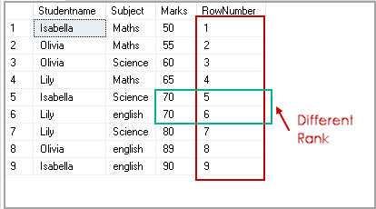

`ROW_NUMBER` – функция нумерации в Transact-SQL, которая возвращает просто номер записи.

Например, запрос
```sql
SELECT Studentname, 
       Subject, 
       Marks, 
       ROW_NUMBER() OVER(ORDER BY Marks) RowNumber
FROM ExamResult;
```
Вернёт набор данных следующего вида:


А запрос вида
```sql
SELECT Studentname, 
       Subject, 
       Marks, 
       ROW_NUMBER() OVER(ORDER BY Marks desc) RowNumber
FROM ExamResult;
```

Вернёт набор

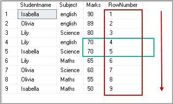


`RANK` возвращает ранг каждой записи. В данном случае, в отличие от `ROW_NUMBER`, идет уже анализ значений и в случае нахождения одинаковых возвращает одинаковый ранг с пропуском следующего.

Например:

```sql
SELECT Studentname, 
       Subject, 
       Marks, 
       RANK() OVER(PARTITION BY Studentname ORDER BY Marks DESC) Rank
FROM ExamResult
ORDER BY Studentname, 
         Rank;
```

Результат:

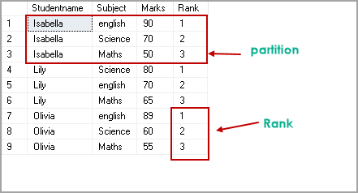

Ещё пример:

```sql
SELECT Studentname, 
       Subject, 
       Marks, 
       RANK() OVER(ORDER BY Marks DESC) Rank
FROM ExamResult
ORDER BY Rank;
```

Результат:

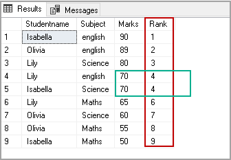


`DENSE_RANK` так же возвращает ранг каждой записи, но в отличие от `RANK` в случае нахождения одинаковых значений возвращает ранг без пропуска следующего.

Например:

```sql
SELECT Studentname, 
       Subject, 
       Marks, 
       DENSE_RANK() OVER(ORDER BY Marks DESC) Rank
FROM ExamResult
ORDER BY Rank;
```

Результат:

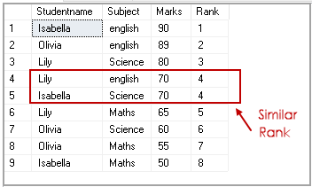

Ещё пример:

```sql
SELECT Studentname, 
       Subject, 
       Marks, 
       DENSE_RANK() OVER(PARTITION BY Subject ORDER BY Marks DESC) Rank
FROM ExamResult
ORDER BY Studentname, 
         Rank;
```

Результат:

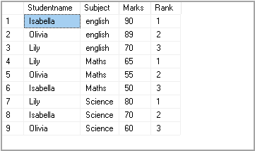

Ну, и на последок, продемонстрируем разницу между `DENSE_RANK` и `RANK`:

```sql
SELECT Studentname, 
       Subject, 
       Marks, 
       RANK() OVER(PARTITION BY StudentName ORDER BY Marks ) Rank
FROM ExamResult
ORDER BY Studentname, 
         Rank;
```


```sql
SELECT Studentname, 
       Subject, 
       Marks, 
       DENSE_RANK() OVER(PARTITION BY StudentName ORDER BY Marks ) Rank
FROM ExamResult
ORDER BY Studentname, 
         Rank;
```

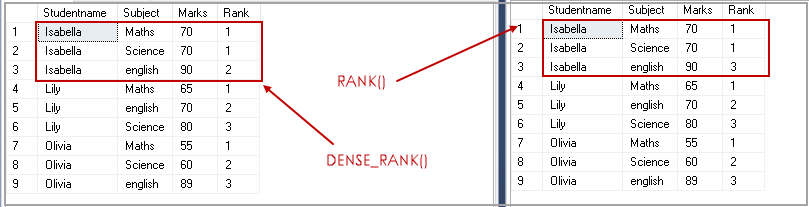

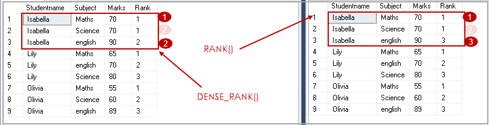


`NTILE` – функция Transact-SQL, которая делит результирующий набор на группы по определенному столбцу.

Например:

```sql
SELECT *, 
       NTILE(2) OVER(
       ORDER BY Marks DESC) Rank
FROM ExamResult
ORDER BY rank;
```

Результат:

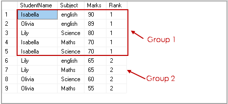

Пример 2:

```sql
SELECT *, 
       NTILE(3) OVER(
       ORDER BY Marks DESC) Rank
FROM ExamResult
ORDER BY rank;
```

Результат:

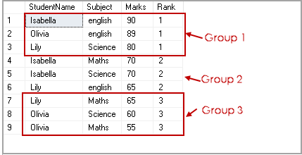

Пример 3:

```sql
SELECT *, 
       NTILE(2) OVER(PARTITION  BY subject ORDER BY Marks DESC) Rank
FROM ExamResult
ORDER BY subject, rank;
```

Результат:

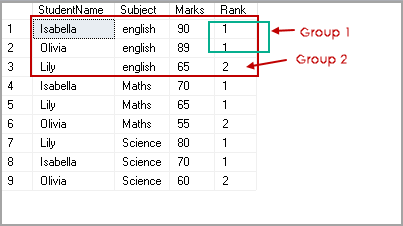
_______________________________________________________________________________________________________________________
<span style="display: inline-block; float: right">[содержание](#sql)</span>

## Для чего используются операторы `INTERSECT`, `EXCEPT` в Transact-SQL?

Оператор `EXCEPT` возвращает уникальные записи из левого входного запроса, которые не выводятся правым входным запросом.

Оператор `INTERSECT` возвращает уникальные записи, выводимые левым и правым входными запросами.